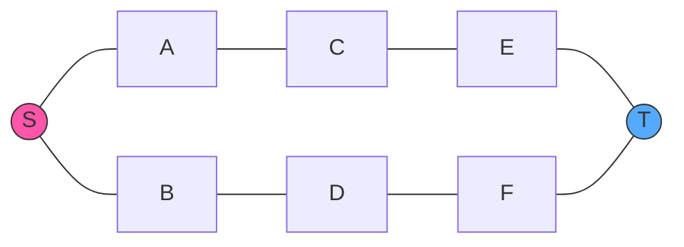

# ⚡ Optimizations and Variants

Now that we understand how Dijkstra's algorithm works, let's explore ways to optimize it and some common implementation variants that adapt the algorithm for different scenarios.

## 🚀 Performance Optimizations

### 1. Priority Queue Implementations

The choice of priority queue implementation significantly impacts performance:

| Implementation | Extract Min | Decrease Key | Overall Time Complexity |
| -------------- | ----------- | ------------ | ----------------------- |
| Array/List     | O(V)        | O(1)         | O(V²)                   |
| Binary Heap    | O(log V)    | O(log V)     | O((V + E) log V)        |
| Fibonacci Heap | O(log V)    | O(1) amortized | O(V log V + E)        |

> [!TIP]
> For sparse graphs (E ≈ V), a binary heap is usually the best choice. For dense graphs (E ≈ V²), a simple array might be faster due to lower constant factors.

### 2. Avoiding Duplicate Nodes in Queue

Instead of adding a node to the queue every time we find a shorter path, we can:

1. Check if the node is already in the queue
2. If it is, update its priority (decrease key operation)
3. If not, add it to the queue

```javascript
if (pq.contains(neighbor)) {
  pq.decreaseKey(neighbor, newDistance);
} else {
  pq.enqueue(neighbor, newDistance);
}
```

This reduces the number of elements in the queue, making operations faster.

### 3. Early Termination

If we only need the shortest path to a specific target node (not all nodes), we can stop the algorithm once we've processed the target:

```javascript
while (!pq.isEmpty()) {
  const { node: currentNode, distance: currentDistance } = pq.dequeue();
  
  if (currentNode === targetNode) {
    // We've found the shortest path to the target!
    return distances[targetNode];
  }
  
  // ... rest of the algorithm
}
```

## 🔄 Common Variants

### 1. Bidirectional Dijkstra



In bidirectional Dijkstra, we run two searches simultaneously:
- Forward search from the source
- Backward search from the target

We stop when the searches meet in the middle, potentially exploring far fewer nodes than a single search.

### 2. A* Algorithm

A* enhances Dijkstra with a heuristic function that estimates the distance from each node to the target:

```javascript
function astar(graph, source, target, heuristic) {
  // ... similar to Dijkstra, but with a key difference:
  
  // Priority is now: currentDistance + heuristic(neighbor, target)
  const priority = newDistance + heuristic(neighbor, target);
  pq.enqueue(neighbor, priority);
}
```

A* can be vastly more efficient when a good heuristic is available (e.g., Euclidean distance for physical maps).

### 3. Dijkstra for Path Reconstruction

To reconstruct the actual paths (not just distances), we maintain a "previous" map:

```javascript
function dijkstraWithPath(graph, source) {
  const distances = {};
  const previous = {}; // Track predecessor nodes
  
  // ... initialization ...
  
  while (!pq.isEmpty()) {
    // ... process current node ...
    
    for (const edge of graph[currentNode] || []) {
      // ... calculate new distance ...
      
      if (newDistance < distances[neighbor]) {
        distances[neighbor] = newDistance;
        previous[neighbor] = currentNode; // Record path
        // ... update queue ...
      }
    }
  }
  
  return { distances, previous };
}
```

To reconstruct a path to node T, we follow previous pointers backward:
```javascript
function getPath(previous, target) {
  const path = [];
  let current = target;
  
  while (current) {
    path.unshift(current);
    current = previous[current];
  }
  
  return path;
}
```

## 💻 Real-World Adaptations

### 1. Dynamic Graphs

In real-world applications like GPS navigation, the graph can change (e.g., traffic conditions):

```javascript
// Edge weight might be a function rather than a constant
function getWeight(edge, currentTime) {
  return edge.baseWeight * (1 + getTrafficFactor(edge, currentTime));
}
```

For dynamic graphs, we might need to:
- Run Dijkstra multiple times as conditions change
- Use incremental variants that can update existing solutions

### 2. Multi-criteria Optimization

Sometimes we need to consider multiple factors:

```javascript
// Edge might have multiple weight factors
const edge = {
  distance: 10,
  time: 15,
  toll: 5
};

// Calculate weighted cost
function calculateCost(edge, preferences) {
  return edge.distance * preferences.distanceWeight + 
         edge.time * preferences.timeWeight + 
         edge.toll * preferences.tollWeight;
}
```

This extension can help with problems like finding a route that balances distance, time, and cost.

## 🧠 Advanced Concepts

<details>
<summary>Johnson's Algorithm for All-Pairs Shortest Paths</summary>

If we need the shortest path between every pair of nodes, Johnson's algorithm:

1. Uses Bellman-Ford to handle potential negative edges by computing a weight transformation
2. Runs Dijkstra from each vertex using the transformed weights

This gives O(V² log V + VE) time complexity, which is better than running Dijkstra V times for sparse graphs.
</details>

<details>
<summary>Delta Stepping</summary>

Delta stepping is a parallel version of Dijkstra's algorithm that:

1. Groups nodes into "buckets" based on distance ranges
2. Processes nodes in buckets in parallel
3. Achieves significant speedup on multi-core systems

This makes it suitable for massive graphs where parallelization is essential.
</details>

## 🎯 Key Takeaways

- The choice of priority queue implementation dramatically affects performance
- Various optimizations can improve Dijkstra's algorithm for specific use cases
- Extensions like A* and bidirectional search can provide huge performance benefits
- Real-world applications often need to adapt the algorithm for changing conditions or multiple criteria
- For certain problems, specialized variants like Johnson's algorithm may be more appropriate

In the next lesson, we'll discuss common applications of Dijkstra's algorithm and when to use alternatives! 