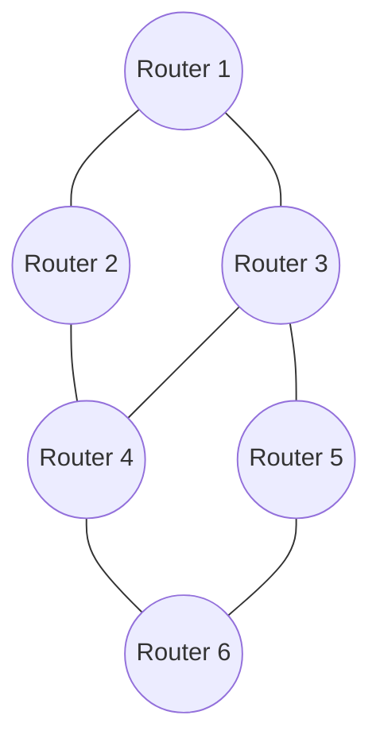

# 🌐 Real-World Applications and Alternatives

Dijkstra's algorithm isn't just an academic concept—it powers countless technologies we use daily. Let's explore where this algorithm shines in practice and when to consider alternative approaches.

## 🗺️ Real-World Applications

### 1. Navigation Systems


Modern GPS navigation systems use Dijkstra's algorithm (or variants like A*) to find the optimal route between locations:

- **Google Maps** calculates the fastest route considering distance, traffic, and road types
- **Uber/Lyft** estimate arrival times and optimal driver routes
- **Flight planning systems** determine fuel-efficient paths between airports

> [!NOTE]
> These systems often use hierarchical approaches—first planning on major highways, then refining to local roads—to handle the massive scale of real-world maps.

### 2. Network Routing



Internet routing protocols like OSPF (Open Shortest Path First) use Dijkstra-based algorithms to:
- Find the shortest path for data packets
- Automatically reroute around congested or failed links
- Balance speed, reliability, and network congestion

### 3. Social Networks

Finding the shortest connection between users ("degrees of separation"):

```javascript
// Find the shortest path between two users in a social network
function findConnection(userGraph, userA, userB) {
  const { previous } = dijkstraWithPath(userGraph, userA);
  return getPath(previous, userB);
}
```

This powers features like LinkedIn's "how you're connected" or Facebook's "mutual friends" insights.

### 4. Robotics and Games

- **Autonomous robots** use Dijkstra's algorithm (or often A*) to navigate environments
- **Video games** use pathfinding for character movement and AI decision-making
- **Strategy games** calculate efficient resource gathering and attack routes

> [!TIP]
> Games often sacrifice some optimality for performance, using techniques like grid-based simplifications and caching popular routes.

## 🔄 Alternative Algorithms

While Dijkstra's algorithm is powerful, it's not always the best choice. Here are alternatives for different scenarios:

### 1. For Unweighted Graphs: Breadth-First Search (BFS)

If all edges have equal weight, BFS is simpler and more efficient:

```javascript
function bfs(graph, source) {
  const distances = {};
  const queue = [source];
  
  // Initialize distances
  for (const node in graph) {
    distances[node] = node === source ? 0 : Infinity;
  }
  
  while (queue.length > 0) {
    const current = queue.shift();
    
    for (const neighbor of graph[current]) {
      if (distances[neighbor] === Infinity) {
        distances[neighbor] = distances[current] + 1;
        queue.push(neighbor);
      }
    }
  }
  
  return distances;
}
```

**When to use**: Networks where all connections have equal cost/distance.

### 2. For Negative Weights: Bellman-Ford Algorithm

If your graph might have negative edge weights, use Bellman-Ford:

```javascript
function bellmanFord(graph, source) {
  const distances = {};
  
  // Initialize distances
  for (const node in graph) {
    distances[node] = node === source ? 0 : Infinity;
  }
  
  // Relax all edges V-1 times
  for (let i = 0; i < Object.keys(graph).length - 1; i++) {
    for (const node in graph) {
      for (const edge of graph[node]) {
        const { node: neighbor, weight } = edge;
        if (distances[node] + weight < distances[neighbor]) {
          distances[neighbor] = distances[node] + weight;
        }
      }
    }
  }
  
  // Check for negative cycles
  for (const node in graph) {
    for (const edge of graph[node]) {
      const { node: neighbor, weight } = edge;
      if (distances[node] + weight < distances[neighbor]) {
        throw new Error("Graph contains a negative-weight cycle");
      }
    }
  }
  
  return distances;
}
```

**When to use**: Financial models, currency exchange, or any network where some transitions might represent gains rather than costs.

### 3. For All-Pairs Shortest Paths: Floyd-Warshall

When you need the shortest path between every pair of nodes:

```javascript
function floydWarshall(graph) {
  const nodes = Object.keys(graph);
  const n = nodes.length;
  
  // Initialize distances
  const dist = Array(n).fill().map(() => Array(n).fill(Infinity));
  
  // Set up initial distances
  for (let i = 0; i < n; i++) {
    dist[i][i] = 0;
    
    for (const edge of graph[nodes[i]]) {
      const j = nodes.indexOf(edge.node);
      dist[i][j] = edge.weight;
    }
  }
  
  // Main algorithm
  for (let k = 0; k < n; k++) {
    for (let i = 0; i < n; i++) {
      for (let j = 0; j < n; j++) {
        if (dist[i][k] + dist[k][j] < dist[i][j]) {
          dist[i][j] = dist[i][k] + dist[k][j];
        }
      }
    }
  }
  
  return dist;
}
```

**When to use**: Network analysis, transportation planning, or any application needing all possible route distances.

## 📝 Algorithm Comparison Chart

| Algorithm | Time Complexity | Space Complexity | Handles Negative Weights | All Pairs | Best For |
|-----------|----------------|-----------------|-------------------------|-----------|----------|
| Dijkstra | O((V+E) log V) | O(V) | No | No | Single source, positive weights |
| A* | O(E) best case | O(V) | No | No | Single-target with heuristic |
| BFS | O(V+E) | O(V) | N/A (unweighted) | No | Unweighted graphs |
| Bellman-Ford | O(VE) | O(V) | Yes | No | Graphs with negative weights |
| Floyd-Warshall | O(V³) | O(V²) | Yes | Yes | Dense graphs, all pairs |
| Johnson's | O(V² log V + VE) | O(V²) | Yes | Yes | Sparse graphs, all pairs |

## 🎯 Choosing the Right Algorithm

To select the appropriate algorithm, consider these factors:

1. **Graph properties**:
   - Are all weights positive? → Dijkstra
   - Are there negative weights? → Bellman-Ford
   - Is the graph unweighted? → BFS

2. **Problem requirements**:
   - Need just one specific path? → Dijkstra/A*
   - Need all possible paths? → Floyd-Warshall/Johnson's
   - Have a good heuristic available? → A*

3. **Performance constraints**:
   - Very large graphs? → Consider hierarchical approaches
   - Need real-time updates? → Look at incremental variants
   - Can parallelize? → Delta stepping or parallel Floyd-Warshall

## 💡 Key Takeaways

- Dijkstra's algorithm powers many technologies we use daily, from GPS to internet routing
- For unweighted graphs, BFS provides a simpler and faster alternative
- When dealing with negative weights, Bellman-Ford is necessary
- Floyd-Warshall is efficient for dense graphs when all-pairs shortest paths are needed
- The choice of algorithm should consider graph properties, problem requirements, and performance constraints

In the next lesson, we'll implement the priority queue needed for an efficient Dijkstra's algorithm! 