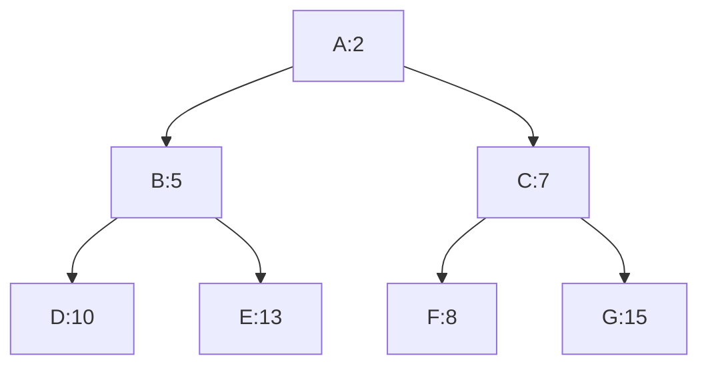

# 🧰 Building the Priority Queue

A priority queue is a fundamental data structure for efficiently implementing Dijkstra's algorithm. It allows us to quickly retrieve the node with the smallest distance, which is essential for the algorithm's greedy approach.

## 🎯 Priority Queue Requirements

For Dijkstra's algorithm, our priority queue needs to support three main operations:

1. **Enqueue**: Add a node with its priority (distance)
2. **Dequeue**: Remove and return the node with the lowest priority (smallest distance)
3. **Decrease Key** (optional but helpful): Update a node's priority if we find a better path

## 🧱 Implementation Options

Let's explore a few ways to implement a priority queue, from simplest to most efficient:

### 1. Array-based Implementation

```javascript
class SimpleArrayPQ {
  constructor() {
    this.items = []; // Array of {node, priority} objects
  }

  enqueue(node, priority) {
    this.items.push({ node, priority });
    // Sort by priority (smallest first)
    this.items.sort((a, b) => a.priority - b.priority);
  }

  dequeue() {
    return this.items.shift();
  }

  isEmpty() {
    return this.items.length === 0;
  }

  contains(node) {
    return this.items.some(item => item.node === node);
  }

  decreaseKey(node, newPriority) {
    const index = this.items.findIndex(item => item.node === node);
    if (index !== -1 && newPriority < this.items[index].priority) {
      this.items[index].priority = newPriority;
      this.items.sort((a, b) => a.priority - b.priority);
    }
  }
}
```

> [!NOTE]
> This implementation is simple but inefficient for large graphs because:
> - Sorting on each enqueue is O(n log n)
> - Finding a node for decreaseKey is O(n)
> - However, it works well for small graphs and is easy to understand!

### 2. Binary Heap Implementation

A more efficient approach uses a binary heap:

```javascript
class BinaryHeapPQ {
  constructor() {
    this.heap = [];
    this.nodeToIndex = new Map(); // For quick lookups
  }

  // Helper methods for navigating the heap
  parent(i) { return Math.floor((i - 1) / 2); }
  leftChild(i) { return 2 * i + 1; }
  rightChild(i) { return 2 * i + 2; }

  // Swap elements and update nodeToIndex map
  swap(i, j) {
    this.nodeToIndex.set(this.heap[i].node, j);
    this.nodeToIndex.set(this.heap[j].node, i);
    [this.heap[i], this.heap[j]] = [this.heap[j], this.heap[i]];
  }

  // Move an element up to maintain heap property
  bubbleUp(i) {
    if (i === 0) return;
    
    const parentIndex = this.parent(i);
    if (this.heap[i].priority < this.heap[parentIndex].priority) {
      this.swap(i, parentIndex);
      this.bubbleUp(parentIndex);
    }
  }

  // Move an element down to maintain heap property
  bubbleDown(i) {
    const leftIndex = this.leftChild(i);
    const rightIndex = this.rightChild(i);
    let smallest = i;

    if (leftIndex < this.heap.length && 
        this.heap[leftIndex].priority < this.heap[smallest].priority) {
      smallest = leftIndex;
    }

    if (rightIndex < this.heap.length && 
        this.heap[rightIndex].priority < this.heap[smallest].priority) {
      smallest = rightIndex;
    }

    if (smallest !== i) {
      this.swap(i, smallest);
      this.bubbleDown(smallest);
    }
  }

  // Add a node with its priority
  enqueue(node, priority) {
    const newElement = { node, priority };
    this.heap.push(newElement);
    const index = this.heap.length - 1;
    this.nodeToIndex.set(node, index);
    this.bubbleUp(index);
  }

  // Remove and return the minimum element
  dequeue() {
    if (this.heap.length === 0) return null;
    
    const min = this.heap[0];
    const last = this.heap.pop();
    this.nodeToIndex.delete(min.node);
    
    if (this.heap.length > 0) {
      this.heap[0] = last;
      this.nodeToIndex.set(last.node, 0);
      this.bubbleDown(0);
    }
    
    return min;
  }

  isEmpty() {
    return this.heap.length === 0;
  }

  contains(node) {
    return this.nodeToIndex.has(node);
  }

  decreaseKey(node, newPriority) {
    if (!this.contains(node)) return;
    
    const index = this.nodeToIndex.get(node);
    if (newPriority < this.heap[index].priority) {
      this.heap[index].priority = newPriority;
      this.bubbleUp(index);
    }
  }
}
```

This implementation has much better performance:
- Enqueue: O(log n)
- Dequeue: O(log n)
- DecreaseKey: O(log n)
- Contains: O(1) thanks to the nodeToIndex map

## 📊 Visual Representation of a Binary Heap

A binary heap can be visualized as a binary tree where each node is smaller than its children:



The numbers represent priorities (distances). The root node always has the smallest priority.

## 🔄 Priority Queue Operations Visualized

Let's see how the priority queue operations work in the context of Dijkstra's algorithm:

### Initial State
```
PQ: [A:0]
```

### After Processing A (enqueue B:2, D:6)
```
PQ: [B:2, D:6]
```

### After Processing B (enqueue C:5)
```
PQ: [C:5, D:6]
```

### After Processing C (enqueue E:10)
```
PQ: [D:6, E:10]
```

### After Processing D (update E to 8)
```
PQ: [E:8]
```

> [!TIP]
> In a real implementation, we'd update E's priority using decreaseKey rather than adding it again.

## 🚀 Optimizing for Dijkstra's Algorithm

For a highly optimized Dijkstra implementation, consider these priority queue enhancements:

1. **Lazy Deletion**: Instead of removing nodes from the queue when visited, mark them as deleted and skip them when encountered during dequeue
2. **Fibonacci Heap**: For very large graphs, a Fibonacci heap offers O(1) amortized time for decreaseKey operations
3. **D-ary Heap**: A generalization of binary heaps where each node has d children instead of 2, which can be more cache-efficient

## 💻 Simplified Implementation for Practice

For learning purposes, here's a simplified priority queue we'll use in our Dijkstra implementation:

```javascript
class PriorityQueue {
  constructor() {
    this.items = [];
  }

  enqueue(node, distance) {
    this.items.push({ node, distance });
    this.items.sort((a, b) => a.distance - b.distance);
  }

  dequeue() {
    return this.items.shift();
  }

  isEmpty() {
    return this.items.length === 0;
  }

  contains(node) {
    return this.items.some((item) => item.node === node);
  }

  decreaseKey(node, newDistance) {
    const index = this.items.findIndex((item) => item.node === node);
    if (index !== -1) {
      this.items[index].distance = newDistance;
      this.items.sort((a, b) => a.distance - b.distance);
    }
  }
}
```

## 🎯 Key Takeaways

- A priority queue is essential for efficiently implementing Dijkstra's algorithm
- The key operations are enqueue, dequeue, and (optionally) decreaseKey
- While a simple array-based implementation works for small graphs, a binary heap is much more efficient for larger graphs
- The choice of priority queue implementation significantly impacts the algorithm's performance
- For production use, consider using a library that provides an optimized priority queue implementation

In the next lesson, we'll put everything together and implement the complete Dijkstra's algorithm! 