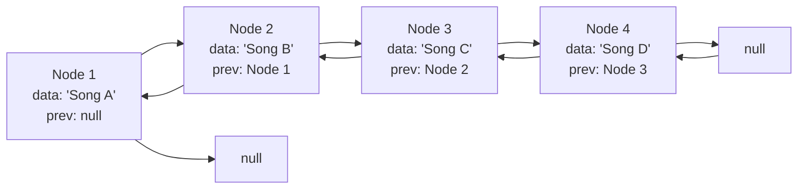

# 🔄 Doubly Linked List: Introduction

> [!NOTE]
> A doubly linked list is a powerful data structure that allows bidirectional traversal, unlike its simpler cousin, the singly linked list.

## The Problem

Imagine you're developing a music player application. Users want to be able to navigate both forward and backward through their playlist. How would you efficiently implement this functionality?

This is where a doubly linked list shines! ✨

## What is a Doubly Linked List?

A doubly linked list is a linear data structure consisting of a sequence of **nodes**, where each node contains:
- Data (the actual value)
- A pointer to the previous node
- A pointer to the next node

This dual-pointing mechanism gives us the freedom to traverse the list in **both directions** - forward and backward!

## Key Features

- **Bidirectional Traversal**: Move in both forward and backward directions
- **Dynamic Size**: Grows and shrinks as needed
- **Efficient Insertions/Deletions**: When we have a reference to a node
- **Head and Tail References**: Quick access to both ends of the list

> [!TIP]
> Think of a doubly linked list like a chain of people in a conga line, where each person holds hands with both the person in front and behind them!

## Challenge Ahead

In this lesson series, we'll implement a doubly linked list from scratch, including:
- Creating the basic structure
- Adding elements to the beginning and end
- Removing elements
- Searching for elements
- Traversing in both directions

Are you ready to master this essential data structure? Let's get started! 🚀

Why Learn Doubly Linked Lists?

Doubly linked lists are fundamental in computer science and find applications in:
- Browser history (forward/back navigation)
- Undo/Redo functionality in applications
- Music players (previous/next song)
- Text editors
- Implementation of more complex data structures like deques

Understanding them will strengthen your programming skills and problem-solving abilities!

 