# 🧱 The Building Blocks: Node Structure

Every great structure starts with its fundamental building blocks. For a doubly linked list, that building block is the **Node**.

## What is a Node?

A node is a container that holds:
1. The actual **data** we want to store 
2. A reference to the **previous** node
3. A reference to the **next** node

> [!NOTE]
> These references are often called "pointers" because they point to other nodes in memory.

## Creating a Node Class

Let's create a Node class to represent this structure:

```javascript
class Node {
  constructor(data) {
    this.data = data;    // The value we want to store
    this.prev = null;    // Reference to the previous node (initially null)
    this.next = null;    // Reference to the next node (initially null)
  }
}
```

In other languages, the implementation is similar:

<details>
<summary>Python Implementation</summary>

```python
class Node:
    def __init__(self, data):
        self.data = data
        self.prev = None
        self.next = None
```
</details>

## Visualizing a Node

Each node is like a container with three compartments:


Initially, when we create a new node, both the `prev` and `next` pointers are set to `null` (or `None` in Python) because the node isn't connected to anything yet.

## Understanding Node Connections

When we connect nodes together, they form the backbone of our doubly linked list:

```mermaid
graph LR;
    subgraph "Node A"
    A1["prev: null"] --- A2["data: 1"] --- A3["next: →"]
    end
    
    subgraph "Node B"
    B1["prev: ←"] --- B2["data: 2"] --- B3["next: →"]
    end
    
    subgraph "Node C"
    C1["prev: ←"] --- C2["data: 3"] --- C3["next: null"]
    end
    
    A3 --> B1
    B3 --> C1
```



> [!TIP]
> 💡 Think of nodes as train cars. Each car (node) can connect to the car in front of it and behind it, allowing for movement in both directions!

## What Makes This Special?

The power of the doubly linked list comes from each node having knowledge of both its next and previous neighbors. This means:

- We can navigate in both directions
- We can easily insert or remove elements when we have a reference to a node
- We can quickly access both ends of the list

**Let's think critically:** How would you remove a node from a singly linked list vs. a doubly linked list? Which is more efficient and why?

<details>
<summary>Hint</summary>

In a singly linked list, to remove a node, you need to find its predecessor first (which requires traversal from the head). In a doubly linked list, each node already knows its predecessor, making removal more efficient!
</details>

In the next lesson, we'll use these nodes to construct the full doubly linked list structure! 🔍 