# 🏗️ Constructing the Doubly Linked List

Now that we understand the building blocks (nodes), let's construct the framework that holds them together - the Doubly Linked List class!

## The Framework

A doubly linked list needs to keep track of:
- The **head** - the first node in the list
- The **tail** - the last node in the list
- Optionally, the **size** of the list

This structure allows us to:
- Access both ends of the list in O(1) time (constant time)
- Keep track of how many elements we have

## Initializing the List

Let's create the basic structure of our DoublyLinkedList class:

```javascript
class DoublyLinkedList {
  constructor() {
    this.head = null;  // Points to the first node
    this.tail = null;  // Points to the last node
    this.size = 0;     // Tracks the number of nodes
  }
  
  // Methods will be added here
}
```

<details>
<summary>Python Implementation</summary>

```python
class DoublyLinkedList:
    def __init__(self):
        self.head = None
        self.tail = None
        self.size = 0
```
</details>

## Visualizing an Empty List

When we first create a doubly linked list, it's empty - both head and tail point to `null` (or `None`):


## Conceptualizing the List Structure

As we add nodes to our list, the head will point to the first node, and the tail will point to the last node:

```mermaid
graph LR;
    H[Head] --> A
    subgraph "Node A"
    A1["prev: null"] --- A2["data: 1"] --- A3["next: →"]
    end
    
    subgraph "Node B"
    B1["prev: ←"] --- B2["data: 2"] --- B3["next: →"]
    end
    
    subgraph "Node C"
    C1["prev: ←"] --- C2["data: 3"] --- C3["next: null"]
    end
    
    A3 --> B1
    B3 --> C1
    T[Tail] --> C
```



> [!NOTE]
> The head and tail references are crucial for efficient operations at both ends of the list!

## Why We Need Both Head and Tail

Having references to both ends of the list provides significant advantages:

- **Head Reference**: Allows us to start traversal from the beginning
- **Tail Reference**: Enables efficient additions to the end without traversing the entire list
- **Together**: They make operations on both ends O(1) time complexity

> [!TIP]
> Think of the head and tail as doorways at opposite ends of a hallway. Without these doorways, you'd have to walk through the entire hallway to get from one end to the other!

## Critical Thinking Question

How does having a tail reference improve performance compared to a list that only tracks the head?

<details>
<summary>Answer</summary>

Without a tail reference, adding to the end of the list would require O(n) time to traverse from head to the last node. With a tail reference, we can add to the end in O(1) time - a significant improvement for large lists!
</details>

In the next lesson, we'll start adding functionality to our doubly linked list by implementing methods to add elements. 🧩 