# ➕ Adding Elements to Your Doubly Linked List

Now that we have our basic structure in place, let's start adding functionality! The first operations we'll implement are adding elements to the list - either at the end (append) or at the beginning (prepend).

## The Append Operation: Adding to the End

Appending adds a new node to the end of the list, making it the new tail.

### The Algorithm for Append

1. Create a new node with the provided data
2. If the list is empty (head is null), make the new node both the head and tail
3. Otherwise:
   - Set the new node's prev pointer to the current tail
   - Set the current tail's next pointer to the new node
   - Update the tail to be the new node
4. Increment the size counter

### Visualizing Append

Let's visualize appending a new node with value 4 to our list:

**Before:**


```mermaid
graph LR;
    H[Head] --> A
    subgraph "Node A"
    A1["prev: null"] --- A2["data: 1"] --- A3["next: →"]
    end
    
    subgraph "Node B"
    B1["prev: ←"] --- B2["data: 2"] --- B3["next: →"]
    end
    
    subgraph "Node C"
    C1["prev: ←"] --- C2["data: 3"] --- C3["next: null"]
    end
    
    A3 --> B1
    B3 --> C1
    T[Tail] --> C
```

**After append(4):**

```mermaid
graph LR;
    H[Head] --> A
    subgraph "Node A"
    A1["prev: null"] --- A2["data: 1"] --- A3["next: →"]
    end
    
    subgraph "Node B"
    B1["prev: ←"] --- B2["data: 2"] --- B3["next: →"]
    end
    
    subgraph "Node C"
    C1["prev: ←"] --- C2["data: 3"] --- C3["next: →"]
    end
    
    subgraph "Node D"
    D1["prev: ←"] --- D2["data: 4"] --- D3["next: null"]
    end
    
    A3 --> B1
    B3 --> C1
    C3 --> D1
    T[Tail] --> D
```


### Code Implementation - Append

```javascript
append(data) {
  const newNode = new Node(data);

  if (!this.head) {
    // Case 1: Empty list
    this.head = newNode;
    this.tail = newNode;
  } else {
    // Case 2: Non-empty list
    newNode.prev = this.tail;
    this.tail.next = newNode;
    this.tail = newNode;
  }
  this.size++;
}
```

<details>
<summary>Python Implementation</summary>

```python
def append(self, data):
    new_node = Node(data)
    
    if not self.head:
        # Case 1: Empty list
        self.head = new_node
        self.tail = new_node
    else:
        # Case 2: Non-empty list
        new_node.prev = self.tail
        self.tail.next = new_node
        self.tail = new_node
    
    self.size += 1
```
</details>

## The Prepend Operation: Adding to the Beginning

Prepending adds a new node to the beginning of the list, making it the new head.

### The Algorithm for Prepend

1. Create a new node with the provided data
2. If the list is empty (head is null), make the new node both the head and tail
3. Otherwise:
   - Set the new node's next pointer to the current head
   - Set the current head's prev pointer to the new node
   - Update the head to be the new node
4. Increment the size counter

### Visualizing Prepend

Let's visualize prepending a new node with value 0 to our list:

**Before:**


**After prepend(0):**


### Code Implementation - Prepend

```javascript
prepend(data) {
  const newNode = new Node(data);

  if (!this.head) {
    // Case 1: Empty list
    this.head = newNode;
    this.tail = newNode;
  } else {
    // Case 2: Non-empty list
    newNode.next = this.head;
    this.head.prev = newNode;
    this.head = newNode;
  }
  this.size++;
}
```

<details>
<summary>Python Implementation</summary>

```python
def prepend(self, data):
    new_node = Node(data)
    
    if not self.head:
        # Case 1: Empty list
        self.head = new_node
        self.tail = new_node
    else:
        # Case 2: Non-empty list
        new_node.next = self.head
        self.head.prev = new_node
        self.head = new_node
    
    self.size += 1
```
</details>

> [!WARNING]
> When implementing these methods, always consider the special case of an empty list. If you don't handle it correctly, you might end up with dangling pointers!

## Critical Thinking Exercise

What would happen if we forgot to update the `tail` pointer in the `append` method for an empty list? How would this affect future operations?

<details>
<summary>Answer</summary>

If we forgot to update the `tail` pointer when appending to an empty list, then `tail` would remain `null` even though we have elements in the list. This would break all operations that rely on the `tail` reference (like appending more elements), causing potential null pointer errors or requiring traversal from the head to find the last element.
</details>

In the next lesson, we'll learn how to remove elements from our doubly linked list! 🗑️ 