# 🗑️ Removing Elements from Your Doubly Linked List

Now that we can add elements to our list, let's learn how to remove them. The delete operation is where a doubly linked list really shines, showing its advantage over singly linked lists.

## The Delete Operation

The delete operation removes a node with a specific value from the list. In a doubly linked list, this is straightforward because each node has references to both its previous and next nodes.

### The Algorithm for Delete

1. Start at the head of the list and search for the node with the target value
2. If the node is found:
   - If it has a previous node, update that previous node's next pointer to skip over the current node
   - Otherwise, we're deleting the head, so update the head to point to the next node
   - If it has a next node, update that next node's prev pointer to skip over the current node
   - Otherwise, we're deleting the tail, so update the tail to point to the previous node
3. Decrement the size counter

### Visualizing Delete

Let's visualize deleting the node with value 2 from our list:

**Before:**

```mermaid
graph LR;
    H[Head] --> A
    subgraph "Node A"
    A1["prev: null"] --- A2["data: 1"] --- A3["next: →"]
    end
    
    subgraph "Node B"
    B1["prev: ←"] --- B2["data: 2"] --- B3["next: →"]
    end
    
    subgraph "Node C"
    C1["prev: ←"] --- C2["data: 3"] --- C3["next: null"]
    end
    
    A3 --> B1
    B3 --> C1
    T[Tail] --> C
```


**After delete(2):**

```mermaid
graph LR;
    H[Head] --> A
    subgraph "Node A"
    A1["prev: null"] --- A2["data: 1"] --- A3["next: →"]
    end
    
    subgraph "Node C"
    C1["prev: ←"] --- C2["data: 3"] --- C3["next: null"]
    end
    
    A3 --> C1
    T[Tail] --> C
```


### Code Implementation - Delete

```javascript
delete(data) {
  let current = this.head;

  // Search for the node
  while (current) {
    if (current.data === data) {
      // Found the node to delete
      
      // Handle the previous connection
      if (current.prev) {
        // Not the head node
        current.prev.next = current.next;
      } else {
        // It's the head node
        this.head = current.next;
      }

      // Handle the next connection
      if (current.next) {
        // Not the tail node
        current.next.prev = current.prev;
      } else {
        // It's the tail node
        this.tail = current.prev;
      }

      this.size--;
      return; // Exit after deletion
    }
    
    // Move to the next node
    current = current.next;
  }
  
  // Node with the given data not found
}
```

<details>
<summary>Python Implementation</summary>

```python
def delete(self, data):
    current = self.head
    
    # Search for the node
    while current:
        if current.data == data:
            # Found the node to delete
            
            # Handle the previous connection
            if current.prev:
                # Not the head node
                current.prev.next = current.next
            else:
                # It's the head node
                self.head = current.next
            
            # Handle the next connection
            if current.next:
                # Not the tail node
                current.next.prev = current.prev
            else:
                # It's the tail node
                self.tail = current.prev
            
            self.size -= 1
            return  # Exit after deletion
        
        # Move to the next node
        current = current.next
    
    # Node with the given data not found
```
</details>

## Special Cases to Consider

When implementing delete, always consider these special cases:

> [!WARNING]
> 1. **Deleting the head**: Make sure to update the head pointer
> 2. **Deleting the tail**: Make sure to update the tail pointer
> 3. **Deleting the only node**: Both head and tail should become null
> 4. **Node not found**: Handle the case when the data doesn't exist in the list

## Advantages of Doubly Linked List for Deletion

In a singly linked list, to delete a node, you need:
1. The node to delete
2. The node *before* it (to update its next pointer)

Finding the node before requires either:
- Keeping a separate reference to it during traversal
- Starting from the head each time

But in a doubly linked list, each node already knows its previous node through the `prev` pointer! This makes deletion much cleaner and more efficient.

## Critical Thinking Exercise

What would happen if we delete the only node in the list but forget to update the tail pointer? How would this affect future operations?

<details>
<summary>Answer</summary>

If we delete the only node but only update the head to null (forgetting to update the tail), then the tail would still point to the deleted node. This would cause issues when trying to append new elements because we'd be trying to use a reference to a node that's no longer valid.
</details>

> [!TIP]
> When deleting nodes, think about all the references that need to be updated. If you miss one, you might create a "dangling pointer" that could cause bugs in your code!

In the next lesson, we'll learn how to search for elements in our doubly linked list! 🔍 