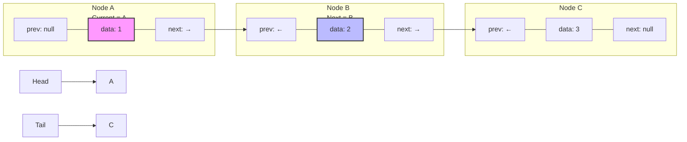

# 🔍 Searching for Elements in Your Doubly Linked List

Finding data in a linked list is a fundamental operation that underlies many other operations like deletion. Let's explore how to search for elements in our doubly linked list.

## The Find Operation

The find operation searches for a node containing a specific value and returns:
- The node if found
- null (or None) if not found

### The Algorithm for Find

1. Start at the head of the list
2. For each node:
   - If the node's data matches the target value, return the node
   - Otherwise, move to the next node
3. If we reach the end of the list without finding the value, return null

### Visualizing Find

Let's visualize searching for a node with value 2 in our list:



After checking node A (data: 1), we move to node B (data: 2) and find our match!

### Code Implementation - Find

```javascript
find(data) {
  let current = this.head;

  while (current) {
    if (current.data === data) {
      return current; // Node found!
    }
    current = current.next;
  }

  return null; // Node not found
}
```

<details>
<summary>Python Implementation</summary>

```python
def find(self, data):
    current = self.head
    
    while current:
        if current.data == data:
            return current  # Node found!
        current = current.next
    
    return None  # Node not found
```
</details>

## Time Complexity of Search

In a doubly linked list, searching is an O(n) operation in the worst case, where n is the number of nodes in the list. This is because we might need to visit every node in the list before finding our target value (or determining it doesn't exist).

Unlike arrays, linked lists don't support random access - we must traverse the list one node at a time.

## Bi-directional Search: A Potential Optimization

One advantage of a doubly linked list is that we could potentially search from both ends simultaneously:

```javascript
findOptimized(data) {
  let headCurrent = this.head;
  let tailCurrent = this.tail;
  
  // Search from both ends simultaneously
  while (headCurrent !== tailCurrent && headCurrent?.prev !== tailCurrent) {
    if (headCurrent?.data === data) {
      return headCurrent;
    }
    if (tailCurrent?.data === data) {
      return tailCurrent;
    }
    
    headCurrent = headCurrent?.next;
    tailCurrent = tailCurrent?.prev;
  }
  
  // Check the middle node if there's an odd number of nodes
  if (headCurrent === tailCurrent && headCurrent?.data === data) {
    return headCurrent;
  }
  
  return null; // Node not found
}
```

This optimization can potentially reduce the average search time by half!

> [!TIP]
> The bi-directional search is a great example of leveraging the unique properties of a doubly linked list. Think about other operations that could benefit from bidirectional traversal!

## Practical Applications of Find

The find operation is crucial for many practical applications:

- **Checking if an element exists**: Before adding a new element, you might want to ensure it's not already in the list
- **Retrieving a node for updating**: Find the node, then modify its data
- **Supporting the delete operation**: Find the node first, then delete it
- **Building more complex methods**: Like inserting at a specific position

## Critical Thinking Exercise

How would you modify the find method to return the *index* of the node (its position in the list) instead of the node itself?

<details>
<summary>Solution</summary>

```javascript
findIndex(data) {
  let current = this.head;
  let index = 0;
  
  while (current) {
    if (current.data === data) {
      return index;
    }
    current = current.next;
    index++;
  }
  
  return -1; // Not found (common convention for "not found" in index searches)
}
```
</details>

In the next lesson, we'll learn how to traverse our doubly linked list in both directions! 🔄 