# 🔄 Traversing Your Doubly Linked List in Both Directions

One of the most powerful features of a doubly linked list is the ability to traverse it in both directions. This bidirectional traversal opens up possibilities that aren't available with singly linked lists.

## Forward Traversal

Forward traversal moves from the head to the tail, following the next pointers.

### The Algorithm for Forward Traversal

1. Start at the head of the list
2. Process the current node's data (e.g., print it)
3. Move to the next node
4. Repeat steps 2-3 until we reach the end (a node with next = null)

### Visualizing Forward Traversal


### Code Implementation - Forward Traversal

```javascript
printForward() {
  let current = this.head;
  let result = '';
  
  while (current) {
    result += current.data + ' ';
    current = current.next;
  }
  
  console.log(result.trim());
}
```

<details>
<summary>Python Implementation</summary>

```python
def print_forward(self):
    current = self.head
    result = ""
    
    while current:
        result += str(current.data) + " "
        current = current.next
    
    print(result.strip())
```
</details>

## Backward Traversal

Backward traversal moves from the tail to the head, following the prev pointers.

### The Algorithm for Backward Traversal

1. Start at the tail of the list
2. Process the current node's data (e.g., print it)
3. Move to the previous node
4. Repeat steps 2-3 until we reach the beginning (a node with prev = null)

### Visualizing Backward Traversal

```mermaid
graph RL;
    T[Tail] --> C
    subgraph "1. Start"
    C1["prev: ←"] --- C2["data: 3"] --- C3["next: null"]
    end
    
    subgraph "2. Previous"
    B1["prev: ←"] --- B2["data: 2"] --- B3["next: →"]
    end
    
    subgraph "3. End"
    A1["prev: null"] --- A2["data: 1"] --- A3["next: →"]
    end
    
    C1 --> B3
    B1 --> A3
    H[Head] --> A
    
    style A fill:#bbf,stroke:#333,stroke-width:2px
    style B fill:#bbf,stroke:#333,stroke-width:2px
    style C fill:#bbf,stroke:#333,stroke-width:2px
```



### Code Implementation - Backward Traversal

```javascript
printBackward() {
  let current = this.tail;
  let result = '';
  
  while (current) {
    result += current.data + ' ';
    current = current.prev;
  }
  
  console.log(result.trim());
}
```

<details>
<summary>Python Implementation</summary>

```python
def print_backward(self):
    current = self.tail
    result = ""
    
    while current:
        result += str(current.data) + " "
        current = current.prev
    
    print(result.strip())
```
</details>

## Why Bidirectional Traversal Matters

Bidirectional traversal offers several advantages:

1. **Flexibility**: You can process data in either direction based on your needs
2. **Efficiency**: If you know an element is closer to the tail, you can start traversal from there
3. **Specialized Operations**: Some algorithms are more natural when traversing backwards
4. **Undo/Redo Functionality**: Perfect for implementing features like browser history

> [!TIP]
> Think about how a music player uses bidirectional traversal to implement "next song" and "previous song" functionality! 🎵

## Beyond Simple Traversal

Once you have basic traversal implemented, you can build more advanced operations:

- **Map**: Transform each element
- **Filter**: Create a new list with elements matching certain criteria
- **Reduce**: Combine all elements into a single value
- **Every/Some**: Check if all/some elements satisfy a condition

## Critical Thinking Exercise

How would you implement a method that finds the middle node of a doubly linked list? Can you think of multiple approaches?

<details>
<summary>Solution</summary>

**Approach 1**: Use the size property and traverse to the middle
```javascript
findMiddle() {
  if (!this.head) return null;
  
  const middleIndex = Math.floor(this.size / 2);
  let current = this.head;
  
  for (let i = 0; i < middleIndex; i++) {
    current = current.next;
  }
  
  return current;
}
```

**Approach 2**: Use two pointers - one moving twice as fast as the other
```javascript
findMiddle() {
  if (!this.head) return null;
  
  let slow = this.head;
  let fast = this.head;
  
  while (fast && fast.next) {
    slow = slow.next;
    fast = fast.next.next;
  }
  
  return slow;
}
```

**Approach 3**: Start from both ends and meet in the middle
```javascript
findMiddle() {
  if (!this.head) return null;
  if (this.head === this.tail) return this.head;
  
  let front = this.head;
  let back = this.tail;
  
  while (front !== back && front.next !== back) {
    front = front.next;
    back = back.prev;
  }
  
  return front;
}
```
</details>

In the next lesson, we'll explore some additional operations and optimizations for our doubly linked list! 🚀 