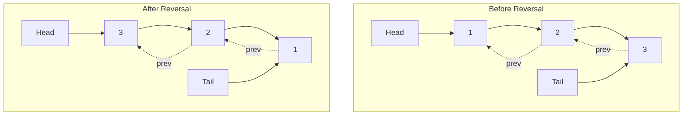
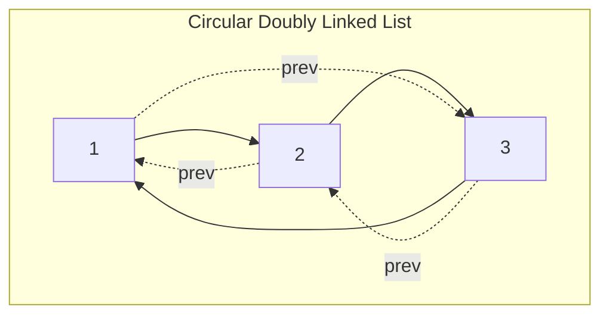

# 🚀 Advanced Operations and Optimizations

Now that we have our basic doubly linked list implementation, let's explore some advanced operations and optimizations that leverage its unique bidirectional capabilities.

## 1. Inserting at a Specific Position

Sometimes you need to insert a node at a specific position in the list. Let's implement this functionality:

```javascript
insertAt(data, position) {
  // Handle invalid positions
  if (position < 0 || position > this.size) {
    throw new Error('Invalid position');
  }
  
  // If inserting at the beginning, use prepend
  if (position === 0) {
    this.prepend(data);
    return;
  }
  
  // If inserting at the end, use append
  if (position === this.size) {
    this.append(data);
    return;
  }
  
  // Create the new node
  const newNode = new Node(data);
  
  // Find the node at the specified position
  let current = this.head;
  for (let i = 0; i < position; i++) {
    current = current.next;
  }
  
  // Update the pointers
  newNode.prev = current.prev;
  newNode.next = current;
  current.prev.next = newNode;
  current.prev = newNode;
  
  this.size++;
}
```

> [!TIP]
> An optimization for this method would be to start from the tail if the position is closer to the end of the list!

### Optimized insertAt Method

```javascript
insertAt(data, position) {
  // Handle invalid positions
  if (position < 0 || position > this.size) {
    throw new Error('Invalid position');
  }
  
  // Special cases for beginning and end
  if (position === 0) {
    this.prepend(data);
    return;
  }
  if (position === this.size) {
    this.append(data);
    return;
  }
  
  const newNode = new Node(data);
  
  // Decide whether to start from head or tail
  if (position <= this.size / 2) {
    // Start from head
    let current = this.head;
    for (let i = 0; i < position; i++) {
      current = current.next;
    }
    
    newNode.next = current;
    newNode.prev = current.prev;
    current.prev.next = newNode;
    current.prev = newNode;
  } else {
    // Start from tail
    let current = this.tail;
    for (let i = this.size - 1; i >= position; i--) {
      current = current.prev;
    }
    
    newNode.next = current.next;
    newNode.prev = current;
    current.next.prev = newNode;
    current.next = newNode;
  }
  
  this.size++;
}
```

## 2. Reversing the List

Reversing a doubly linked list is an interesting exercise. Unlike a singly linked list, we can use the prev pointers:

```javascript
reverse() {
  if (!this.head || this.head === this.tail) {
    return; // Nothing to reverse
  }
  
  let current = this.head;
  let temp = null;
  
  // Swap next and prev pointers for all nodes
  while (current) {
    // Store the next node
    temp = current.next;
    
    // Swap the next and prev pointers
    current.next = current.prev;
    current.prev = temp;
    
    // Move to the next node (which is now current.prev since we swapped)
    current = temp;
  }
  
  // Swap head and tail
  temp = this.head;
  this.head = this.tail;
  this.tail = temp;
}
```



## 3. Creating a Circular Doubly Linked List

A variation of the doubly linked list is a circular doubly linked list, where the tail's next points to the head, and the head's prev points to the tail:

```javascript
makeCircular() {
  if (!this.head) return;
  
  this.tail.next = this.head;
  this.head.prev = this.tail;
}

makeLinear() {
  if (!this.head) return;
  
  this.tail.next = null;
  this.head.prev = null;
}
```



## 4. Implementing a Doubly Linked List-based Deque

A deque (double-ended queue) is a data structure that allows adding and removing elements from both ends. A doubly linked list is perfect for implementing this:

```javascript
class Deque {
  constructor() {
    this.list = new DoublyLinkedList();
  }
  
  addFront(data) {
    this.list.prepend(data);
  }
  
  addRear(data) {
    this.list.append(data);
  }
  
  removeFront() {
    if (this.isEmpty()) {
      throw new Error('Deque is empty');
    }
    const data = this.list.head.data;
    this.list.delete(data);
    return data;
  }
  
  removeRear() {
    if (this.isEmpty()) {
      throw new Error('Deque is empty');
    }
    const data = this.list.tail.data;
    this.list.delete(data);
    return data;
  }
  
  peekFront() {
    if (this.isEmpty()) {
      return null;
    }
    return this.list.head.data;
  }
  
  peekRear() {
    if (this.isEmpty()) {
      return null;
    }
    return this.list.tail.data;
  }
  
  isEmpty() {
    return this.list.size === 0;
  }
  
  size() {
    return this.list.size;
  }
}
```

## 5. Memory Optimization: XOR Linked List

An XOR linked list is a memory-efficient variant where a single pointer field stores both the previous and next references using bitwise XOR operations. This reduces memory usage by half:

> [!NOTE]
> This is a more advanced concept and is usually implemented in languages that allow low-level memory access, like C/C++.

```c
struct Node {
    int data;
    struct Node* npx; // XOR of next and previous node addresses
};

// Function to get XOR of two node pointers
struct Node* XOR(struct Node* a, struct Node* b) {
    return (struct Node*)((uintptr_t)a ^ (uintptr_t)b);
}

// Insert at the beginning
void insert(struct Node** head, int data) {
    struct Node* new_node = (struct Node*)malloc(sizeof(struct Node));
    new_node->data = data;
    
    // New node's npx is XOR of NULL and current head
    new_node->npx = *head;
    
    // If list is not empty, update current head's npx
    if (*head != NULL) {
        // Current head's npx = XOR(new_node, current head's next)
        // Since current head's npx = XOR(NULL, next), 
        // current head's next = XOR(NULL, current head's npx)
        (*head)->npx = XOR(new_node, XOR(NULL, (*head)->npx));
    }
    
    // Update head
    *head = new_node;
}
```

## Critical Thinking Exercise

How would you implement a method that checks if a doubly linked list is palindromic (reads the same forwards and backwards)?

<details>
<summary>Solution</summary>

```javascript
isPalindrome() {
  if (!this.head || this.head === this.tail) {
    return true; // Empty list or single node is a palindrome
  }
  
  let front = this.head;
  let back = this.tail;
  
  while (front !== back && front.prev !== back) {
    if (front.data !== back.data) {
      return false;
    }
    front = front.next;
    back = back.prev;
  }
  
  return true;
}
```

This solution leverages the bidirectional nature of the doubly linked list to check from both ends simultaneously, making it very efficient!
</details>

In the next and final lesson, we'll review what we've learned and explore real-world applications of doubly linked lists! 🌟 