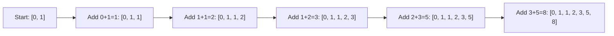

# 🔁 Iterative Fibonacci Implementation

> [!NOTE]
> The iterative approach to Fibonacci is significantly more efficient than the naive recursive approach.

## Iterative vs. Recursive Thinking 🤔

While recursion elegantly captures the mathematical definition of Fibonacci, **iteration** (using loops) offers a more efficient way to calculate the sequence.

## The Iterative Approach for Fibonacci 🧩

Instead of making recursive calls, we can use a loop to build the sequence from the bottom up:

1. Initialize the first two Fibonacci numbers (0 and 1)
2. In each iteration, calculate the next number by adding the previous two
3. Continue until we have generated n numbers

## Visualizing the Iterative Process 📊



Notice how we only calculate each number once, building the sequence step by step! 👍

## Implementing the Iterative Algorithm 💻

Here's a clean implementation of the iterative approach:

```python
def fibonacci_sequence(n):
    if n <= 0:
        return []
    if n == 1:
        return [0]
    
    sequence = [0, 1]
    while len(sequence) < n:
        sequence.append(sequence[-1] + sequence[-2])
    return sequence
```

## The Power of Iteration ⚡

<details>
<summary>Performance Advantages</summary>

The iterative approach has a time complexity of O(n), which is dramatically better than the O(2^n) of naive recursion.

This means we can efficiently calculate much larger Fibonacci sequences. For example, calculating the first 1000 Fibonacci numbers is quick and practical with the iterative approach!
</details>

## Space Efficiency Bonus 📦

If we only need to calculate the nth Fibonacci number (not the entire sequence), we can optimize even further:

```python
def fibonacci_number(n):
    if n <= 0:
        return 0
    if n == 1:
        return 1
    
    a, b = 0, 1
    for _ in range(2, n+1):
        a, b = b, a + b
    return b
```

> [!TIP]
> Notice how this version only uses two variables (a and b), giving it O(1) space complexity!

## 🧠 Think About...

Consider these questions:
1. Try tracing through the execution of `fibonacci_sequence(6)` step by step.
2. How much more efficient is the iterative approach compared to the recursive one? Think about both time and space efficiency.
3. Can you think of any disadvantages the iterative approach might have compared to the recursive one?

In the next lesson, we'll explore advanced techniques for optimizing Fibonacci calculations even further! 