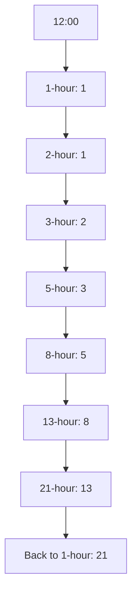

# 🌍 Fibonacci in the Wild

> [!NOTE]
> The Fibonacci sequence isn't just a mathematical curiosity—it appears throughout nature, art, architecture, and many fields of science!

## Fibonacci in Nature 🌱

The Fibonacci sequence appears with remarkable frequency in the natural world:

### 1. Plant Growth 🌻

Many plants exhibit Fibonacci patterns in their growth:
- The number of petals on flowers often follows the Fibonacci sequence (3, 5, 8, 13, 21, 34...)
- Sunflower seeds form spiral patterns based on Fibonacci numbers
- Pine cones, pineapples, and cauliflower all display Fibonacci spirals

### 2. Animal Features 🐚

- Nautilus shells grow in a logarithmic spiral closely related to the golden ratio
- The family tree of honeybees follows Fibonacci patterns
- Some animal populations grow according to Fibonacci-like sequences

## Fibonacci in Design and Art 🎨

### 1. The Golden Ratio in Architecture

The golden ratio (approximately 1.618, derived from Fibonacci numbers) has been used in architecture for its pleasing proportions:
- The Parthenon in Athens
- The Great Pyramid of Giza
- Renaissance paintings and sculptures

### 2. Modern Design

The sequence influences contemporary design:
- Web layout and user interfaces
- Typography and spacing
- Photography composition (the "rule of thirds" is an approximation of golden ratio principles)

## Fibonacci in Computer Science 💻

### 1. Algorithm Analysis

- Used as a benchmark for evaluating recursive algorithms
- Illustrates concepts like dynamic programming and memoization
- Demonstrates time-space tradeoffs

### 2. Data Structures

- Fibonacci heaps are advanced data structures used in graph algorithms
- Fibonacci search is a technique for searching sorted arrays

## Financial Applications 📈

Fibonacci in Trading

In technical analysis of financial markets:
- Fibonacci retracement levels (23.6%, 38.2%, 61.8%, etc.) are used to identify potential support and resistance levels
- Fibonacci extensions help determine price targets
- Fibonacci time zones attempt to predict when price changes might occur

## Music and Acoustics 🎵

The Fibonacci sequence appears in:
- Musical scales and chord progressions
- Placement of frets on string instruments
- The structure of some famous compositions

## Practical Example: Fibonacci Clock ⏰

Imagine a clock that runs on Fibonacci timing—each hour would be a Fibonacci number of minutes!

## 🧠 Think About...

Consider these questions:
1. Why do you think Fibonacci patterns appear so frequently in nature?
2. Can you identify any Fibonacci patterns in your everyday environment?
3. How might understanding Fibonacci sequences improve your approach to design or problem-solving?

In our final lesson, we'll summarize what we've learned and provide guidance for further exploration of this fascinating mathematical sequence! 