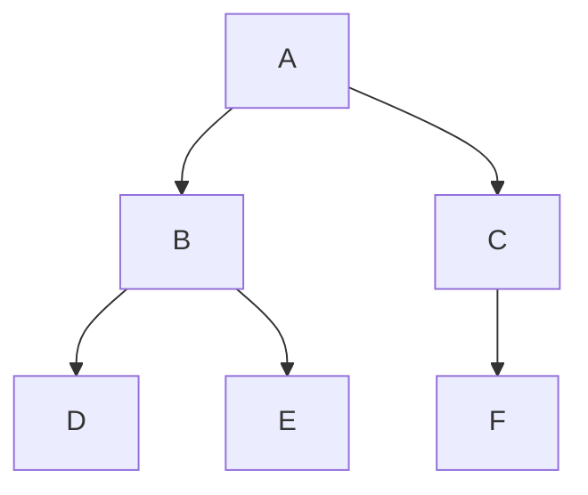

# 🔍 Breadth-First Search: A Level-by-Level Exploration

> [!NOTE]
> Breadth-First Search (BFS) is a fundamental graph traversal algorithm that explores a graph layer by layer, visiting all neighbors of a node before moving to the next level.

## 🌟 The Problem

Imagine you're standing at the entrance of a maze. You want to find your way through it in the most efficient manner possible. How would you explore it?

One approach would be to first check all the paths immediately accessible from your current position, then move on to explore the paths one step further, and so on. This is exactly what BFS does - it explores all neighbors at the current depth before moving to the next level of depth.

In computer science, we define the BFS problem as:

> Given a graph and a starting vertex, visit all reachable vertices in a level-by-level manner, where vertices at the same level (same distance from the start) are visited before moving to the next level.

## 📊 Graph Representation

Before diving into BFS, let's understand how we represent a graph:

```
{
    'A': ['B', 'C'],
    'B': ['D', 'E'],
    'C': ['F'],
    'D': [],
    'E': [],
    'F': []
}
```

This is called an **adjacency list** representation, where:
- Each key represents a vertex in the graph
- The corresponding value is an array of all adjacent vertices (neighbors)

<details>
<summary>Visual representation of this graph</summary>



</details>

## 🎯 Goal of BFS

The goal of BFS is to visit all the vertices reachable from a starting vertex, level by level.

For example, if we start BFS from vertex 'A' in the graph above:
1. First, we visit 'A'
2. Then, we visit all neighbors of 'A': 'B' and 'C'
3. Finally, we visit all unvisited neighbors of 'B' and 'C': 'D', 'E', and 'F'

The output would be: `A B C D E F`

## 🤔 Why Is BFS Important?

BFS helps us solve many important problems:

- Finding the shortest path in unweighted graphs
- Testing if a graph is bipartite
- Finding all connected components
- Solving puzzles like the "Shortest path to solve Rubik's cube"
- Social network features like "People you may know within 2 connections"

> [!TIP]
> Always remember the key property of BFS: it guarantees that the first time we reach a node is the shortest possible path from the starting node in terms of the number of edges.

## ❓ Questions to Consider

As we explore the BFS algorithm in depth, think about:

1. How would you systematically explore a graph level by level?
2. What data structure would be most suitable for this type of traversal?
3. How would you avoid revisiting vertices in a graph with cycles?

In the next sections, we'll build up our understanding step by step and implement a complete BFS algorithm! 