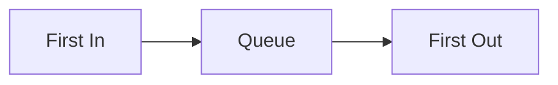

# 🧰 The Tools We Need: Data Structures for BFS

To implement BFS effectively, we need the right tools for the job. Let's explore the essential data structures that make BFS work.

## 🔄 Queue: The Heart of BFS

> [!NOTE]
> A **queue** is a First-In-First-Out (FIFO) data structure that allows us to process elements in the order they were added.

The queue is the most critical data structure for BFS. It's what gives the algorithm its "breadth-first" property:



### How the Queue Works in BFS:

1. We start by adding the starting vertex to the queue
2. We remove the first vertex from the queue and process it
3. We add all unvisited neighbors of that vertex to the queue
4. We repeat steps 2-3 until the queue is empty

This FIFO behavior ensures we explore all vertices at the current level before moving to the next level.

> [!TIP]
> Think of the queue like a waiting line - the first person to join the line is the first one to be served.

<details>
<summary>Queue Operations Visualization</summary>

```
Starting Queue: [A]

Step 1: Remove A, Process A
Queue after: []
Neighbors of A: B, C
Add unvisited neighbors: B, C
Queue after: [B, C]

Step 2: Remove B, Process B
Queue after: [C]
Neighbors of B: D, E
Add unvisited neighbors: D, E
Queue after: [C, D, E]

Step 3: Remove C, Process C
Queue after: [D, E]
Neighbors of C: F
Add unvisited neighbors: F
Queue after: [D, E, F]

...and so on
```
</details>

## 🚫 Visited Set: Avoiding Infinite Loops

In graphs with cycles, we need to keep track of vertices we've already visited to avoid processing them multiple times.

> [!WARNING]
> Without tracking visited vertices, BFS could enter an infinite loop when processing cycles in the graph!

A **Set** is perfect for this purpose because:
- It allows us to check if an element exists in constant time O(1)
- It ensures each vertex is only processed once

### How the Visited Set Works in BFS:

1. We start with an empty set
2. When we encounter a vertex, we add it to the set
3. Before processing a neighbor, we check if it's already in the set
4. If it's not in the set, we process it; otherwise, we skip it

```javascript
// Example of using a visited set in JavaScript
const visited = new Set();
visited.add('A');
// Later in code...
if (!visited.has('B')) {
    // Process 'B'
    visited.add('B');
}
```

## 📊 Result Array: Tracking the Traversal Order

To capture the order in which vertices are visited during BFS, we use an array:

1. We start with an empty array
2. Each time we process a vertex, we add it to the array
3. By the end of the algorithm, the array contains all vertices in the order they were visited

```javascript
// Example tracking result in JavaScript
const result = [];
result.push('A');  // First vertex visited
result.push('B');  // Second vertex visited
// and so on...
```

## 🤔 Why These Data Structures?

Each data structure serves a specific purpose:
- **Queue**: Ensures level-by-level exploration (breadth-first property)
- **Visited Set**: Prevents infinite loops and redundant processing
- **Result Array**: Records the traversal order

> [!TIP]
> Understanding these data structures is key to implementing BFS correctly. Consider how each contributes to the algorithm's behavior and effectiveness.

## ❓ Questions to Consider

1. What would happen if we used a stack instead of a queue? How would the traversal change?
2. Can you think of alternative ways to track visited vertices besides using a set?
3. How might the space complexity of BFS be affected by the structure of the graph?

In the next section, we'll start building our BFS algorithm step by step! 