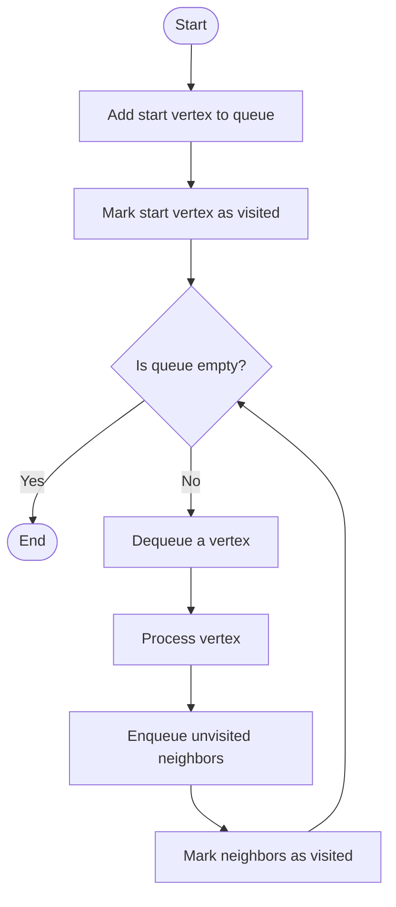

# 🧠 The BFS Algorithm: Breaking It Down

Now that we understand the problem and our essential data structures, let's walk through the BFS algorithm step by step.

## 📝 The Basic Algorithm

Here's a high-level overview of BFS:

1. Initialize a queue with the starting vertex
2. Mark the starting vertex as visited
3. While the queue is not empty:
   - Dequeue a vertex
   - Process the vertex (add to result)
   - Enqueue all unvisited neighbors and mark them as visited

Let's break this down further with a detailed walkthrough:

## 🔍 Detailed Step-by-Step Walkthrough

### Step 1: Initialization 🚀

```javascript
function bfs(graph, start) {
  // Initialize result array to track order of traversal
  const result = [];
  
  // Initialize set to keep track of visited vertices
  const visited = new Set();
  
  // Initialize queue with starting vertex
  const queue = [start];
  
  // Mark the starting vertex as visited
  visited.add(start);
  
  // Continue with BFS...
}
```

> [!NOTE]
> During initialization, we set up our data structures and add the starting point to both the queue and the visited set.

### Step 2: Main Loop Processing 🔄

```javascript
// While the queue is not empty
while (queue.length > 0) {
  // Dequeue the first vertex
  const currentVertex = queue.shift();
  
  // Process the vertex (add to result)
  result.push(currentVertex);
  
  // ... (continue with neighbor processing)
}
```

> [!TIP]
> The `shift()` method removes and returns the first element of an array, simulating a queue's dequeue operation. This ensures we process vertices in the order they were discovered.

### Step 3: Neighbor Processing 👥

```javascript
// Get the neighbors of the current vertex
const neighbors = graph[currentVertex] || [];

// For each neighbor
for (const neighbor of neighbors) {
  // If the neighbor hasn't been visited
  if (!visited.has(neighbor)) {
    // Add to queue and mark as visited
    queue.push(neighbor);
    visited.add(neighbor);
  }
}
```

> [!WARNING]
> Always check if a neighbor is already visited before adding it to the queue! Without this check, you might process vertices multiple times and potentially create an infinite loop in graphs with cycles.

### Step 4: Return Result 🏁

```javascript
// Return the traversal order
return result;
```

## 🎬 Visual Example Walkthrough

Let's trace through the algorithm with our example graph:

```
Graph:
{
  'A': ['B', 'C'],
  'B': ['D', 'E'],
  'C': ['F'],
  'D': [],
  'E': [],
  'F': []
}
```

<details>
<summary>Detailed Execution Trace</summary>

```
Initialization:
- Queue: ['A']
- Visited: {'A'}
- Result: []

Iteration 1:
- Dequeue: 'A'
- Process: 'A'
- Result: ['A']
- Neighbors of 'A': ['B', 'C']
- Enqueue unvisited: 'B', 'C'
- Queue: ['B', 'C']
- Visited: {'A', 'B', 'C'}

Iteration 2:
- Dequeue: 'B'
- Process: 'B'
- Result: ['A', 'B']
- Neighbors of 'B': ['D', 'E']
- Enqueue unvisited: 'D', 'E'
- Queue: ['C', 'D', 'E']
- Visited: {'A', 'B', 'C', 'D', 'E'}

Iteration 3:
- Dequeue: 'C'
- Process: 'C'
- Result: ['A', 'B', 'C']
- Neighbors of 'C': ['F']
- Enqueue unvisited: 'F'
- Queue: ['D', 'E', 'F']
- Visited: {'A', 'B', 'C', 'D', 'E', 'F'}

Iteration 4:
- Dequeue: 'D'
- Process: 'D'
- Result: ['A', 'B', 'C', 'D']
- Neighbors of 'D': []
- No unvisited neighbors to enqueue
- Queue: ['E', 'F']
- Visited: {'A', 'B', 'C', 'D', 'E', 'F'}

Iteration 5:
- Dequeue: 'E'
- Process: 'E'
- Result: ['A', 'B', 'C', 'D', 'E']
- Neighbors of 'E': []
- No unvisited neighbors to enqueue
- Queue: ['F']
- Visited: {'A', 'B', 'C', 'D', 'E', 'F'}

Iteration 6:
- Dequeue: 'F'
- Process: 'F'
- Result: ['A', 'B', 'C', 'D', 'E', 'F']
- Neighbors of 'F': []
- No unvisited neighbors to enqueue
- Queue: []
- Visited: {'A', 'B', 'C', 'D', 'E', 'F'}

Queue is empty - BFS complete!
Final result: ['A', 'B', 'C', 'D', 'E', 'F']
```
</details>

## 🧩 The Complete Algorithm

Here's the complete BFS algorithm, putting all the pieces together:

```javascript
function bfs(graph, start) {
  // Initialize data structures
  const result = [];
  const visited = new Set();
  const queue = [start];
  
  // Mark the starting vertex as visited
  visited.add(start);
  
  // Main BFS loop
  while (queue.length > 0) {
    // Dequeue a vertex
    const currentVertex = queue.shift();
    
    // Process the vertex
    result.push(currentVertex);
    
    // Process all neighbors
    const neighbors = graph[currentVertex] || [];
    for (const neighbor of neighbors) {
      if (!visited.has(neighbor)) {
        queue.push(neighbor);
        visited.add(neighbor);
      }
    }
  }
  
  return result;
}
```

## 🤔 Understanding the Flow

The key to understanding BFS is to visualize the flow of vertices through the queue:



> [!TIP]
> The breadth-first property comes from the queue processing vertices in the order they were discovered, ensuring level-by-level traversal.

## ❓ Questions to Consider

1. How would you modify the BFS algorithm to find the shortest path between two vertices?
2. What would happen if you marked vertices as visited only after processing them instead of before?
3. Can you think of a scenario where BFS might not be the optimal algorithm to use?

In the next section, we'll explore the implementation of BFS in different programming languages! 