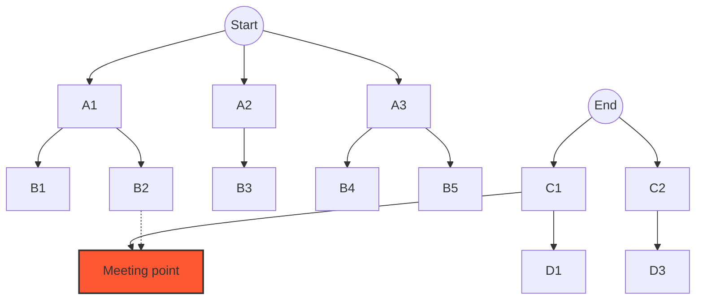

# 🚀 Real-World Applications and Variations of BFS

BFS is an incredibly versatile algorithm with numerous applications beyond simple graph traversal. Let's explore how BFS can be adapted to solve different problems and the variations that make it even more powerful.

## 🌐 Common Applications of BFS

### 1. Shortest Path Finding in Unweighted Graphs 🛣️

One of the most important applications of BFS is finding the shortest path between two vertices in an unweighted graph.

```javascript
function shortestPath(graph, start, end) {
  // Queue for BFS traversal
  const queue = [[start, [start]]];
  
  // Set to keep track of visited vertices
  const visited = new Set([start]);
  
  while (queue.length > 0) {
    // Dequeue a vertex and its path
    const [currentVertex, path] = queue.shift();
    
    // If we found the end vertex, return the path
    if (currentVertex === end) {
      return path;
    }
    
    // Get all adjacent vertices
    const neighbors = graph[currentVertex] || [];
    
    for (const neighbor of neighbors) {
      if (!visited.has(neighbor)) {
        // Mark as visited
        visited.add(neighbor);
        
        // Create a new path by appending the neighbor
        const newPath = [...path, neighbor];
        
        // Enqueue the neighbor and its path
        queue.push([neighbor, newPath]);
      }
    }
  }
  
  // No path found
  return null;
}
```

> [!NOTE]
> BFS guarantees that the first path found to any node is the shortest in terms of the number of edges.

### 2. Level-Order Traversal of Trees 🌳

BFS is perfect for level-order traversal of trees, where we visit nodes level by level from top to bottom.

```javascript
function levelOrderTraversal(root) {
  if (!root) return [];
  
  const result = [];
  const queue = [root];
  
  while (queue.length > 0) {
    const currentLevel = [];
    const levelSize = queue.length;
    
    for (let i = 0; i < levelSize; i++) {
      const node = queue.shift();
      currentLevel.push(node.val);
      
      if (node.left) queue.push(node.left);
      if (node.right) queue.push(node.right);
    }
    
    result.push(currentLevel);
  }
  
  return result;
}
```

### 3. Finding Connected Components 🧩

BFS can identify all connected components in an undirected graph:

```javascript
function findConnectedComponents(graph) {
  const vertices = Object.keys(graph);
  const visited = new Set();
  const components = [];
  
  for (const vertex of vertices) {
    if (!visited.has(vertex)) {
      // Found a new component, do BFS
      const component = [];
      const queue = [vertex];
      visited.add(vertex);
      
      while (queue.length > 0) {
        const current = queue.shift();
        component.push(current);
        
        for (const neighbor of graph[current] || []) {
          if (!visited.has(neighbor)) {
            visited.add(neighbor);
            queue.push(neighbor);
          }
        }
      }
      
      components.push(component);
    }
  }
  
  return components;
}
```

### 4. Testing Bipartiteness 🔄

BFS can check if a graph is bipartite (can be colored with two colors so that no adjacent vertices have the same color):

```javascript
function isBipartite(graph) {
  const vertices = Object.keys(graph);
  const colors = new Map(); // 0 and 1 represent two different colors
  
  for (const start of vertices) {
    if (colors.has(start)) continue;
    
    const queue = [start];
    colors.set(start, 0);
    
    while (queue.length > 0) {
      const current = queue.shift();
      const currentColor = colors.get(current);
      const neighborColor = 1 - currentColor; // Alternate between 0 and 1
      
      for (const neighbor of graph[current] || []) {
        if (!colors.has(neighbor)) {
          colors.set(neighbor, neighborColor);
          queue.push(neighbor);
        } else if (colors.get(neighbor) !== neighborColor) {
          return false; // Found adjacent vertices with the same color
        }
      }
    }
  }
  
  return true;
}
```

### 5. Word Ladder Problem 📚

The classic word ladder problem is a perfect application of BFS:

> Given two words and a dictionary, find the shortest transformation sequence from the start word to the end word, changing only one letter at a time.

<details>
<summary>Word Ladder Implementation</summary>

```javascript
function wordLadder(beginWord, endWord, wordList) {
  const wordSet = new Set(wordList);
  
  if (!wordSet.has(endWord)) return 0;
  
  const queue = [[beginWord, 1]]; // [word, level]
  const visited = new Set([beginWord]);
  
  while (queue.length > 0) {
    const [currentWord, level] = queue.shift();
    
    if (currentWord === endWord) {
      return level;
    }
    
    // Try changing each character
    for (let i = 0; i < currentWord.length; i++) {
      // Try all possible letters
      for (let charCode = 97; charCode <= 122; charCode++) {
        const char = String.fromCharCode(charCode);
        const newWord = currentWord.slice(0, i) + char + currentWord.slice(i + 1);
        
        if (wordSet.has(newWord) && !visited.has(newWord)) {
          queue.push([newWord, level + 1]);
          visited.add(newWord);
        }
      }
    }
  }
  
  return 0; // No transformation sequence found
}
```
</details>

## 🔄 Variations of BFS

### 1. Bidirectional BFS 🔄

Bidirectional BFS runs two simultaneous BFS searches: one from the start and one from the goal. It can dramatically reduce the search space:



<details>
<summary>Bidirectional BFS Implementation</summary>

```javascript
function bidirectionalBFS(graph, start, end) {
  if (start === end) return [start];
  
  // Forward and backward queues
  const forwardQueue = [[start, [start]]];
  const backwardQueue = [[end, [end]]];
  
  // Forward and backward visited sets with paths
  const forwardVisited = new Map();
  forwardVisited.set(start, [start]);
  
  const backwardVisited = new Map();
  backwardVisited.set(end, [end]);
  
  while (forwardQueue.length > 0 && backwardQueue.length > 0) {
    // Check for intersection
    let intersect = checkIntersection(forwardVisited, backwardVisited);
    if (intersect) {
      return buildPath(forwardVisited, backwardVisited, intersect);
    }
    
    // Expand forward
    bfsExpand(graph, forwardQueue, forwardVisited, backwardVisited);
    
    // Check for intersection after forward expansion
    intersect = checkIntersection(forwardVisited, backwardVisited);
    if (intersect) {
      return buildPath(forwardVisited, backwardVisited, intersect);
    }
    
    // Expand backward
    bfsExpand(graph, backwardQueue, backwardVisited, forwardVisited);
  }
  
  return null; // No path found
}

function bfsExpand(graph, queue, visited, otherVisited) {
  const [currentVertex, path] = queue.shift();
  
  const neighbors = graph[currentVertex] || [];
  for (const neighbor of neighbors) {
    if (!visited.has(neighbor)) {
      const newPath = [...path, neighbor];
      visited.set(neighbor, newPath);
      queue.push([neighbor, newPath]);
    }
  }
}

function checkIntersection(visitedA, visitedB) {
  for (const vertex of visitedA.keys()) {
    if (visitedB.has(vertex)) {
      return vertex; // Found an intersection
    }
  }
  return null;
}

function buildPath(forwardVisited, backwardVisited, intersect) {
  const forwardPath = forwardVisited.get(intersect);
  const backwardPath = backwardVisited.get(intersect);
  
  // Remove the duplicate intersection point
  const reversedBackwardPath = backwardPath.slice(0, -1).reverse();
  
  return [...forwardPath, ...reversedBackwardPath];
}
```
</details>

> [!TIP]
> Bidirectional BFS can significantly reduce the search space in sparse graphs, especially when the branching factor is high.

### 2. Multi-Source BFS 🌐

Multi-source BFS starts the traversal from multiple vertices simultaneously:

<details>
<summary>Multi-Source BFS Implementation</summary>

```javascript
function multiSourceBFS(graph, sources) {
  const result = [];
  const visited = new Set(sources);
  const queue = [...sources];
  
  while (queue.length > 0) {
    const currentVertex = queue.shift();
    result.push(currentVertex);
    
    const neighbors = graph[currentVertex] || [];
    for (const neighbor of neighbors) {
      if (!visited.has(neighbor)) {
        visited.add(neighbor);
        queue.push(neighbor);
      }
    }
  }
  
  return result;
}
```
</details>

This is useful for problems like:
- Finding the shortest distance from any cell in a grid to the nearest target
- Computing the minimum distance to the nearest exit in a maze

### 3. 0-1 BFS 🔢

For graphs with edge weights of only 0 or 1, a modified BFS using a deque (double-ended queue) can find the shortest path:

<details>
<summary>0-1 BFS Implementation</summary>

```javascript
function zeroOneBFS(graph, start, end) {
  // Distance map
  const dist = new Map();
  const vertices = Object.keys(graph);
  
  // Initialize distances
  for (const vertex of vertices) {
    dist.set(vertex, Infinity);
  }
  dist.set(start, 0);
  
  // Deque for 0-1 BFS
  const deque = [start];
  
  while (deque.length > 0) {
    const currentVertex = deque.shift();
    
    for (const [neighbor, weight] of graph[currentVertex] || []) {
      // Relaxation
      if (dist.get(currentVertex) + weight < dist.get(neighbor)) {
        dist.set(neighbor, dist.get(currentVertex) + weight);
        
        // Add to front if weight is 0, to back if weight is 1
        if (weight === 0) {
          deque.unshift(neighbor);
        } else {
          deque.push(neighbor);
        }
      }
    }
  }
  
  return dist.get(end);
}
```
</details>

### 4. BFS with Distance Tracking 📏

BFS can be modified to track the distance from the start vertex:

```javascript
function bfsWithDistance(graph, start) {
  const distances = new Map();
  const queue = [start];
  
  // Initialize distances
  distances.set(start, 0);
  
  while (queue.length > 0) {
    const currentVertex = queue.shift();
    const currentDistance = distances.get(currentVertex);
    
    const neighbors = graph[currentVertex] || [];
    for (const neighbor of neighbors) {
      if (!distances.has(neighbor)) {
        distances.set(neighbor, currentDistance + 1);
        queue.push(neighbor);
      }
    }
  }
  
  return distances;
}
```

## 🌟 When to Use BFS vs Other Algorithms

| Algorithm | Best For | Not Ideal For |
| --- | --- | --- |
| BFS | - Shortest path in unweighted graphs<br>- Level-order traversal<br>- Finding connected components | - Weighted graphs<br>- Deep graphs with limited breadth |
| DFS | - Path finding<br>- Topological sorting<br>- Cycle detection | - Shortest paths<br>- Level-based operations |
| Dijkstra's | - Shortest path in weighted graphs | - Negative weights<br>- Simple unweighted graphs |
| A* | - Informed search with heuristic<br>- Path finding in games | - When heuristic isn't available |

> [!TIP]
> BFS shines when exploring a graph level by level is important or when finding the shortest path in terms of number of edges.

## ❓ Questions to Consider

1. How would you modify BFS to find all shortest paths between two vertices instead of just one?
2. Can you think of a real-world problem in your field that could be solved using BFS?
3. What are the trade-offs between using bidirectional BFS versus standard BFS?

In the next section, we'll look at performance considerations and optimizations for BFS! 