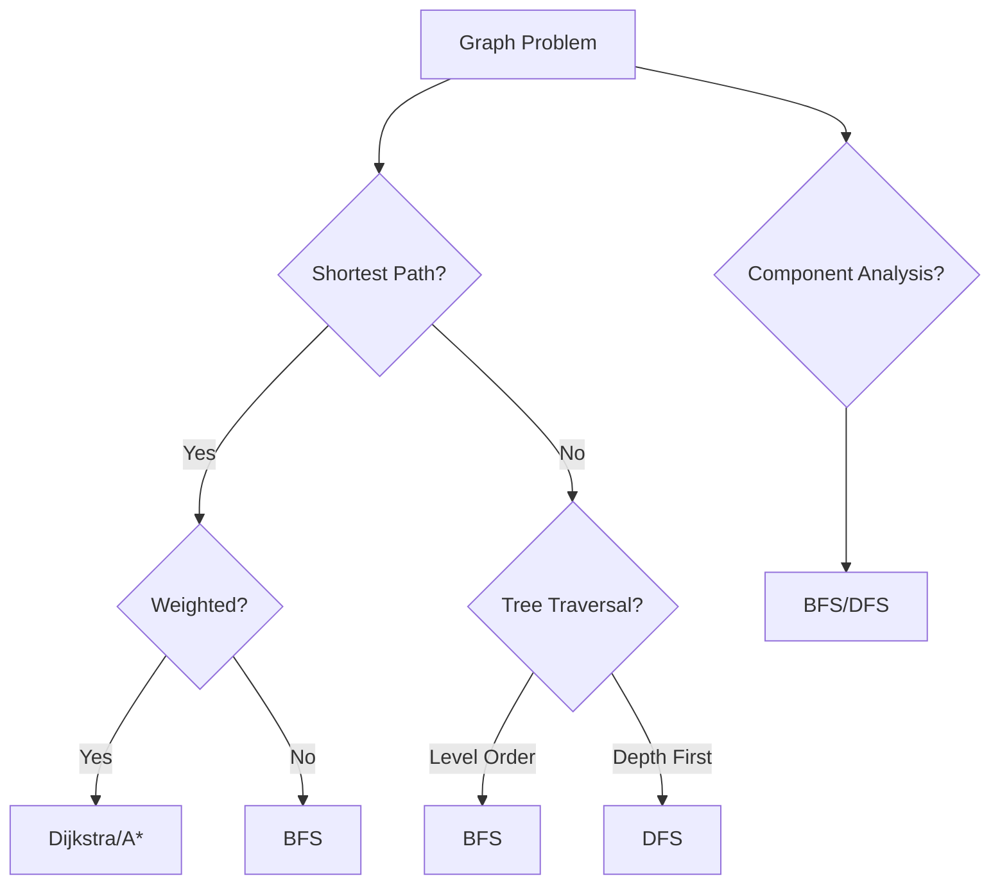

# 🏁 Mastering BFS: Conclusion and Next Steps

Congratulations on completing this comprehensive guide to Breadth-First Search! Let's recap what we've learned and explore where to go from here.

## 📝 Summary of BFS

Breadth-First Search is a fundamental graph traversal algorithm that explores a graph level by level, starting from a source vertex and gradually exploring outward. Here's a quick recap of the key aspects we've covered:

### Core Components
- **Queue**: The heart of BFS, ensuring level-by-level traversal
- **Visited Set**: Prevents revisiting vertices and infinite loops
- **Result Array**: Tracks the traversal order

### Key Properties
- **Time Complexity**: O(V + E)
- **Space Complexity**: O(V)
- **Level-by-Level Exploration**: Guarantees shortest paths in unweighted graphs

### Applications
- Finding shortest paths in unweighted graphs
- Level-order traversal of trees
- Finding connected components
- Testing bipartiteness
- And many more real-world applications

## 🧩 BFS in the Algorithmic Toolkit

BFS is a versatile algorithm that fits into a broader context of graph algorithms. Understanding when to use BFS versus other algorithms is a key skill:

## 🎯 Key Takeaways

1. **Conceptual Understanding**: BFS is all about exploring a graph layer by layer, which is perfect for shortest path problems in unweighted graphs.

2. **Implementation Mastery**: The core BFS algorithm is relatively simple, but variations and optimizations can significantly enhance its utility and performance.

3. **Problem-Solving Approach**: 
   - Identify if a problem requires level-by-level exploration
   - Determine if finding the shortest path is a requirement
   - Consider whether visiting all reachable vertices is necessary

4. **Practical Applications**: BFS is not just a theoretical concept but a practical tool with numerous real-world applications across different domains.

## 🚀 Going Beyond Basic BFS

Now that you've mastered the fundamentals of BFS, here are some directions to explore:

### Advanced Algorithms Building on BFS

1. **Dijkstra's Algorithm**: Extends BFS to handle weighted graphs
2. **A* Search**: Combines BFS with heuristics for more efficient path finding
3. **Bidirectional Search**: Runs BFS from both start and goal to find paths more efficiently
4. **Multi-Source BFS**: Starts from multiple sources simultaneously

### Related Graph Algorithms

1. **Depth-First Search (DFS)**: Explores as far as possible along each branch before backtracking
2. **Topological Sort**: Orders vertices such that all directed edges go from earlier to later vertices
3. **Strongly Connected Components**: Finds maximal strongly connected subgraphs

## 📚 Further Learning Resources

> [!TIP]
> The best way to master BFS is through practice and application!

### Interactive Visualizations
- [VisuAlgo - BFS & DFS](https://visualgo.net/en/dfsbfs)
- [University of San Francisco CS Visualization](https://www.cs.usfca.edu/~galles/visualization/BFS.html)

### Practice Problems
- [LeetCode Graph Problems](https://leetcode.com/tag/breadth-first-search/)
- [HackerRank BFS: Shortest Reach](https://www.hackerrank.com/challenges/bfsshortreach)
- [CodeForces Graph Problems](https://codeforces.com/problemset?tags=bfs)

### Books and Articles
- "Introduction to Algorithms" by Cormen, Leiserson, Rivest, and Stein
- "Algorithms" by Robert Sedgewick and Kevin Wayne
- "Algorithm Design Manual" by Steven Skiena

### Online Courses
- [Stanford Algorithms Specialization (Coursera)](https://www.coursera.org/specializations/algorithms)
- [Princeton Algorithms, Part I & II (Coursera)](https://www.coursera.org/learn/algorithms-part1)
- [MIT Introduction to Algorithms (OCW)](https://ocw.mit.edu/courses/electrical-engineering-and-computer-science/6-006-introduction-to-algorithms-fall-2011/)

## 🔄 From Theory to Practice

The true power of understanding BFS comes when you can apply it to solve real problems. Here are some practical projects to try:

1. **Social Network Analysis**: Implement "degrees of separation" in a social graph
2. **Game Development**: Create a pathfinding algorithm for a 2D maze game
3. **Web Crawler**: Build a simple web crawler that explores websites breadth-first
4. **Recommendation System**: Develop a "people you may know" feature using BFS

## 🤔 Final Reflections

As you continue your algorithmic journey, remember that BFS is just one tool in a larger toolkit. The key is understanding not just how to implement these algorithms, but when and why to use them.

> [!NOTE]
> Graph algorithms like BFS form the backbone of countless applications, from Google Maps to Facebook's friend suggestions to Amazon's product recommendations.

## ❓ Challenge Questions

Before we conclude, here are some challenging questions to test your understanding:

1. How would you modify BFS to find all paths between two vertices, not just the shortest one?
2. Can you design an algorithm that combines aspects of both BFS and DFS?
3. How would you implement BFS in a distributed system where the graph is too large to fit in the memory of a single machine?

---

Thank you for exploring Breadth-First Search with us! We hope this guide has deepened your understanding and equipped you with the knowledge to apply BFS confidently in your projects and problem-solving endeavors.

Happy coding! 🚀 