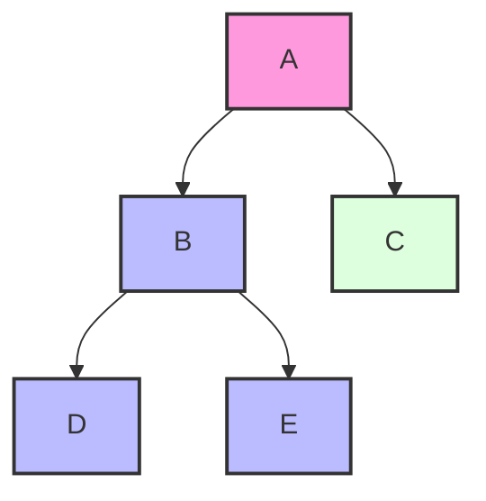

# 🧭 Navigating the Depths of a Graph

> [!NOTE]
> In this lesson, we'll explore what graph traversal is and why Depth-First Search (DFS) is a powerful solution.

## What is a Graph? 🔍

A graph is a collection of **nodes** (or vertices) connected by **edges**. Graphs are incredibly versatile data structures that can represent various real-world scenarios:

- 🗺️ Road networks with cities as nodes and roads as edges
- 👥 Social networks with people as nodes and friendships as edges
- 🌐 Web pages with pages as nodes and hyperlinks as edges
- 🧩 Game states with positions as nodes and moves as edges

## The Graph Traversal Challenge 🎯

**The Problem**: Given a graph and a starting point, how do we systematically visit every node that is reachable from our starting point?

This seemingly simple question is actually foundational to solving many complex problems in computer science and beyond.

## Graph Representation: Adjacency List 📋

Before we dive into the traversal, let's understand how we'll represent our graph. One common and efficient way is using an **adjacency list**:

```python
graph = {
    'A': ['B', 'C'],
    'B': ['D', 'E'],
    'C': [],
    'D': [],
    'E': []
}
```

In this representation:
- Each key is a node in our graph
- The value is a list of all neighboring nodes (connected by edges)

## What is Depth-First Search? 🚀

Depth-First Search is a traversal algorithm that, as the name suggests, explores a graph by going as deep as possible along each branch before backtracking.

Think of it like exploring a maze with this strategy: "At each intersection, pick a path and follow it until you either reach a dead end or a previously visited intersection, then backtrack to the most recent intersection with an unexplored path."

> [!TIP]
> Imagine yourself exploring a cave system with a piece of string. You keep following tunnels as deep as possible, marking your path with the string. When you hit a dead end, you follow the string back until you find a junction with an unexplored tunnel.

## Why DFS? 💡

DFS is particularly useful for:
- Finding paths between two nodes
- Detecting cycles in a graph
- Topological sorting of nodes
- Solving puzzles and games
- Mapping networks

## Visual Preview

Let's visualize how DFS traverses a simple graph:



**Question to ponder**: 🤔 If we start at node A, in what order will DFS visit the other nodes?

In the next lesson, we'll start breaking down how DFS works step by step. 