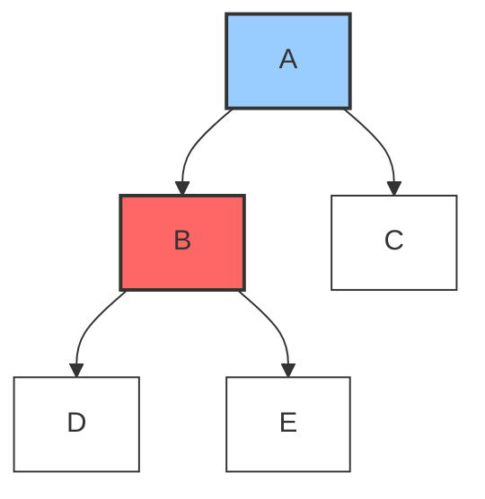

# 🧠 Key Principles of Depth-First Search

## The Fundamental Idea 💡

At its heart, DFS employs a simple but powerful principle:

> [!NOTE]
> **The DFS Principle**: Go as deep as possible along a path before exploring alternatives.

This "depth-first" approach gives the algorithm its name and distinctive behavior.

## Core Components 🧩

For our DFS implementation, we'll need to keep track of a few essential elements:

1. **Graph Structure** 🕸️ - The network of nodes and connections we want to explore
2. **Starting Node** 🏁 - Where our exploration begins
3. **Visited Nodes** ✓ - Keeping track of nodes we've already explored (to avoid cycles)
4. **Result Order** 📋 - Recording the sequence of our node visits

## The Key Mechanisms 🔧

### 1. Tracking Visited Nodes ✅

One of the most critical aspects of graph traversal is avoiding infinite loops. In a graph with cycles, we could end up revisiting the same nodes forever!

```python
# We'll use a set for O(1) lookups
visited = set()
```

> [!WARNING]
> Forgetting to track visited nodes is the most common mistake in graph traversal algorithms! This can lead to infinite loops in graphs with cycles.

### 2. Depth Management 📏

DFS manages depth in one of two ways:

<details>
<summary>Recursive Approach (Using the Call Stack)</summary>

```python
def dfs_helper(node):
    visited.add(node)
    result.append(node)
    
    for neighbor in graph[node]:
        if neighbor not in visited:
            dfs_helper(neighbor)  # Deeper we go!
```

Each recursive call adds a new layer to the function call stack, automatically tracking our depth.
</details>

<details>
<summary>Iterative Approach (Using an Explicit Stack)</summary>

```python
stack = [start_node]
while stack:
    node = stack.pop()  # Last in, first out!
    if node not in visited:
        visited.add(node)
        result.append(node)
        for neighbor in reversed(graph[node]):  # Add in reverse to maintain order
            if neighbor not in visited:
                stack.append(neighbor)
```

Here, we explicitly manage a stack data structure that mimics the function call stack.
</details>

## Mental Model: The Explorer Analogy 🧗‍♀️

Imagine you're exploring a cave system:

1. You start at an entrance (the start node)
2. You mark the entrance as "visited" (perhaps with chalk)
3. You see multiple tunnels ahead and choose one
4. You go as deep as you can down that tunnel until:
   - You hit a dead end, or
   - You encounter a section you've already marked
5. When you can't go further, you backtrack to the most recent junction with unexplored tunnels
6. If there are no unexplored tunnels left, you've completed your exploration!



> [!TIP]
> The recursive approach naturally mimics the way humans tend to explore - going deeper until forced to backtrack.

## The Stack: Heart of DFS 📚

Whether explicitly (in iterative implementation) or implicitly (in recursive implementation), a **stack** is the core data structure that powers DFS.

- Last-In-First-Out (LIFO) principle
- Perfect for tracking the most recent unexplored paths
- Naturally supports the backtracking behavior DFS requires

## Think About It 🤔

**Question**: Why does DFS use a stack rather than a queue?

<details>
<summary>Hint</summary>

Think about what happens when you add multiple items to a stack and then remove them. How does this ordering help us explore deeply before broadly?
</details>

<details>
<summary>Answer</summary>

A stack's "Last-In-First-Out" nature ensures that we fully explore the most recently discovered paths before moving to alternatives. This creates the depth-first behavior, as opposed to the breadth-first behavior we'd get with a queue.
</details>

In the next lesson, we'll visualize the step-by-step process of how DFS traverses a graph! 