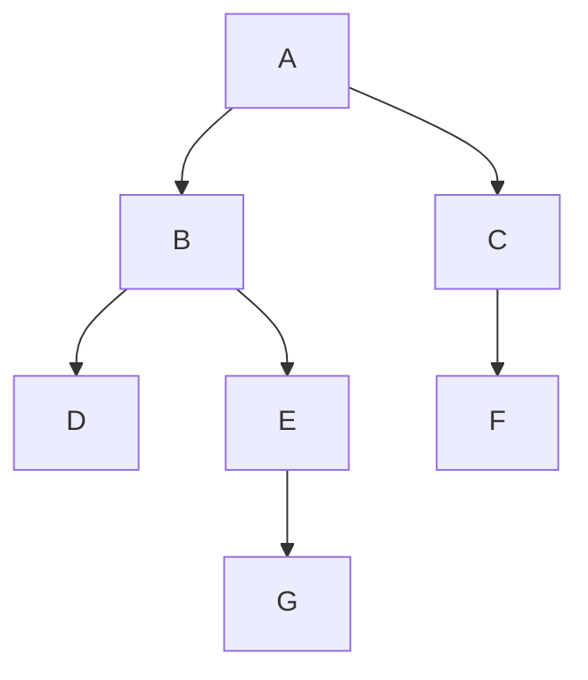
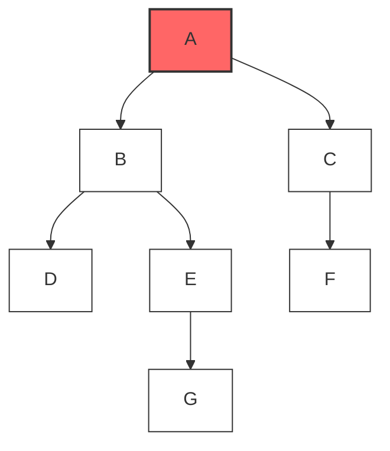
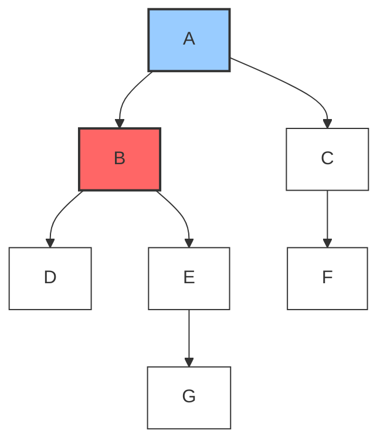
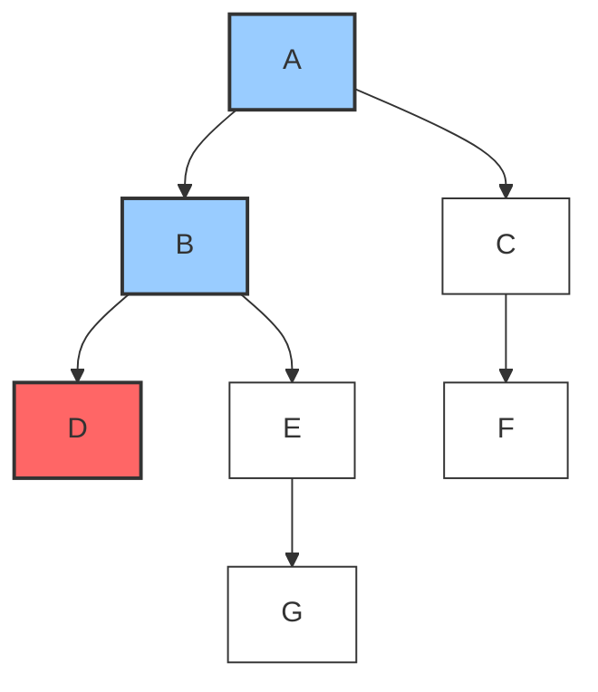
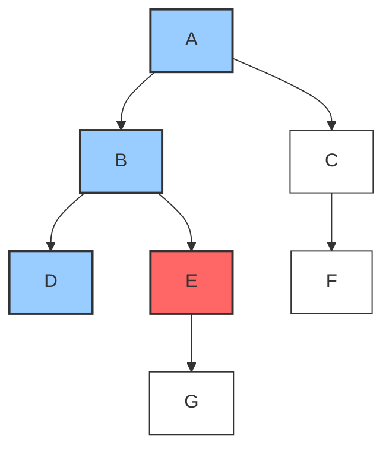
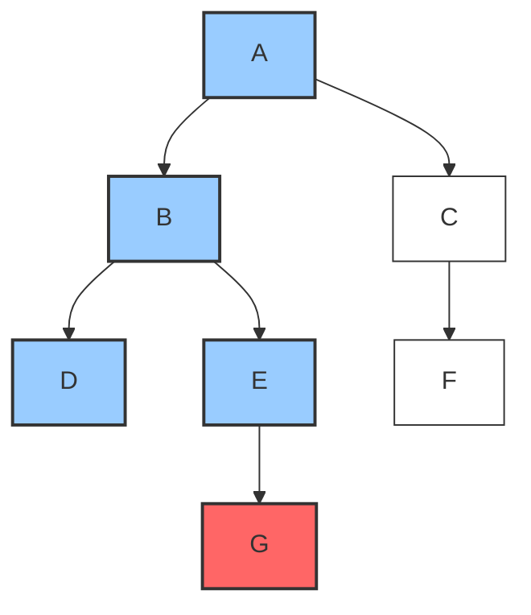
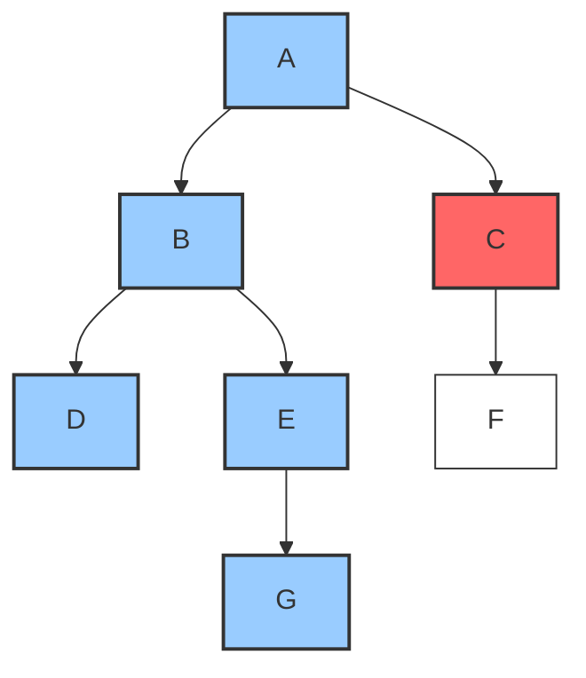
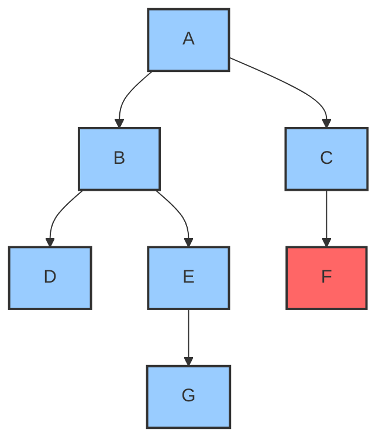
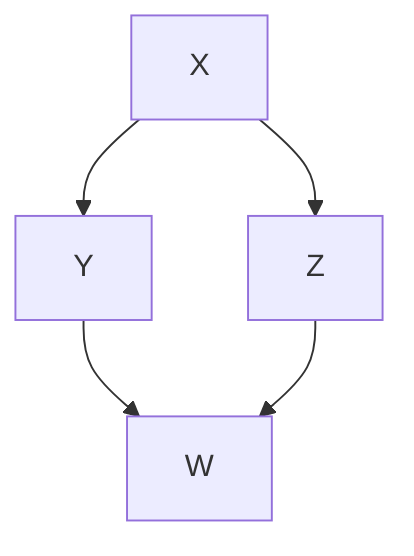

# 👁️ Seeing DFS in Action

In this lesson, we'll walk through a step-by-step visualization of DFS on a simple graph. This visual approach will help solidify your understanding of how the algorithm works.

## Our Example Graph 🕸️

Let's work with this simple graph:



And here's how it looks as an adjacency list:

```python
graph = {
    'A': ['B', 'C'],
    'B': ['D', 'E'],
    'C': ['F'],
    'D': [],
    'E': ['G'],
    'F': [],
    'G': []
}
```

## The DFS Journey: Step by Step 🚶‍♂️

Let's start our DFS traversal from node `A` and trace through each step:

### Step 1: Starting at A 🏁



- We mark `A` as visited
- Add `A` to our result: `[A]`
- Explore `A`'s neighbors: `B` and `C`

### Step 2: Going Deeper to B 🧗‍♂️



- We mark `B` as visited
- Add `B` to our result: `[A, B]`
- Explore `B`'s neighbors: `D` and `E`

### Step 3: Going Even Deeper to D 📉



- We mark `D` as visited
- Add `D` to our result: `[A, B, D]`
- `D` has no neighbors, so we've reached a dead end!

### Step 4: Backtracking to B's Other Neighbor - E 🔙



- We mark `E` as visited
- Add `E` to our result: `[A, B, D, E]`
- Explore `E`'s neighbors: `G`

### Step 5: Continuing Down to G 📉



- We mark `G` as visited
- Add `G` to our result: `[A, B, D, E, G]`
- `G` has no neighbors, so we've reached another dead end!

### Step 6: All of B's Paths Explored, Backtrack to A's Other Neighbor - C 🔙



- We mark `C` as visited
- Add `C` to our result: `[A, B, D, E, G, C]`
- Explore `C`'s neighbors: `F`

### Step 7: Final Exploration to F 🏁



- We mark `F` as visited
- Add `F` to our result: `[A, B, D, E, G, C, F]`
- `F` has no neighbors, so we've reached our final dead end!

### Complete Traversal 🎉

With no more nodes to explore, our DFS traversal is complete!

Final visit order: `A, B, D, E, G, C, F`

> [!TIP]
> Notice how DFS always goes as deep as possible before backtracking. We completely explored the A → B → D/E → G path before coming back to explore the A → C → F path.

## Tracing Through the Call Stack (Recursive Version) 📚

Let's trace through what the call stack would look like in the recursive implementation:

```
dfs(A)
  mark A as visited
  add A to result
  
  dfs(B)  // First neighbor of A
    mark B as visited
    add B to result
    
    dfs(D)  // First neighbor of B
      mark D as visited
      add D to result
      // D has no neighbors, so return
      
    dfs(E)  // Second neighbor of B
      mark E as visited
      add E to result
      
      dfs(G)  // Neighbor of E
        mark G as visited
        add G to result
        // G has no neighbors, so return
        
      // E's neighbors all explored, so return
      
    // B's neighbors all explored, so return
    
  dfs(C)  // Second neighbor of A
    mark C as visited
    add C to result
    
    dfs(F)  // Neighbor of C
      mark F as visited
      add F to result
      // F has no neighbors, so return
      
    // C's neighbors all explored, so return
    
  // A's neighbors all explored, so return
```

## Try It Yourself! 🧪

**Challenge**: What would the visit order be for this graph if we started at node 'X'?



<details>
<summary>Solution</summary>

If we start at 'X', the DFS visit order would be: `X, Y, W, Z`

Explanation:
1. We start at 'X', mark it visited
2. Go to 'Y' (first neighbor), mark it visited
3. Go to 'W' (neighbor of 'Y'), mark it visited
4. 'W' has no unvisited neighbors, so backtrack
5. 'Y' has no more unvisited neighbors, so backtrack to 'X'
6. Go to 'Z' (second neighbor of 'X'), mark it visited
7. We don't visit 'W' again because it's already marked as visited

This demonstrates how DFS avoids cycles by tracking visited nodes!
</details>

In the next lesson, we'll look at the recursive implementation of DFS in detail! 