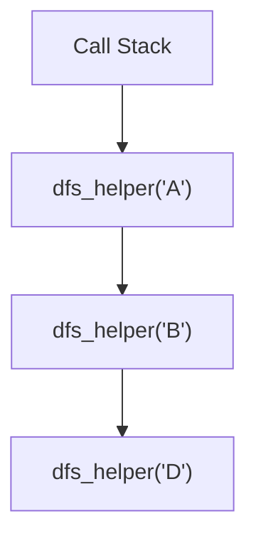

# 🔄 Recursive DFS: Elegant Depth Navigation

In this lesson, we'll explore the recursive implementation of DFS - a clean, elegant approach that leverages the function call stack to track our traversal depth.

## The Power of Recursion 💫

Recursion provides a natural way to implement DFS because:

1. It automatically manages the backtracking for us using the function call stack
2. It creates code that closely mirrors how we think about the algorithm conceptually
3. It's often more concise and readable than the iterative approach

> [!NOTE]
> In recursive DFS, each function call explores a node and its descendants before returning, naturally creating the depth-first behavior.

## Step-by-Step Code Breakdown 🔍

Let's dissect the recursive implementation:

```python
def dfs(graph, start_vertex):
    visited = set()
    result = []
    
    def dfs_helper(vertex):
        # Mark the current vertex as visited and add to result
        visited.add(vertex)
        result.append(vertex)
        
        # Visit all adjacent vertices that haven't been visited yet
        for neighbor in graph[vertex]:
            if neighbor not in visited:
                dfs_helper(neighbor)
    
    # Start DFS from the given vertex
    dfs_helper(start_vertex)
    
    return result
```

### Main Function Setup 🏗️

```python
def dfs(graph, start_vertex):
    visited = set()  # Track visited nodes
    result = []      # Store traversal order
```

We initialize two key data structures:
- `visited`: A set to efficiently track which nodes we've already seen (O(1) lookups)
- `result`: A list to record the order in which we visit nodes

### The Helper Function: Where the Magic Happens ✨

```python
def dfs_helper(vertex):
    # Mark the current vertex as visited and add to result
    visited.add(vertex)
    result.append(vertex)
    
    # Visit all adjacent vertices that haven't been visited yet
    for neighbor in graph[vertex]:
        if neighbor not in visited:
            dfs_helper(neighbor)
```

This inner function does the actual traversal work:
1. Mark the current vertex as visited
2. Add it to our result list
3. Recursively explore each unvisited neighbor

> [!TIP]
> The nested helper function has access to the `visited` and `result` variables from the outer function scope. This is called a "closure" and is a powerful pattern in recursive graph algorithms.

### Starting the Traversal 🏁

```python
# Start DFS from the given vertex
dfs_helper(start_vertex)

return result
```

Finally, we kick off the traversal from our starting vertex and return the result.

## Memory and the Call Stack 📚

The recursive approach uses the system's call stack to implicitly track our path through the graph:



Each recursive call adds a new frame to the call stack, and each return removes one. This naturally implements the backtracking behavior of DFS.

## Implementation Details and Tricks 🔧

### Tracking Visited Nodes ✅

```python
visited = set()  # O(1) lookups!
```

We use a set for `visited` because it provides O(1) lookup time, which is crucial for efficiency.

### Why a Helper Function? 🤔

```python
def dfs_helper(vertex):
    # ...
```

The nested helper function provides two key benefits:
1. It maintains closure over the `visited` and `result` variables
2. It presents a cleaner interface to the caller (hiding implementation details)

## Example Trace-Through 📝

Let's trace through our code on a simple graph:

```python
graph = {
    'A': ['B', 'C'],
    'B': ['D'],
    'C': ['E'],
    'D': [],
    'E': []
}
```

<details>
<summary>Step-by-Step Execution</summary>

1. Call `dfs(graph, 'A')`
   - Initialize `visited = set()` and `result = []`
   - Call `dfs_helper('A')`

2. Inside `dfs_helper('A')`
   - Add 'A' to `visited` and `result`: `visited = {'A'}`, `result = ['A']`
   - Loop through neighbors of 'A': 'B' and 'C'
   - 'B' is not visited, so call `dfs_helper('B')`

3. Inside `dfs_helper('B')`
   - Add 'B' to `visited` and `result`: `visited = {'A', 'B'}`, `result = ['A', 'B']`
   - Loop through neighbors of 'B': 'D'
   - 'D' is not visited, so call `dfs_helper('D')`

4. Inside `dfs_helper('D')`
   - Add 'D' to `visited` and `result`: `visited = {'A', 'B', 'D'}`, `result = ['A', 'B', 'D']`
   - 'D' has no neighbors, so return to `dfs_helper('B')`

5. Back to `dfs_helper('B')`
   - All neighbors processed, so return to `dfs_helper('A')`

6. Back to `dfs_helper('A')`
   - Next neighbor is 'C'
   - 'C' is not visited, so call `dfs_helper('C')`

7. Inside `dfs_helper('C')`
   - Add 'C' to `visited` and `result`: `visited = {'A', 'B', 'D', 'C'}`, `result = ['A', 'B', 'D', 'C']`
   - Loop through neighbors of 'C': 'E'
   - 'E' is not visited, so call `dfs_helper('E')`

8. Inside `dfs_helper('E')`
   - Add 'E' to `visited` and `result`: `visited = {'A', 'B', 'D', 'C', 'E'}`, `result = ['A', 'B', 'D', 'C', 'E']`
   - 'E' has no neighbors, so return to `dfs_helper('C')`

9. Back to `dfs_helper('C')`
   - All neighbors processed, so return to `dfs_helper('A')`

10. Back to `dfs_helper('A')`
    - All neighbors processed, so return from `dfs_helper('A')`

11. Back to `dfs(graph, 'A')`
    - Return `result = ['A', 'B', 'D', 'C', 'E']`
</details>

## Pros and Cons of Recursive DFS 🎯

### Advantages ✅

- **Simplicity**: Code is clean, intuitive, and mirrors the conceptual algorithm
- **Elegance**: Naturally handles the stack and backtracking behavior
- **Readability**: Easier to understand for those familiar with recursion

### Limitations ⚠️

- **Stack Overflow Risk**: Very deep graphs can exceed the call stack limit
- **Memory Overhead**: Each recursive call adds a frame to the call stack
- **Performance**: Recursive function calls can have slightly more overhead than iteration

> [!WARNING]
> For very large graphs, the recursive approach might cause a stack overflow. In such cases, consider using the iterative implementation.

## Practice Exercise 💪

**Challenge**: Modify the recursive DFS implementation to also return the path from the start vertex to a specific target vertex, or an empty list if the target is not found.

<details>
<summary>Solution</summary>

```python
def find_path_dfs(graph, start_vertex, target_vertex):
    visited = set()
    
    def dfs_helper(vertex, path):
        # Add current vertex to path and mark as visited
        current_path = path + [vertex]
        visited.add(vertex)
        
        # If we found the target, return the path
        if vertex == target_vertex:
            return current_path
        
        # Try to find the target through each neighbor
        for neighbor in graph[vertex]:
            if neighbor not in visited:
                result = dfs_helper(neighbor, current_path)
                if result:  # If we found a path to the target
                    return result
        
        # No path found through this vertex
        return None
    
    # Start DFS from the given vertex with an empty path
    return dfs_helper(start_vertex, []) or []
```

This implementation builds the path as it traverses and returns it as soon as the target is found, or an empty list if no path exists.
</details>

In the next lesson, we'll explore the iterative implementation of DFS! 