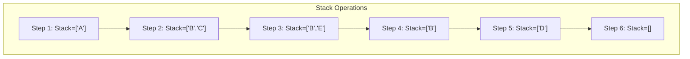

# 🔁 Iterative DFS: Explicit Stack Control

In this lesson, we'll explore the iterative implementation of DFS - a powerful approach that gives us explicit control over the stack and avoids potential recursion depth issues.

## Replacing Recursion with an Explicit Stack 📚

The key insight for iterative DFS is that we can replace the implicit function call stack with an explicit data structure - a stack that we manage ourselves:

> [!NOTE]
> While the recursive approach uses the system's call stack, the iterative approach uses an explicit stack data structure that we control directly.

## Step-by-Step Code Breakdown 🔍

Let's analyze the iterative implementation:

```python
def dfs(graph, start_vertex):
    visited = set()
    result = []
    stack = [start_vertex]
    
    while stack:
        # Pop a vertex from the stack
        vertex = stack.pop()
        
        # Skip if already visited
        if vertex in visited:
            continue
        
        # Mark as visited and add to result
        visited.add(vertex)
        result.append(vertex)
        
        # Add neighbors to the stack in reverse order
        # This ensures we visit them in the same order as the recursive solution
        for neighbor in reversed(graph[vertex]):
            if neighbor not in visited:
                stack.append(neighbor)
    
    return result
```

### Initial Setup 🏗️

```python
def dfs(graph, start_vertex):
    visited = set()
    result = []
    stack = [start_vertex]
```

We initialize three key data structures:
- `visited`: A set to track nodes we've already seen
- `result`: A list to record the order of node visits
- `stack`: A list used as a stack to control our traversal

### The Main Loop: Processing the Stack ⚙️

```python
while stack:
    # Pop a vertex from the stack
    vertex = stack.pop()
    
    # Skip if already visited
    if vertex in visited:
        continue
```

This loop continues as long as there are nodes to explore in our stack:
1. We pop the top node from the stack
2. We check if we've already visited it (to avoid cycles)

### Processing Each Node 🔄

```python
# Mark as visited and add to result
visited.add(vertex)
result.append(vertex)
```

When we encounter a new node:
1. We mark it as visited
2. We add it to our result list

### Adding Neighbors to the Stack 👥

```python
# Add neighbors to the stack in reverse order
# This ensures we visit them in the same order as the recursive solution
for neighbor in reversed(graph[vertex]):
    if neighbor not in visited:
        stack.append(neighbor)
```

Here's where the depth-first behavior comes from:
1. We loop through the node's neighbors
2. We add unvisited neighbors to the stack
3. We add them in reverse order (explained below)

> [!TIP]
> We add neighbors in reverse order because the stack is LIFO (Last-In-First-Out). This ensures we process the original first neighbor first, matching the order of the recursive implementation.

## Visualization: Stack in Action 📊

Let's visualize the stack operations using a simple graph:

```
A --- B --- D
|
C --- E
```

Represented as an adjacency list:
```python
graph = {
    'A': ['B', 'C'],
    'B': ['A', 'D'],
    'C': ['A', 'E'],
    'D': ['B'],
    'E': ['C']
}
```

<details>
<summary>Step-by-Step Stack Operations</summary>

Starting with `start_vertex = 'A'`:

1. Initialize: 
   - `stack = ['A']`
   - `visited = {}`
   - `result = []`

2. Pop 'A' from stack:
   - `stack = []`
   - Mark 'A' as visited: `visited = {'A'}`
   - Add to result: `result = ['A']`
   - Add neighbors in reverse order: 'C', 'B'
   - `stack = ['B', 'C']`

3. Pop 'C' from stack:
   - `stack = ['B']`
   - Mark 'C' as visited: `visited = {'A', 'C'}`
   - Add to result: `result = ['A', 'C']`
   - Add neighbors in reverse order: 'E', 'A'
   - 'A' is already visited, so only add 'E'
   - `stack = ['B', 'E']`

4. Pop 'E' from stack:
   - `stack = ['B']`
   - Mark 'E' as visited: `visited = {'A', 'C', 'E'}`
   - Add to result: `result = ['A', 'C', 'E']`
   - Add neighbors: 'C'
   - 'C' is already visited, so add nothing
   - `stack = ['B']`

5. Pop 'B' from stack:
   - `stack = []`
   - Mark 'B' as visited: `visited = {'A', 'C', 'E', 'B'}`
   - Add to result: `result = ['A', 'C', 'E', 'B']`
   - Add neighbors in reverse order: 'D', 'A'
   - 'A' is already visited, so only add 'D'
   - `stack = ['D']`

6. Pop 'D' from stack:
   - `stack = []`
   - Mark 'D' as visited: `visited = {'A', 'C', 'E', 'B', 'D'}`
   - Add to result: `result = ['A', 'C', 'E', 'B', 'D']`
   - Add neighbors: 'B'
   - 'B' is already visited, so add nothing
   - `stack = []`

7. Stack is empty, so we're done!
   - Final result: `result = ['A', 'C', 'E', 'B', 'D']`
</details>



## Key Differences from Recursive DFS 🔄 vs 🔁

The iterative approach has several important differences from the recursive version:

### 1. Processing Order and Visited Checks ⏱️

In the recursive version, we mark nodes as visited **before** diving deeper:
```python
visited.add(vertex)  # Mark first
dfs_helper(neighbor)  # Then recurse
```

In the iterative version, we process nodes only after popping them from the stack:
```python
vertex = stack.pop()
if vertex in visited:  # Check if visited
    continue
visited.add(vertex)  # Mark as visited
```

This means we might add the same node to the stack multiple times before processing it!

### 2. Adding Neighbors in Reverse Order 🔄

```python
for neighbor in reversed(graph[vertex]):
```

We add neighbors to the stack in reverse order to ensure we process them in the same order as the recursive version. This is because the stack is LIFO (Last-In-First-Out).

### 3. Explicit vs. Implicit Stack Management 📊

- **Recursive**: Call stack managed by the system
- **Iterative**: Stack explicitly managed in our code

## Pros and Cons of Iterative DFS 🎯

### Advantages ✅

- **No Stack Overflow**: Can handle very deep graphs without recursion limits
- **Explicit Control**: Direct management of the traversal stack
- **Slightly Better Performance**: Avoids function call overhead
- **Easier to Debug**: Stack state is directly visible and controllable

### Limitations ⚠️

- **More Complex Code**: Requires explicit handling of the stack
- **Less Intuitive**: Doesn't match the conceptual understanding as closely
- **Visited Node Handling**: Requires careful management of when to mark nodes as visited

> [!TIP]
> The iterative approach is preferred for production systems with large graphs, while the recursive approach is often clearer for educational purposes or smaller problems.

## Challenge: Cycle Detection 🔄

**Problem**: Modify the iterative DFS to detect if a graph contains a cycle.

<details>
<summary>Hint</summary>

A graph contains a cycle if, during traversal, we encounter a node that is already being processed (it's part of our current exploration path, but not fully processed yet).
</details>

<details>
<summary>Solution</summary>

```python
def has_cycle(graph):
    # Track both visited and currently exploring nodes
    visited = set()
    exploring = set()
    
    def dfs_cycle_detect(node):
        visited.add(node)
        exploring.add(node)
        
        for neighbor in graph[node]:
            if neighbor not in visited:
                if dfs_cycle_detect(neighbor):
                    return True
            elif neighbor in exploring:
                # Found a cycle!
                return True
        
        # Done exploring this node
        exploring.remove(node)
        return False
    
    # Check from each node (for disconnected graphs)
    for node in graph:
        if node not in visited:
            if dfs_cycle_detect(node):
                return True
    
    return False
```

This implementation uses two sets: `visited` for nodes we've seen, and `exploring` for nodes currently on our exploration path. If we ever encounter a node that's in `exploring`, we've found a cycle!
</details>

In the next lesson, we'll explore the time and space complexity analysis of DFS! 