# ⏱️ Understanding DFS Complexity

In this lesson, we'll analyze the time and space complexity of the DFS algorithm. Understanding these aspects is crucial for predicting how the algorithm will perform with different input sizes.

## Time Complexity 🕒

The time complexity of DFS is:

> [!NOTE]
> **O(V + E)** where V is the number of vertices (nodes) and E is the number of edges in the graph.

Let's break down why:

### Visiting Each Vertex Once ✅

```python
visited.add(vertex)
```

- We mark each vertex as visited exactly once
- Each vertex is processed exactly once (added to result)
- This gives us **O(V)** time for vertex processing

### Examining Each Edge Once ↔️

```python
for neighbor in graph[vertex]:
    if neighbor not in visited:
        # Process neighbor
```

- For each vertex, we examine all its outgoing edges
- In total, we examine each edge exactly once in an undirected graph
- For directed graphs, we examine each edge at most once
- This gives us **O(E)** time for edge examination

### Combined Time Complexity ⏱️

Since we need to do both operations above, the total time complexity is:
**O(V) + O(E) = O(V + E)**


## Space Complexity 💾

The space complexity of DFS is:

> [!NOTE]
> **O(V)** in the worst case, where V is the number of vertices.

This space is used by several data structures:

### 1. The Visited Set 📝

```python
visited = set()  # Stores each vertex once
```

- We need to track which vertices we've already visited
- In the worst case, we'll visit all vertices
- Space needed: **O(V)**

### 2. The Result List 📋

```python
result = []  # Stores each vertex once
```

- We store each visited vertex in our result
- In the worst case, we'll visit all vertices
- Space needed: **O(V)**

### 3. The Stack (Implicit or Explicit) 📚

For the **recursive implementation**:
- The function call stack can grow to the maximum depth of the DFS
- In the worst case (a linear graph), this could be **O(V)**

For the **iterative implementation**:
- Our explicit stack could contain, in the worst case, all vertices
- Space needed: **O(V)**

### Combined Space Complexity 📊

The total space complexity is dominated by the largest of these components:
**O(V) + O(V) + O(V) = O(V)**


## Best vs. Worst Case Scenarios 📈📉

### Best Case 🌟

In the best case, the graph is small and well-connected:
- Time: Still **O(V + E)** but with small constants
- Space: **O(V)** but with small constants

### Worst Case ⚠️

For time complexity, the worst case occurs when we need to visit all vertices and edges:
- A complete graph where every vertex is connected to every other vertex
- Time: **O(V + E)** = **O(V + V²)** = **O(V²)** for a dense graph

For space complexity, the worst case occurs with a deep graph that forces a large stack:
- A linear "chain" graph (each node connects only to the next)
- Space: **O(V)** for the maximum call stack depth

> [!TIP]
> DFS is generally very efficient for most graph problems! The linear time complexity (in terms of graph size) makes it suitable for processing even large graphs.

## Comparison with BFS 🔄 vs. 🔁

DFS and BFS (Breadth-First Search) have the same asymptotic complexity:
- Time: Both are **O(V + E)**
- Space: Both are **O(V)**

However, there are important practical differences:

```mermaid
graph TD;
    subgraph "DFS"
    DT["Time: O(V+E)"]
    DS["Space: O(V)"]
    DP1["✅ Good for deep path finding"]
    DP2["✅ Good for topological sort"]
    DP3["⚠️ Not optimal for shortest paths"]
    end
    
    subgraph "BFS"
    BT["Time: O(V+E)"]
    BS["Space: O(V)"]
    BP1["✅ Good for shortest paths"]
    BP2["✅ Good for level-order traversal"]
    BP3["⚠️ May use more memory in practice"]
    end
```



## Real-World Performance Considerations 🌍

In practice, several factors affect DFS performance:

### 1. Graph Representation 📊

Adjacency list (what we've been using) allows for efficient edge iteration:
- Time to find all neighbors of a vertex: **O(degree(v))**
- Total: **O(V + E)**

Adjacency matrix would be less efficient for sparse graphs:
- Time to find all neighbors of a vertex: **O(V)**
- Total: **O(V²)**

### 2. Language and Implementation Details ⚙️

- **Recursion Overhead**: Recursive DFS can have function call overhead
- **Data Structure Efficiency**: How sets and stacks are implemented affects constants
- **Cache Efficiency**: Memory access patterns can significantly impact performance

### 3. Graph Structure 🕸️

- **Connectedness**: Highly connected graphs explore more edges
- **Diameter**: Graphs with larger diameters (max distance between any two vertices) may require deeper recursion
- **Density**: Dense graphs have more edges to process

## Optimization Opportunities 🚀

Several optimizations can improve DFS performance:

1. **Avoid Redundant Checks**: In some cases, we can avoid checking if a node is already in the visited set by structuring our code differently

2. **Early Termination**: If searching for a specific node or condition, return as soon as found

3. **Tail Recursion**: Some languages can optimize tail-recursive calls

4. **Custom Data Structures**: Specialized, problem-specific data structures can improve constants

## Challenge: Analyze This Variation ⚔️

**Problem**: What is the time and space complexity of this DFS variation that counts the number of connected components in an undirected graph?

```python
def count_connected_components(graph):
    visited = set()
    count = 0
    
    def dfs(node):
        visited.add(node)
        for neighbor in graph[node]:
            if neighbor not in visited:
                dfs(neighbor)
    
    for node in graph:
        if node not in visited:
            count += 1
            dfs(node)
    
    return count
```

<details>
<summary>Solution</summary>

**Time Complexity**: Still **O(V + E)**
- We visit each vertex exactly once: **O(V)**
- We examine each edge exactly once: **O(E)**
- The outer loop over all vertices doesn't change the asymptotic complexity

**Space Complexity**: **O(V)**
- The visited set stores at most all vertices: **O(V)**
- The recursive call stack, in the worst case, could go as deep as all vertices: **O(V)**

Although this algorithm solves a different problem (counting connected components), its complexity is the same as the basic DFS.
</details>

In the next lesson, we'll explore practical applications and variations of DFS! 