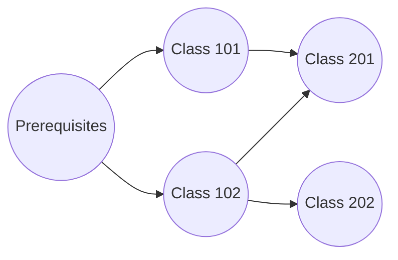

# 🛠️ Real-World Applications of DFS

In this lesson, we'll explore how DFS extends beyond basic graph traversal to solve a variety of practical problems. DFS is a versatile algorithm that forms the foundation for many elegant solutions in computer science.

## Topological Sorting 📚

One of the most important applications of DFS is topological sorting - arranging the vertices of a directed acyclic graph (DAG) in a linear order such that for every directed edge (u, v), vertex u comes before vertex v.



### Implementation 🔧

```python
def topological_sort(graph):
    visited = set()
    temp_mark = set()  # For cycle detection
    ordering = []
    
    def dfs(node):
        # Check for cycles
        if node in temp_mark:
            raise ValueError("Graph has a cycle, topological sort not possible")
        
        if node not in visited:
            temp_mark.add(node)
            
            # Visit all neighbors first
            for neighbor in graph[node]:
                dfs(neighbor)
            
            # Then add current node
            temp_mark.remove(node)
            visited.add(node)
            ordering.append(node)
    
    # Visit all nodes
    for node in graph:
        if node not in visited:
            dfs(node)
    
    # Reverse for correct ordering
    return ordering[::-1]
```

**Applications**: Course scheduling, build systems, task scheduling, data serialization

> [!TIP]
> The key insight for topological sort is that we add a node to our ordering only *after* we've processed all its outgoing edges!

## Finding Connected Components 🧩

DFS can efficiently identify connected components in an undirected graph.

```python
def find_connected_components(graph):
    visited = set()
    components = []
    
    def dfs(node, component):
        visited.add(node)
        component.append(node)
        
        for neighbor in graph[node]:
            if neighbor not in visited:
                dfs(neighbor, component)
    
    for node in graph:
        if node not in visited:
            current_component = []
            dfs(node, current_component)
            components.append(current_component)
    
    return components
```

**Applications**: Network analysis, image segmentation, finding communities in social networks

## Cycle Detection 🔄

DFS can detect cycles in both directed and undirected graphs.

### In Directed Graphs

```python
def has_cycle_directed(graph):
    all_visited = set()  # Permanently marked nodes
    currently_visiting = set()  # Temporarily marked nodes
    
    def dfs(node):
        if node in currently_visiting:
            return True  # Cycle detected
        
        if node in all_visited:
            return False
        
        currently_visiting.add(node)
        
        for neighbor in graph[node]:
            if dfs(neighbor):
                return True
        
        currently_visiting.remove(node)
        all_visited.add(node)
        return False
    
    for node in graph:
        if node not in all_visited:
            if dfs(node):
                return True
    
    return False
```

**Applications**: Deadlock detection in operating systems, circular dependencies in software

## Pathfinding 🗺️

While DFS is not optimal for finding the shortest path (BFS is better for that), it's useful for simply determining if a path exists between two vertices.

```python
def path_exists(graph, start, end):
    visited = set()
    
    def dfs(node):
        if node == end:
            return True
        
        visited.add(node)
        
        for neighbor in graph[node]:
            if neighbor not in visited:
                if dfs(neighbor):
                    return True
        
        return False
    
    return dfs(start)
```

**Applications**: Maze solving, network routing, connectivity checking

## Maze Generation and Solving 🧠

DFS is perfect for generating and solving mazes!


**Applications**: Game development, puzzle creation, educational tools

## Advanced Variation: Tarjan's Algorithm 🔍

Tarjan's algorithm is a DFS-based method for finding strongly connected components in a directed graph.

> [!NOTE]
> A strongly connected component (SCC) is a subgraph where every vertex is reachable from every other vertex.

```python
def tarjans_algorithm(graph):
    index_counter = [0]
    index = {}  # Node -> discovery time
    lowlink = {}  # Node -> earliest reachable node
    onstack = set()
    stack = []
    scc_list = []
    
    def strongconnect(node):
        # Set the depth index for node
        index[node] = index_counter[0]
        lowlink[node] = index_counter[0]
        index_counter[0] += 1
        stack.append(node)
        onstack.add(node)
        
        # Consider successors of node
        for successor in graph[node]:
            if successor not in index:
                # Successor has not yet been visited; recurse on it
                strongconnect(successor)
                lowlink[node] = min(lowlink[node], lowlink[successor])
            elif successor in onstack:
                # Successor is in stack and hence in the current SCC
                lowlink[node] = min(lowlink[node], index[successor])
        
        # If node is a root node, pop the stack and generate an SCC
        if lowlink[node] == index[node]:
            scc = []
            w = None
            while w != node:
                w = stack.pop()
                onstack.remove(w)
                scc.append(w)
            scc_list.append(scc)
    
    for node in graph:
        if node not in index:
            strongconnect(node)
    
    return scc_list
```

**Applications**: Analysis of strongly connected components in networks, circuit analysis

## Articulation Points and Bridges 🌉

DFS can find critical points (articulation points) and edges (bridges) in a graph whose removal would increase the number of connected components.

```python
def find_articulation_points(graph):
    visited = set()
    discovery = {}  # Discovery time
    low = {}  # Earliest visited vertex reachable from subtree
    parent = {}  # Parent in DFS tree
    articulation_points = set()
    time = [0]  # Using list for mutable integer
    
    def dfs(u):
        # Count of children in DFS Tree
        children = 0
        
        # Mark the current node as visited
        visited.add(u)
        
        # Initialize discovery time and low value
        discovery[u] = time[0]
        low[u] = time[0]
        time[0] += 1
        
        # Go through all neighbors
        for v in graph[u]:
            # If v is not visited yet, then make it a child of u in DFS tree
            if v not in visited:
                parent[v] = u
                children += 1
                dfs(v)
                
                # Check if subtree rooted with v has a connection to one of the ancestors of u
                low[u] = min(low[u], low[v])
                
                # u is an articulation point in following cases:
                # (1) u is root of DFS tree and has two or more children.
                if parent.get(u) is None and children > 1:
                    articulation_points.add(u)
                
                # (2) If u is not root and low value of one of its child is more than or equal to discovery value of u.
                if parent.get(u) is not None and low[v] >= discovery[u]:
                    articulation_points.add(u)
            
            # Update low value of u for parent function calls
            elif v != parent.get(u, None):
                low[u] = min(low[u], discovery[v])
    
    # Call the recursive helper function for all undiscovered vertices
    for vertex in graph:
        if vertex not in visited:
            dfs(vertex)
    
    return articulation_points
```

**Applications**: Network reliability, infrastructure planning, critical node analysis

## Backtracking Algorithms 🔙

DFS forms the backbone of backtracking algorithms, which explore all possible configurations to find solutions.

Examples include:
- N-Queens problem
- Sudoku solver
- Generating permutations
- Subset sum problems

```python
def solve_n_queens(n):
    solutions = []
    board = [['.' for _ in range(n)] for _ in range(n)]
    
    def is_safe(row, col):
        # Check column
        for i in range(row):
            if board[i][col] == 'Q':
                return False
        
        # Check upper left diagonal
        for i, j in zip(range(row-1, -1, -1), range(col-1, -1, -1)):
            if board[i][j] == 'Q':
                return False
        
        # Check upper right diagonal
        for i, j in zip(range(row-1, -1, -1), range(col+1, n)):
            if board[i][j] == 'Q':
                return False
        
        return True
    
    def backtrack(row):
        if row == n:
            solutions.append([''.join(row) for row in board])
            return
        
        for col in range(n):
            if is_safe(row, col):
                board[row][col] = 'Q'
                backtrack(row + 1)
                board[row][col] = '.'  # Backtrack
    
    backtrack(0)
    return solutions
```

> [!TIP]
> In backtracking with DFS, we explore a path until we determine it can't lead to a solution, then "backtrack" to try another path.

## Challenge: Implement Bipartite Checking 🎭

**Problem**: A bipartite graph is one whose vertices can be divided into two disjoint groups such that no vertices within the same group are adjacent. Write a DFS-based function to check if a graph is bipartite.

<details>
<summary>Hint</summary>

Try coloring the graph with two colors, such that no adjacent vertices have the same color. If this is possible, the graph is bipartite.
</details>

<details>
<summary>Solution</summary>

```python
def is_bipartite(graph):
    # Use two colors: 1 and -1
    color = {}  # Node -> color
    
    def dfs(node, current_color):
        color[node] = current_color
        
        for neighbor in graph[node]:
            if neighbor not in color:
                # Color the neighbor with the opposite color
                if not dfs(neighbor, -current_color):
                    return False
            elif color[neighbor] == current_color:
                # If a neighbor has the same color, not bipartite
                return False
        
        return True
    
    # Handle disconnected components
    for node in graph:
        if node not in color:
            if not dfs(node, 1):
                return False
    
    return True
```

This algorithm colors each node and ensures adjacent nodes have different colors. If at any point we find adjacent nodes with the same color, the graph is not bipartite.
</details>

In our final lesson, we'll review what we've learned and provide a complete implementation example along with tips for mastering DFS! 