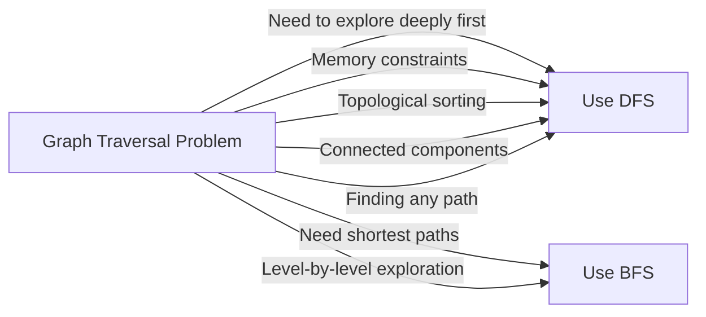

# 🏆 Mastering Depth-First Search

Congratulations on completing this journey through Depth-First Search! Let's review what we've learned and explore how to continue developing your graph algorithm skills.

## The DFS Journey: A Summary 🗺️

Throughout these lessons, we've covered:

1. **The Graph Traversal Problem**: Understanding what graph traversal is and why it matters
2. **Core DFS Concepts**: The fundamental principles and components of DFS
3. **Step-by-Step Visualization**: Seeing DFS in action with visual examples
4. **Recursive Implementation**: Using the call stack to manage traversal depth
5. **Iterative Implementation**: Explicitly managing the stack for more control
6. **Complexity Analysis**: Understanding the time and space efficiency of DFS
7. **Applications & Variations**: Exploring the versatile uses of DFS in solving various problems

## Complete DFS Implementation 📝

Here's a complete, well-documented implementation of DFS that incorporates the best practices we've discussed:

```python
def dfs(graph, start_vertex):
    """
    Perform a depth-first search traversal on a graph.
    
    Args:
        graph: Dictionary representing the graph as an adjacency list.
              Keys are vertices, values are lists of adjacent vertices.
        start_vertex: The vertex to start the traversal from.
        
    Returns:
        A list containing the vertices in the order they were visited.
    """
    if start_vertex not in graph:
        return []  # Handle case where start vertex doesn't exist
    
    visited = set()  # For O(1) lookups
    result = []      # To track visit order
    
    # For iterative implementation
    def dfs_iterative():
        stack = [start_vertex]
        
        while stack:
            vertex = stack.pop()
            
            if vertex in visited:
                continue
                
            visited.add(vertex)
            result.append(vertex)
            
            # Add neighbors in reverse order for consistent traversal order
            for neighbor in reversed(graph[vertex]):
                if neighbor not in visited:
                    stack.append(neighbor)
    
    # For recursive implementation
    def dfs_recursive(vertex):
        visited.add(vertex)
        result.append(vertex)
        
        for neighbor in graph[vertex]:
            if neighbor not in visited:
                dfs_recursive(neighbor)
    
    # Choose which implementation to use
    # dfs_recursive(start_vertex)  # Uncomment to use recursive version
    dfs_iterative()                # Using iterative version by default
    
    return result
```

> [!TIP]
> This implementation includes both recursive and iterative approaches. For most practical applications, the iterative approach is preferred to avoid potential stack overflow issues.

## Key Takeaways 💡

### 1. The Power of the Stack

Whether implicit (in recursion) or explicit (in iteration), the stack is the heart of DFS, giving it the distinctive depth-first behavior.

### 2. Visited Tracking is Essential

Always track visited nodes to prevent infinite loops in cyclic graphs!

### 3. Versatility in Applications

DFS is the foundation for solving a wide range of problems:
- Topological sorting
- Finding connected components
- Cycle detection
- Pathfinding
- And many more!

### 4. Linear Complexity

With O(V + E) time complexity, DFS is efficient enough for most graph problems.

## Common Pitfalls to Avoid ⚠️

1. **Forgetting to Track Visited Nodes**: This can lead to infinite loops in graphs with cycles.

2. **Stack Overflow in Recursive Implementation**: For very deep graphs, the recursive approach might exceed the call stack limit.

3. **Incorrect Graph Representation**: Ensure your adjacency list correctly represents your graph.

4. **Inefficient Data Structures**: Using a list instead of a set for visited nodes can dramatically slow down your algorithm.

5. **Not Handling Disconnected Components**: If you need to process all nodes, remember to iterate through all vertices as potential starting points.

## DFS vs. BFS: Choosing the Right Tool 🔄 vs. 🔁



Remember:
- **DFS** dives deep before exploring breadth
- **BFS** explores all neighbors before going deeper

## Tips for Mastering DFS 🌟

1. **Practice Visualization**: Draw out the graph and trace through the algorithm by hand.

2. **Understand Both Implementations**: Be comfortable with both recursive and iterative approaches.

3. **Start Simple**: Begin with basic graph traversal before tackling complex variations.

4. **Customize for Your Problem**: Modify the base algorithm to fit your specific needs.

5. **Test Edge Cases**: Empty graphs, single-node graphs, disconnected graphs, cyclic graphs.

## Challenge Yourself 💪

Here's a final challenge to test your DFS mastery:

**Problem**: Given a 2D grid of characters and a word, write a function to determine if the word exists in the grid. The word can be constructed from letters sequentially adjacent in the grid (horizontally, vertically, or diagonally), and a letter cell may not be used more than once.

<details>
<summary>Hint</summary>

This is a classic backtracking problem. You can use DFS to explore possible paths from each starting cell, treating the grid as a graph where adjacent cells are connected.
</details>

<details>
<summary>Solution</summary>

```python
def exist(board, word):
    if not board or not board[0]:
        return False
    
    rows, cols = len(board), len(board[0])
    
    def dfs(r, c, index):
        # Base case: we found the word
        if index == len(word):
            return True
        
        # Check boundaries and if current cell matches current character
        if (r < 0 or r >= rows or c < 0 or c >= cols or 
            board[r][c] != word[index]):
            return False
        
        # Mark as visited by changing the value temporarily
        temp = board[r][c]
        board[r][c] = '#'
        
        # Explore all four directions
        found = (dfs(r+1, c, index+1) or
                 dfs(r-1, c, index+1) or
                 dfs(r, c+1, index+1) or
                 dfs(r, c-1, index+1))
        
        # Restore the value (backtrack)
        board[r][c] = temp
        
        return found
    
    # Try each cell as a starting point
    for r in range(rows):
        for c in range(cols):
            if dfs(r, c, 0):
                return True
    
    return False
```

This solution uses DFS with backtracking to explore all possible paths from each cell in the grid, marking cells as visited during exploration and restoring them when backtracking.
</details>

## Next Steps in Your Learning Journey 🚀

To continue building your graph algorithm expertise:

1. **Master BFS (Breadth-First Search)**: The complementary graph traversal algorithm to DFS.

2. **Learn Dijkstra's Algorithm**: For finding shortest paths in weighted graphs.

3. **Explore Minimum Spanning Trees**: Using algorithms like Kruskal's or Prim's.

4. **Study Advanced Graph Theory**: Flow networks, maximum flow, minimum cut.

5. **Apply to Real-World Problems**: Implement DFS to solve practical problems in your own projects.

## Final Thoughts 🌟

Depth-First Search is more than just an algorithm—it's a powerful way of thinking about problems. By understanding how to systematically explore possibilities and backtrack when needed, you've gained a valuable problem-solving tool that extends far beyond graph traversal.

Remember, the best way to truly master DFS is through practice. Challenge yourself with different graph problems, implement variations, and keep exploring the depths of what this algorithm can do!

Happy coding! 🚀 