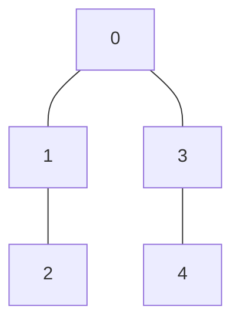

# 🔍 Breadth-First Search (BFS) for Graph Matrices

> [!NOTE]
> In this lesson series, we'll explore Breadth-First Search for graphs represented as matrices, a fundamental graph traversal algorithm used in countless applications.

## What is the Problem? 🤔

Imagine you're exploring a maze where each room has multiple doorways connecting to other rooms. If you wanted to find all the rooms reachable from your starting position, exploring level by level (first checking all rooms one door away, then all rooms two doors away, and so on), you'd be performing a breadth-first search!

In computer science terms:

> [!TIP]
> **The Problem**: Given a graph represented as an adjacency matrix and a starting vertex, we need to visit all reachable vertices in a **breadth-first** manner - visiting all vertices at the current distance before moving to vertices that are farther away.

### What's an Adjacency Matrix? 📊

An adjacency matrix is a square grid where:
- Each row and column represents a vertex in the graph
- The value at position `[i][j]` indicates whether there's an edge from vertex `i` to vertex `j`
  - `1` (or any non-zero value) means there's a connection
  - `0` means there's no connection

For example, this adjacency matrix:
```
[
  [0, 1, 0, 1, 0],
  [1, 0, 1, 0, 0],
  [0, 1, 0, 0, 0],
  [1, 0, 0, 0, 1],
  [0, 0, 0, 1, 0]
]
```

Represents this graph:



## Why Does This Matter? 🌟

Breadth-First Search is incredibly versatile:

- 🔗 **Finding shortest paths** in unweighted graphs
- 🌐 **Web crawling** to discover pages
- 👥 **Social network analysis** to find connections within a certain distance
- 🧩 **Puzzle solving** (like finding the fewest moves to solve a Rubik's cube)
- 🔍 **Network broadcast models** to determine how information spreads

## The Expected Output 📝

When we perform BFS, we should get a list of vertices in the order they were visited. For the graph above, starting from vertex `0`, the BFS traversal would be:

```
[0, 1, 3, 2, 4]
```

Can you understand why? Let's break it down:
1. We start at vertex `0`
2. We visit its immediate neighbors: `1` and `3`
3. We then visit the neighbors of `1`: that's `2`
4. And finally, we visit the neighbors of `3`: that's `4`

<details>
<summary>💭 Think About It</summary>

Why do we visit vertex `1` before vertex `3` when both are neighbors of the starting vertex `0`? 

In most BFS implementations, we process neighbors in the order they appear in the adjacency matrix (or adjacency list). Since vertex `1` appears before vertex `3` in the row for vertex `0`, we visit `1` first.

This is an implementation detail, though - both orderings would be valid BFS traversals!
</details>

> [!TIP]
> In the next lessons, we'll break down exactly how the BFS algorithm works, implement it step by step, and explore its applications and complexities.

**Ready to dive in?** Let's explore how BFS works in the next lesson! 