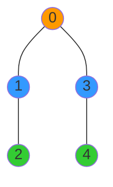

# 🧠 The Key Concepts Behind BFS

Breadth-First Search is built on several fundamental concepts that make it powerful and versatile. Before we dive into the implementation, let's understand these core ideas.

## Level-by-Level Exploration 🏗️

The defining characteristic of BFS is that it explores a graph **level by level**:

1. First, visit the starting vertex (level 0)
2. Then, visit all vertices one edge away (level 1)
3. Next, visit all vertices two edges away (level 2)
4. And so on...

This creates a ripple effect, like dropping a stone in water and watching the circles expand outward.

> [!NOTE]
> This level-by-level approach ensures that we find the **shortest path** (in terms of number of edges) from the starting vertex to any other reachable vertex.

## The Queue Data Structure 📦

To achieve this level-by-level exploration, BFS relies on a **queue** data structure. A queue is a First-In-First-Out (FIFO) structure:

- Elements are added at the back (enqueue)
- Elements are removed from the front (dequeue)

> [!TIP]
> Think of a queue like a line of people waiting - the first person who joins the line is the first person to be served.

The queue is essential to BFS because it ensures we process vertices in the order they were discovered, maintaining the level-by-level exploration pattern.

## Tracking Visited Vertices ✅

To avoid processing the same vertex multiple times (especially in graphs with cycles), BFS keeps track of which vertices have been **visited**.

This is typically done using:
- An array of boolean values, where `visited[i]` is `true` if vertex `i` has been visited
- A set data structure that contains visited vertices

> [!WARNING]
> Forgetting to mark vertices as visited can lead to infinite loops in graphs with cycles!

## Checking Connections in the Adjacency Matrix 🔍

For each vertex we process, we need to find all its neighbors. In an adjacency matrix representation:

- For a vertex `v`, we check row `v` in the matrix
- For each column `i` where `matrix[v][i] == 1`, vertex `i` is a neighbor of vertex `v`

💡 Performance Consideration

Checking for neighbors in an adjacency matrix takes O(V) time for each vertex (where V is the number of vertices), since we have to check every position in the row, even if most entries are 0.

This is why BFS with an adjacency matrix has O(V²) time complexity overall.

For sparse graphs (graphs with few edges), an adjacency list representation would be more efficient, giving O(V+E) time complexity.

## The Complete BFS Process 🔄

Putting these concepts together, the BFS process follows these steps:

1. Mark the starting vertex as visited
2. Add it to the queue
3. While the queue is not empty:
   a. Dequeue a vertex and process it (add it to the traversal result)
   b. Find all unvisited neighbors of this vertex using the adjacency matrix
   c. Mark each unvisited neighbor as visited
   d. Add each unvisited neighbor to the queue

This cycle continues until the queue is empty, meaning there are no more reachable vertices to explore.

> [!TIP]
> In the next lesson, we'll break down the BFS algorithm into detailed steps with visualizations to show exactly how it works.

## Think About It 🤔

Here are some questions to consider before we move on:

1. What would happen if we used a stack (Last-In-First-Out) instead of a queue in our BFS algorithm?
2. How might the BFS traversal change if we start from a different vertex in the same graph?
3. In a disconnected graph (a graph with multiple separate components), will a single BFS traversal visit all vertices?

Answers

1. If we used a stack instead of a queue, we'd be implementing Depth-First Search (DFS) instead of BFS! DFS explores as far as possible along each branch before backtracking.

2. Starting from a different vertex would give a different traversal order, as we'd be exploring the graph from a different starting point. The structure of the traversal (level-by-level) would remain the same.

3. No, a single BFS traversal will only visit vertices reachable from the starting vertex. To visit all vertices in a disconnected graph, you'd need to run BFS from a vertex in each separate component.

 