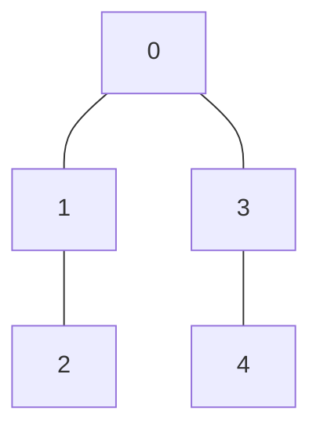
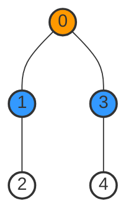
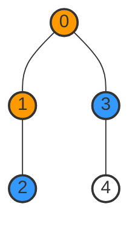
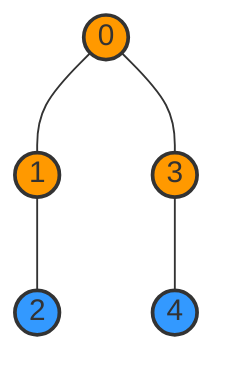
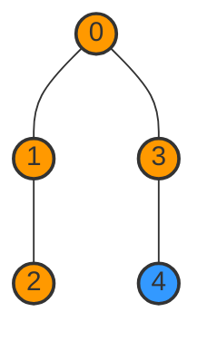
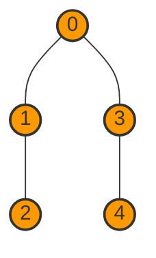

# 🚶‍♂️ Walking Through BFS: A Visual Guide

In this lesson, we'll walk through the BFS algorithm step by step with a concrete example, visualizing each stage of the process to build a solid intuition.

Let's use this simple graph, represented by an adjacency matrix:

```
[
  [0, 1, 0, 1, 0],
  [1, 0, 1, 0, 0],
  [0, 1, 0, 0, 0],
  [1, 0, 0, 0, 1],
  [0, 0, 0, 1, 0]
]
```

Which looks like:



We'll start the BFS traversal from vertex `0`.

## Step-by-Step BFS Execution 📋

### Initial Setup

Before we begin the algorithm:
1. Create an empty queue
2. Create a boolean array `visited` to track visited vertices, all initialized to `false`
3. Create an empty array `traversal` to store the order of visited vertices

### Step 1: Process the Starting Vertex

1. Mark vertex `0` as visited: `visited[0] = true`
2. Add vertex `0` to the queue
3. At this point:
   - Queue: `[0]`
   - Visited: `[true, false, false, false, false]`
   - Traversal: `[]`

### Step 2: Start the BFS Loop

1. Dequeue the front vertex from the queue: `0`
2. Add it to the traversal: `traversal = [0]`
3. Find all unvisited neighbors of vertex `0` using the adjacency matrix:
   - Check row `0`: `[0, 1, 0, 1, 0]`
   - Neighbors are indices where the value is `1`: vertices `1` and `3`
4. For each unvisited neighbor:
   - Mark as visited: `visited[1] = true, visited[3] = true`
   - Add to the queue: queue now contains `[1, 3]`
5. At this point:
   - Queue: `[1, 3]`
   - Visited: `[true, true, false, true, false]`
   - Traversal: `[0]`



### Step 3: Process Vertex 1

1. Dequeue the front vertex from the queue: `1`
2. Add it to the traversal: `traversal = [0, 1]`
3. Find all unvisited neighbors of vertex `1`:
   - Check row `1`: `[1, 0, 1, 0, 0]`
   - Neighbors are vertices `0` and `2`
   - Vertex `0` is already visited, so we only consider `2`
4. For the unvisited neighbor:
   - Mark as visited: `visited[2] = true`
   - Add to the queue: queue now contains `[3, 2]`
5. At this point:
   - Queue: `[3, 2]`
   - Visited: `[true, true, true, true, false]`
   - Traversal: `[0, 1]`



### Step 4: Process Vertex 3

1. Dequeue the front vertex from the queue: `3`
2. Add it to the traversal: `traversal = [0, 1, 3]`
3. Find all unvisited neighbors of vertex `3`:
   - Check row `3`: `[1, 0, 0, 0, 1]`
   - Neighbors are vertices `0` and `4`
   - Vertex `0` is already visited, so we only consider `4`
4. For the unvisited neighbor:
   - Mark as visited: `visited[4] = true`
   - Add to the queue: queue now contains `[2, 4]`
5. At this point:
   - Queue: `[2, 4]`
   - Visited: `[true, true, true, true, true]`
   - Traversal: `[0, 1, 3]`



### Step 5: Process Vertex 2

1. Dequeue the front vertex from the queue: `2`
2. Add it to the traversal: `traversal = [0, 1, 3, 2]`
3. Find all unvisited neighbors of vertex `2`:
   - Check row `2`: `[0, 1, 0, 0, 0]`
   - Neighbor is vertex `1`, which is already visited
4. No new vertices to add to the queue
5. At this point:
   - Queue: `[4]`
   - Visited: `[true, true, true, true, true]`
   - Traversal: `[0, 1, 3, 2]`



### Step 6: Process Vertex 4

1. Dequeue the front vertex from the queue: `4`
2. Add it to the traversal: `traversal = [0, 1, 3, 2, 4]`
3. Find all unvisited neighbors of vertex `4`:
   - Check row `4`: `[0, 0, 0, 1, 0]`
   - Neighbor is vertex `3`, which is already visited
4. No new vertices to add to the queue
5. At this point:
   - Queue: `[]` (empty)
   - Visited: `[true, true, true, true, true]`
   - Traversal: `[0, 1, 3, 2, 4]`



### Final Result

The queue is now empty, so the BFS algorithm terminates. Our final traversal is:

```
[0, 1, 3, 2, 4]
```

This shows the vertices in the order they were visited, forming a breadth-first traversal of the graph starting from vertex `0`.

## 🔑 Key Observations

From this walkthrough, we can make several important observations:

1. **Level-Order Traversal**: Notice how we visited all vertices at distance 1 from the start (vertices `1` and `3`) before moving to vertices at distance 2 (vertices `2` and `4`).

2. **Queue Behavior**: The queue ensures we process vertices in the order they were discovered, which maintains the level-by-level traversal pattern.

3. **Visited Tracking**: Marking vertices as visited prevents us from adding them to the queue multiple times, avoiding cycles and redundant processing.

4. **Adjacency Matrix Usage**: For each vertex, we examined an entire row in the adjacency matrix to find its neighbors, which takes O(V) time per vertex.

> [!TIP]
> **Important Insight**: If we saved the distances during this process (adding one to the parent's distance for each child), we would have discovered that the shortest path from vertex `0` to vertex `4` has length 2 (passing through vertex `3`).

## 🤔 Think About It

Let's consider a few questions to deepen our understanding:

1. What would the BFS traversal be if we started from vertex `2` instead of vertex `0`?

2. How would the traversal change if the edge between vertices `0` and `1` was removed?

3. What's the maximum number of vertices that can be in the queue at any point during the BFS traversal of this example?

<details>
<summary>Answers</summary>

1. Starting from vertex `2`, the BFS traversal would be: `[2, 1, 0, 3, 4]`

2. If the edge between vertices `0` and `1` was removed, the traversal starting from vertex `0` would be: `[0, 3, 4, 1, 2]` or `[0, 3, 1, 4, 2]` depending on implementation details.

3. The maximum queue size in this example is 2, which occurs after processing vertex `0` (when vertices `1` and `3` are in the queue) and after processing vertex `3` (when vertices `2` and `4` are in the queue).
</details>

In the next lesson, we'll look at the pseudocode and actual code implementation of the BFS algorithm for adjacency matrices. 