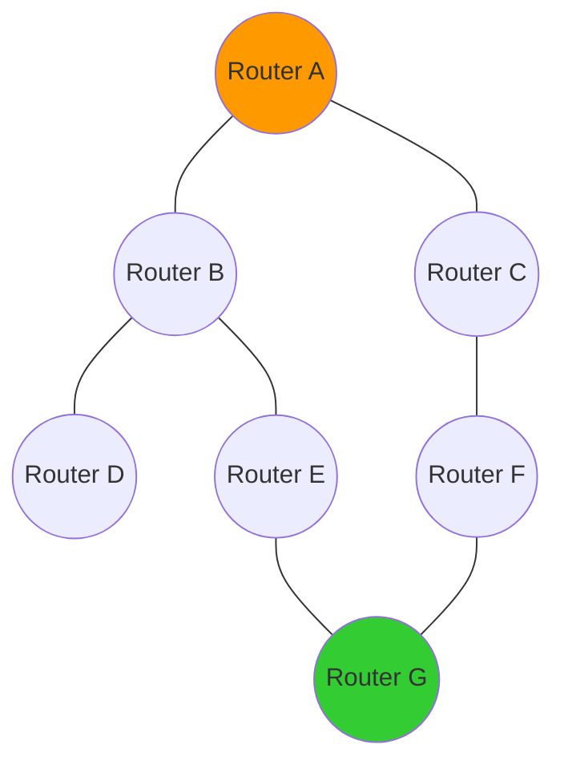
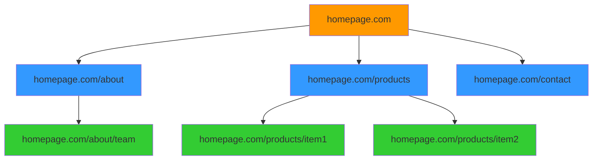
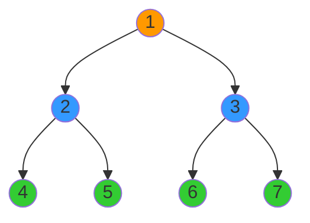
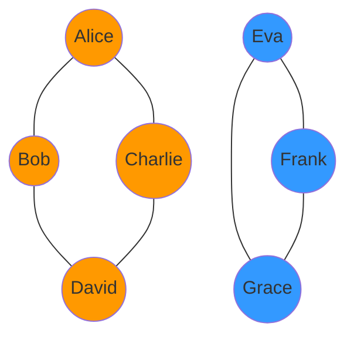
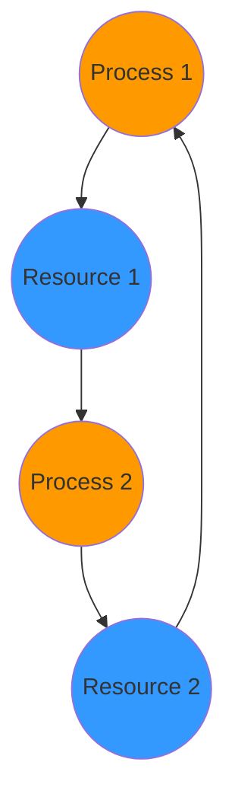
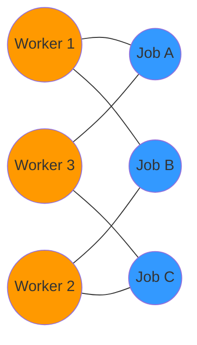
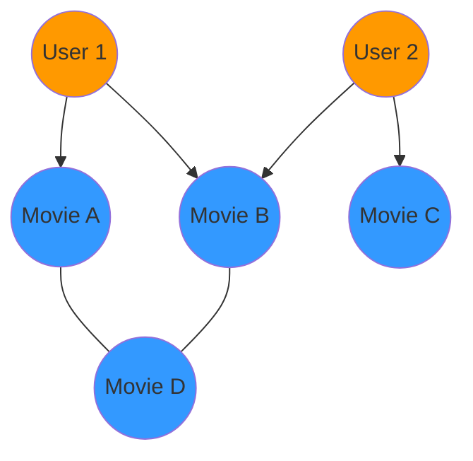
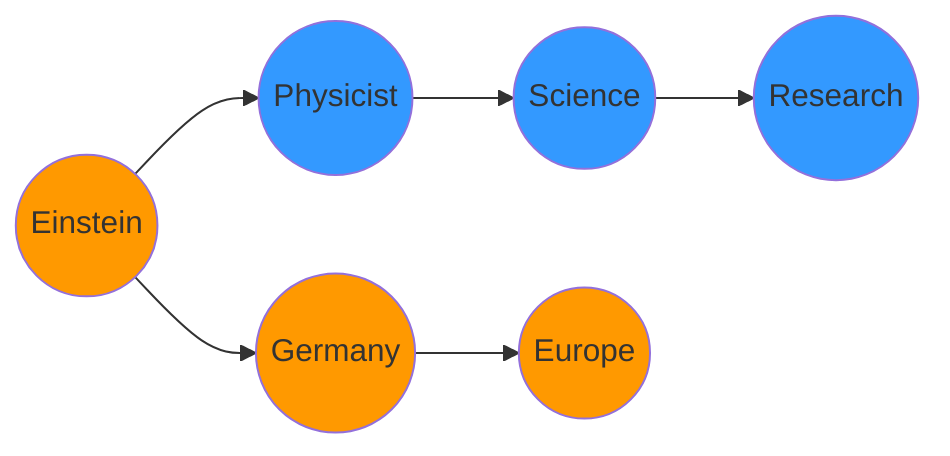

# 🌍 BFS in the Real World: Practical Applications

BFS isn't just a theoretical algorithm - it's a powerful tool with numerous real-world applications. In this lesson, we'll explore how BFS is used to solve practical problems across different domains.

## 1. Shortest Path Finding 🗺️

One of the most common applications of BFS is finding the shortest path in unweighted graphs.

### Example: Network Routing

In computer networks where each link has equal weight (cost), BFS can find the path with the fewest hops between nodes.



> [!NOTE]
> BFS would find that the shortest path from Router A to Router G is A → B → E → G (3 hops), rather than A → C → F → G (also 3 hops). If both paths have the same number of hops, BFS will typically return the first one it finds.

### Example: Word Ladder Problem

In the word ladder puzzle, you need to transform one word into another by changing one letter at a time, with each intermediate step being a valid word.

For instance, transforming "COLD" to "WARM":
```
COLD → CORD → CARD → WARD → WARM
```

This can be modeled as a graph where each word is a vertex, and there's an edge between words that differ by exactly one letter. BFS finds the shortest transformation sequence.

## 2. Level Order Traversal 🌲

BFS is perfect for traversing structures level by level.

### Example: Web Crawling

Web crawlers use BFS to discover and index web pages starting from a seed URL:



By using BFS, the crawler can methodically explore the web structure, ensuring that higher-priority pages (those closer to the seed URL) are indexed first.

### Example: Level-Order Tree Traversal

In binary trees, BFS is used to visit nodes level by level, from left to right:



BFS traversal: 1, 2, 3, 4, 5, 6, 7

This is useful in many tree-related applications, such as visualizing hierarchical data.

## 3. Finding Connected Components 🧩

BFS can identify all connected components in an undirected graph.

### Example: Image Segmentation

In image processing, BFS helps identify connected regions of similar pixels:

```
Original Image:  Connected Components:
⬜⬜⬜⬜⬛⬛⬛  ⬜⬜⬜⬜🟥🟥🟥
⬜⬜⬛⬜⬛⬛⬛  ⬜⬜🟦⬜🟥🟥🟥
⬜⬛⬛⬛⬜⬜⬜  ⬜🟦🟦🟦⬜⬜⬜
⬜⬜⬛⬜⬜⬛⬛  ⬜⬜🟦⬜⬜🟩🟩
⬛⬜⬜⬜⬛⬛⬛  🟨⬜⬜⬜🟩🟩🟩
```

By running BFS from each unvisited pixel, we can identify and label separate regions.

### Example: Social Network Communities

In social networks, BFS can identify connected groups of users:



This helps in community detection and targeted content delivery.

## 4. State Space Exploration 🧠

BFS is excellent for exploring possible states in puzzles and games.

### Example: 8-Puzzle Solver

In the 8-puzzle (sliding puzzle), BFS can find the shortest sequence of moves to solve the puzzle:

```
Initial State:    Goal State:
+---+---+---+    +---+---+---+
| 2 | 8 | 3 |    | 1 | 2 | 3 |
+---+---+---+    +---+---+---+
| 1 | 6 | 4 |    | 8 |   | 4 |
+---+---+---+    +---+---+---+
| 7 |   | 5 |    | 7 | 6 | 5 |
+---+---+---+    +---+---+---+
```

Each state is a vertex, and edges connect states that can be reached by a single move.

> [!WARNING]
> The state space can grow exponentially, so pure BFS may be inefficient for complex puzzles. In practice, informed search algorithms like A* (which combines BFS with heuristics) are often used.

### Example: Chess Move Generator

In chess AI, BFS can generate all possible game states after a certain number of moves:

```
Initial Board → States after 1 move → States after 2 moves → ...
```

This aids in move planning and evaluation.

## 5. Detecting Cycles in Graphs 🔄

BFS can detect cycles in undirected graphs. If, during BFS, we encounter a vertex that's already been visited and it's not the parent of the current vertex, we've found a cycle.

### Example: Deadlock Detection in Operating Systems

Operating systems can model resource allocation as a graph, where cycles represent potential deadlocks:



BFS can detect such cycles, helping prevent system deadlocks.

## 6. Finding Bipartite Graphs 🎭

A bipartite graph can be divided into two sets where no two vertices within the same set are adjacent. BFS can determine if a graph is bipartite by coloring vertices.

### Example: Matching Problems

Many assignment problems can be modeled as bipartite matching:



BFS helps verify the bipartite structure and aids in finding optimal assignments.

## 7. AI and Machine Learning Applications 🤖

BFS plays a role in various AI and machine learning applications.

### Example: Recommendation Systems

Recommendation systems can use BFS to explore the network of user preferences and item relationships:



BFS can find related items within a certain "distance" of a user's interests.

### Example: Knowledge Graph Navigation

In knowledge graphs, BFS helps discover relationships and paths between entities:



This aids in question answering and information retrieval.

## 🤔 Think About It

Consider these questions to deepen your understanding:

1. How might BFS be useful in a GPS navigation system?

2. Can you think of scenarios where BFS would be preferred over DFS, and vice versa?

3. How would you use BFS to find the shortest path in a 2D grid where some cells are obstacles?

<details>
<summary>Insights</summary>

1. In GPS navigation, BFS could find the route with the fewest intersections or turns. However, for finding the shortest distance, Dijkstra's algorithm (a weighted version of BFS) would be more appropriate.

2. BFS is preferred when:
   - Finding the shortest path in unweighted graphs
   - Level-by-level exploration is needed
   - The solution is likely to be closer to the starting point

   DFS is preferred when:
   - Exploring all possibilities in a branch before backtracking
   - Memory is limited (DFS typically uses less memory)
   - The solution is likely to be deeper in the graph

3. Represent the grid as a graph where each cell is a vertex, and adjacent non-obstacle cells are connected by edges. Run BFS from the starting cell, marking cells as visited and tracking their distance from the start. When you reach the destination cell, the distance gives you the shortest path length.
</details>

## Summary

BFS is a versatile algorithm with applications across numerous domains:

- 🗺️ **Navigation and path finding** in maps, networks, and game states
- 🌐 **Web crawling and indexing** for search engines
- 👥 **Social network analysis** for community detection
- 🎨 **Image processing** for connected component labeling
- 🎮 **Game AI** for state exploration
- 🖥️ **System design** for deadlock detection
- 🤖 **AI applications** for knowledge graphs and recommendation systems

Understanding BFS not only helps you solve graph problems but also provides insights into how many real-world systems and applications work.

In the next lesson, we'll discuss performance optimization techniques and compare BFS with related algorithms. 