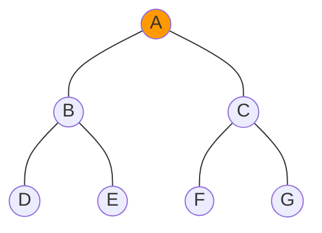
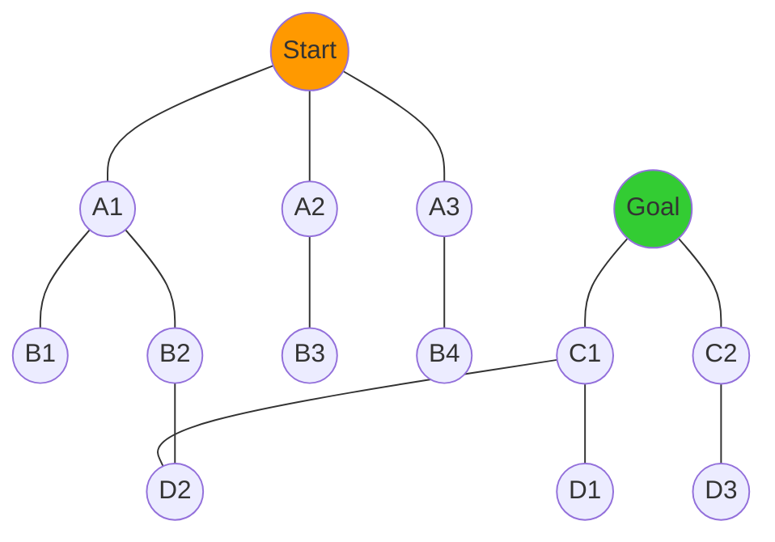

# 🔄 BFS in Context: Comparison with Other Algorithms

To fully appreciate BFS, it's valuable to understand how it relates to other graph traversal and search algorithms. In this lesson, we'll compare BFS with several related algorithms, highlighting their differences, strengths, and ideal use cases.

## BFS vs. DFS: The Two Fundamental Traversals 🔄

Breadth-First Search (BFS) and Depth-First Search (DFS) are the two primary graph traversal algorithms. Let's see how they differ:

### Traversal Pattern



- **BFS**: A, B, C, D, E, F, G (level by level)
- **DFS**: A, B, D, E, C, F, G (explore one branch fully before backtracking)

### Key Differences

| Feature | BFS | DFS |
|---------|-----|-----|
| Data Structure | Queue (FIFO) | Stack (LIFO) |
| Memory Usage | 🔴 Higher (must store all nodes at current level) | 🟢 Lower (only stores path from root to current node) |
| Path Finding | 🟢 Finds shortest path in unweighted graphs | 🔴 May not find shortest path |
| Completeness | 🟢 Will find solution if one exists | 🟢 Will find solution if one exists |
| Implementation | Iterative is natural | Both recursive and iterative are natural |
| Good For | Finding nearby solutions, shortest paths | Exploring all possibilities, maze solving |

> [!TIP]
> Think of BFS as a cautious explorer who thoroughly examines the immediate vicinity before venturing further, while DFS is an adventurous explorer who rushes down one path as far as possible before backtracking.

## BFS vs. Dijkstra's Algorithm: When Weights Matter 🏋️‍♂️

While BFS finds the shortest path in terms of the number of edges, Dijkstra's algorithm finds the shortest path in weighted graphs.

### Example

```mermaid
graph LR;
    A((A)):::start --- B((B));
    A --- C((C));
    B --- D((D)):::end;
    C --- D;
    
    linkStyle 0 stroke-width:2px,fill:none,stroke:blue,label:1;
    linkStyle 1 stroke-width:2px,fill:none,stroke:green,label:4;
    linkStyle 2 stroke-width:2px,fill:none,stroke:blue,label:5;
    linkStyle 3 stroke-width:2px,fill:none,stroke:green,label:1;
    
    classDef start fill:#ff9900;
    classDef end fill:#33cc33;
```

- **BFS Path**: A → B → D (2 edges)
- **Dijkstra's Path**: A → C → D (total weight: 5)

### Key Differences

| Feature | BFS | Dijkstra's |
|---------|-----|------------|
| Edge Consideration | All edges have equal weight | Considers edge weights |
| Data Structure | Simple queue | Priority queue |
| Time Complexity | O(V + E) or O(V²) with adjacency matrix | O((V + E) log V) with binary heap |
| Space Complexity | O(V) | O(V) |
| Use Case | Unweighted graphs | Weighted graphs without negative edges |

> [!NOTE]
> BFS is actually a special case of Dijkstra's algorithm where all edge weights are equal.

## BFS vs. A* Search: Adding Heuristics 🧠

A* (A-star) search combines the advantages of BFS/Dijkstra's with heuristic information to find paths more efficiently.

### Example: Path Finding in a Grid

```
S = Start, G = Goal, # = Obstacle

+---+---+---+---+---+
| S |   |   |   |   |
+---+---+---+---+---+
|   | # | # |   |   |
+---+---+---+---+---+
|   | # |   |   |   |
+---+---+---+---+---+
|   |   |   | # |   |
+---+---+---+---+---+
|   | # |   |   | G |
+---+---+---+---+---+
```

- **BFS**: Explores outward in all directions (inefficient)
- **A***: Uses heuristic (like Manhattan distance) to prioritize promising paths toward the goal

### Key Differences

| Feature | BFS | A* Search |
|---------|-----|-----------|
| Knowledge Used | No domain knowledge | Uses heuristic function |
| Exploration Pattern | Equal in all directions | Guided toward the goal |
| Optimality | Optimal for unweighted graphs | Optimal if heuristic is admissible |
| Time Efficiency | 🔴 Less efficient | 🟢 More efficient with good heuristic |
| Use Cases | General graph traversal | Path finding in spatial problems, puzzles |

<details>
<summary>💡 What makes a good heuristic?</summary>

A good heuristic for A* should:
1. Never overestimate the true cost to the goal (to maintain optimality)
2. Be as close as possible to the true cost (for efficiency)
3. Be fast to compute

Common heuristics include:
- Manhattan distance for grid-based movement
- Euclidean distance for unrestricted movement
- Custom domain-specific heuristics for specialized problems
</details>

## BFS vs. Bidirectional Search: Meeting in the Middle 🤝

Bidirectional search runs two simultaneous searches: one from the start and one from the goal.

### Visualization



### Key Differences

| Feature | BFS | Bidirectional Search |
|---------|-----|---------------------|
| Search Direction | One-way (from start) | Two-way (from start and goal) |
| Efficiency | O(b^d) where b is branching factor and d is distance | O(b^(d/2) + b^(d/2)) ≈ O(b^(d/2)) |
| Memory Usage | 🔴 Higher | 🔴 Higher (must store two frontiers) |
| Implementation | Simpler | More complex (must detect when frontiers intersect) |
| Use Cases | General traversal | Finding paths between two specific points |

> [!TIP]
> Bidirectional search is particularly effective when:
> - The branching factor is high
> - The start and goal vertices are known
> - The distance between them is large

## BFS vs. Iterative Deepening: Combining DFS and BFS 🌀

Iterative Deepening Depth-First Search (IDDFS) combines the space efficiency of DFS with the level-by-level exploration of BFS.

### How It Works

IDDFS repeatedly runs DFS with an increasing depth limit:
1. First, explore to depth 0 (just the start vertex)
2. Then, explore to depth 1 (start vertex and its neighbors)
3. Then, explore to depth 2, and so on...

### Key Differences

| Feature | BFS | IDDFS |
|---------|-----|-------|
| Space Complexity | O(b^d) | O(d) |
| Time Complexity | O(b^d) | O(b^d) (but with higher constant factor) |
| Traversal Pattern | Level-by-level | Level-by-level, but using DFS |
| Implementation | Simple | More complex (requires depth limiting) |
| Memory Usage | 🔴 Higher | 🟢 Lower |
| Use Cases | When memory is not constrained | When memory is limited |

## BFS vs. Bellman-Ford: Handling Negative Weights 📉

While BFS works for unweighted graphs and Dijkstra's for positive-weighted graphs, Bellman-Ford can handle graphs with negative edge weights.

### Example

```mermaid
graph LR;
    A((A)):::start --- B((B));
    A --- C((C));
    B --- D((D)):::end;
    C --- D;
    C --- B;
    
    linkStyle 0 stroke-width:2px,fill:none,stroke:blue,label:2;
    linkStyle 1 stroke-width:2px,fill:none,stroke:green,label:1;
    linkStyle 2 stroke-width:2px,fill:none,stroke:blue,label:3;
    linkStyle 3 stroke-width:2px,fill:none,stroke:green,label:2;
    linkStyle 4 stroke-width:2px,fill:none,stroke:red,label:-2;
    
    classDef start fill:#ff9900;
    classDef end fill:#33cc33;
```

- **BFS Path**: A → B → D (fewest edges)
- **Bellman-Ford Path**: A → C → B → D (optimal with negative weight)

### Key Differences

| Feature | BFS | Bellman-Ford |
|---------|-----|--------------|
| Edge Weights | Unweighted (or uniform) | Can handle any weights, including negative |
| Negative Cycles | N/A | Can detect negative cycles |
| Time Complexity | O(V + E) or O(V²) with matrix | O(VE) |
| Use Cases | Shortest path in unweighted graphs | Shortest path with possible negative weights |

## 🤔 When to Choose Which Algorithm?

Here's a quick decision guide for selecting the right algorithm:

1. **Use BFS when**:
   - You need the shortest path in an unweighted graph
   - You're doing level-order traversal
   - You want to find all nodes within a certain distance
   - The solution is likely close to the starting point

2. **Use DFS when**:
   - You need to explore all paths or solutions
   - Memory is constrained
   - The graph is very deep
   - You're checking for cycles or connectivity

3. **Use Dijkstra's when**:
   - The graph has positive weights
   - You need the shortest path in a weighted graph

4. **Use A* when**:
   - You have a heuristic to guide the search
   - Finding the path efficiently is important
   - The problem has spatial or distance properties

5. **Use Bidirectional Search when**:
   - You know both the start and goal
   - The graph has a high branching factor
   - The path is expected to be long

6. **Use Bellman-Ford when**:
   - The graph may have negative weights
   - You need to detect negative cycles

## 🧠 Think About It

Consider these questions:

1. For which type of graph would BFS with an adjacency matrix be more efficient than BFS with an adjacency list?

2. If you were implementing a web crawler, would you use BFS or DFS? Why?

3. In a social network application, if you wanted to find all friends within 3 degrees of connection, which algorithm would you use?

<details>
<summary>Answers</summary>

1. BFS with an adjacency matrix would be more efficient for **dense graphs** where most vertices are connected to most other vertices. In such cases, the O(V²) time complexity of the matrix approach is competitive, and the matrix provides fast O(1) edge lookups.

2. For a web crawler, **BFS** is typically preferred because:
   - It explores pages closest to the seed URL first (which are often more relevant)
   - It ensures broad coverage of the web rather than going deep into a single domain
   - It can be easily prioritized or modified to respect crawl delays

3. To find all friends within 3 degrees, you would use **BFS** because:
   - It naturally explores by levels of connection
   - You can easily limit the search to a specific depth (3 in this case)
   - It finds all nodes at each level before proceeding to the next
</details>

## Summary

We've compared BFS with several related algorithms:

- **DFS**: Explores deeply before widely
- **Dijkstra's**: BFS with weighted edges
- **A***: Dijkstra's with heuristic guidance
- **Bidirectional Search**: BFS from both ends
- **IDDFS**: Space-efficient BFS using repeated DFS
- **Bellman-Ford**: Handles negative weights

Understanding these relationships helps you select the right algorithm for each problem and appreciate the evolution of graph search techniques.

In our final lesson, we'll consolidate everything we've learned and discuss optimization techniques for BFS with adjacency matrices. 