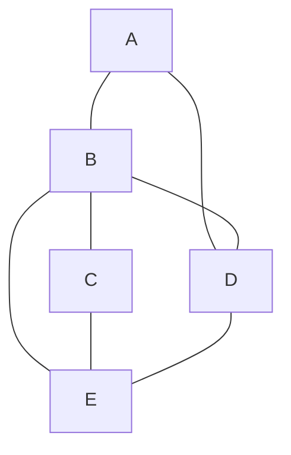

# 🔄 Hamiltonian Cycle: The Challenge

> [!NOTE]
> A Hamiltonian Cycle is a path in an undirected graph that visits each vertex exactly once and returns to the starting vertex, forming a closed loop.

## 🧩 The Problem

Imagine you're planning a road trip through several cities. You want to visit each city exactly once and then return to your starting point. This classic problem in graph theory is known as the **Hamiltonian Cycle** problem.

Formally, given an undirected graph G with n vertices, we need to determine whether there exists a cycle that:
1. Visits every vertex exactly once
2. Returns to the starting vertex
3. Forms a complete cycle

## 🌍 Real-World Applications

This seemingly abstract problem has numerous practical applications:

- 🚚 **Delivery Route Planning**: Finding efficient routes for delivery vehicles
- 🔌 **Circuit Design**: Creating optimal layouts for electronic circuits
- 🧬 **Genome Sequencing**: Assembling DNA fragments in bioinformatics
- 🎮 **Game Development**: Designing puzzles where players must visit every location once

## 🎯 Examples

Let's visualize this with some examples:

In this graph:
- A Hamiltonian Cycle exists: A → B → C → E → D → A
- Each vertex is visited exactly once before returning to the start

Why is this challenging?

The Hamiltonian Cycle problem is computationally intensive because:

- As the number of vertices increases, the number of potential paths grows factorially
- It's an NP-complete problem, meaning no known polynomial-time solution exists
- We must systematically explore different paths to find a valid cycle

This makes it both theoretically fascinating and practically challenging!

## 🤔 Think About It

Before we dive into solving this problem:

1. How would you approach finding a Hamiltonian Cycle in a small graph?
2. What properties might a graph need to have for a Hamiltonian Cycle to exist?
3. Can you think of any graphs that definitely won't have a Hamiltonian Cycle?

> [!TIP]
> As we explore the solution in the following lessons, try to visualize the process of finding a cycle on paper with a small example graph. This hands-on approach often helps solidify understanding! 