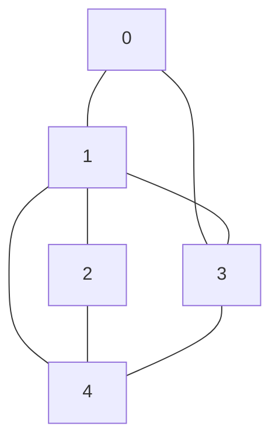

# 📊 Representing Graphs for Hamiltonian Cycle

Before we can solve the Hamiltonian Cycle problem, we need to understand how to represent a graph in code. The representation we choose will significantly impact our algorithm's implementation.

## 🧠 Adjacency Matrix: Our Representation of Choice

For our Hamiltonian Cycle algorithm, we'll use an **adjacency matrix** representation:

```
[
  [0, 1, 0, 1, 0],
  [1, 0, 1, 1, 1],
  [0, 1, 0, 0, 1],
  [1, 1, 0, 0, 1],
  [0, 1, 1, 1, 0]
]
```

> [!NOTE]
> In an adjacency matrix, a value of 1 at position [i][j] indicates there's an edge connecting vertex i to vertex j. A value of 0 means no connection exists.

## 🔍 Understanding the Adjacency Matrix

Let's break down what this matrix represents:

- The matrix dimensions (n×n) correspond to the number of vertices in the graph
- Each row and column represents a vertex (0 to n-1)
- The diagonal is typically all zeros (assuming no self-loops)
- For undirected graphs, the matrix is symmetric around the diagonal



The above graph corresponds to our example adjacency matrix.

## 💡 Advantages of Adjacency Matrix

For the Hamiltonian Cycle problem, adjacency matrices offer key benefits:

1. **Quick Edge Checking**: We can check if vertices are connected in O(1) time
2. **Implementation Simplicity**: Straightforward to code and understand
3. **Vertex Connectivity**: Easy to determine how many edges each vertex has

<details>
<summary>Alternative Representations</summary>

While we're using an adjacency matrix, other common graph representations include:

- **Adjacency List**: More space-efficient for sparse graphs, but slower edge checking
- **Edge List**: Simple but less efficient for our algorithm's needs
- **Incidence Matrix**: Useful for certain applications but overly complex for our needs

The choice of representation depends on the specific algorithm and the properties of the graph you're working with.
</details>

## 🔄 Matrix Interpretation for Our Algorithm

When building a Hamiltonian Cycle, we'll use the adjacency matrix to:

1. Check if two vertices are connected (can we move from current vertex to next)
2. Verify if our cycle is valid (is the last vertex connected to the first)
3. Efficiently track adjacency information during our search

> [!TIP]
> When working with adjacency matrices, remember that the rows and columns are zero-indexed. This means vertex 0 corresponds to the first row and column, vertex 1 to the second, and so on.

## 💭 Questions to Consider

Before moving on:

1. How would you represent a directed graph using an adjacency matrix?
2. How might the density of edges in a graph affect the efficiency of our representation?
3. Can you draw the graph represented by this adjacency matrix?
   ```
   [0, 1, 1]
   [1, 0, 1]
   [1, 1, 0]
   ```

In the next lesson, we'll explore the core concept that powers our solution: backtracking! 