# 🔄 Backtracking: The Algorithm's Engine

## 🧩 What is Backtracking?

Backtracking is a powerful algorithmic technique that systematically explores all possible solutions to a problem by incrementally building candidates and abandoning them ("backtracking") as soon as it determines they cannot lead to a valid solution.

> [!NOTE]
> Think of backtracking as navigating a maze: you explore one path until you hit a dead end, then backtrack to the last junction and try a different route.

## 🌲 Backtracking and the Decision Tree

Backtracking can be visualized as traversing a decision tree:

```mermaid
graph TD;
    Start --> V0;
    V0 --> V0_1;
    V0 --> V0_2;
    V0 --> V0_3;
    V0_1 --> V0_1_1["❌ Dead end"];
    V0_1 --> V0_1_2;
    V0_2 --> V0_2_1["❌ Dead end"];
    V0_2 --> V0_2_2["✅ Solution"];
    V0_3 --> V0_3_1;
    V0_3 --> V0_3_2["❌ Dead end"];
```



Each node represents a partial solution, and each branch represents a choice to extend that solution.

## 🧠 Key Principles of Backtracking

Backtracking algorithms typically share these characteristics:

1. **Incremental Construction**: Build the solution one element at a time
2. **Validity Checking**: Verify if the current partial solution can lead to a complete solution
3. **Recursive Exploration**: Use recursion to explore different possibilities
4. **Abandonment**: Abandon paths that cannot lead to valid solutions
5. **Completeness**: Systematically explore all possibilities until a solution is found

## 📝 Pseudocode Template for Backtracking

```
function backtrack(partialSolution):
    if partialSolution is a complete solution:
        return partialSolution
    
    for each possible next step:
        if next step is valid:
            add next step to partialSolution
            
            result = backtrack(partialSolution)
            if result is a valid solution:
                return result
                
            remove next step from partialSolution (backtrack)
    
    return "no solution found"
```

## 🚦 Why Backtracking for Hamiltonian Cycle?

Backtracking is ideal for the Hamiltonian Cycle problem because:

- We can build a potential cycle incrementally by adding one vertex at a time
- We can quickly check if adding a vertex maintains a valid path
- We can efficiently abandon invalid paths early
- It provides a systematic way to explore all possible cycles

> [!WARNING]
> While backtracking is more efficient than brute force, it still has exponential time complexity in the worst case. For large graphs, it may still be impractical.

## 💡 Backtracking in Action: A Simple Example

Let's consider a small graph with just 4 vertices:


Our backtracking process might look like:

1. Start at A
2. Try path: A → B
3. Try path: A → B → C
4. Try path: A → B → C → D (dead end, no way back to A)
5. Backtrack to A → B
6. Try path: A → B → D
7. Try path: A → B → D → C
8. Complete cycle: A → B → D → C → A (found a solution!)

<details>
<summary>Avoiding Common Traps</summary>

When implementing backtracking for Hamiltonian Cycle:

- **Infinite Loops**: Use a "visited" array to prevent revisiting vertices
- **Incomplete Cycles**: Check that the last vertex connects back to the first
- **Inefficient Pruning**: Abandon paths as soon as they become invalid
- **Redundant Exploration**: For undirected graphs, consider fixing the starting vertex
</details>

## 🤔 Questions to Ponder

Before moving to the implementation:

1. How would the backtracking tree grow as the number of vertices increases?
2. How might we optimize the backtracking approach for certain types of graphs?
3. Can you trace through the backtracking process for a simple 3-vertex complete graph?

In the next lesson, we'll implement the backtracking solution for finding a Hamiltonian Cycle! 