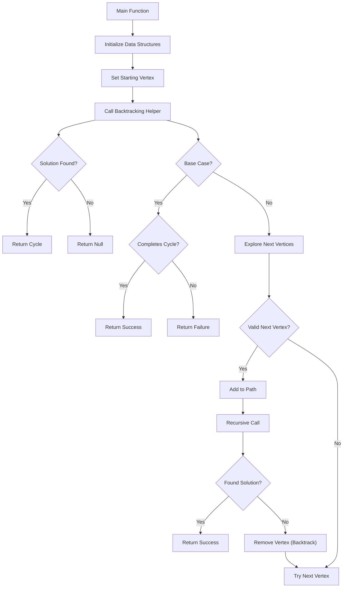
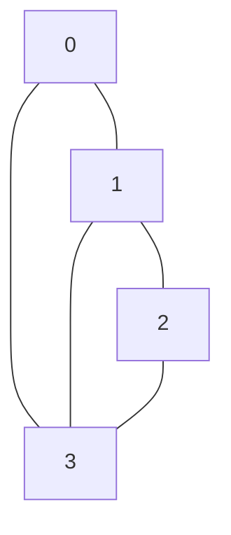

# 💻 Coding the Hamiltonian Cycle Algorithm

Now that we understand the problem and the backtracking approach, let's implement the Hamiltonian Cycle algorithm step by step.

## 🧱 The Building Blocks

Our implementation will need these key components:

1. A function to find a Hamiltonian Cycle in a graph
2. A recursive helper function to implement the backtracking logic
3. Data structures to track our path and visited vertices
4. Logic to check if a complete cycle exists

## 🏗️ The Implementation Structure

Let's break down our implementation into logical parts:



## 📝 The Code Implementation

Let's implement the algorithm in pseudocode first:

```
function findHamiltonianCycle(graph):
    numVertices = length of graph
    path = array of size numVertices, initialized with -1
    visited = array of size numVertices, initialized with false
    
    // Start from vertex 0
    path[0] = 0
    visited[0] = true
    
    if hamCycleUtil(graph, path, visited, 1):
        path.append(0)  // Complete the cycle by returning to start
        return path
    
    return null  // No Hamiltonian Cycle exists

function hamCycleUtil(graph, path, visited, position):
    // Base case: all vertices are included in the path
    if position == numVertices:
        // Check if the last vertex is adjacent to the first vertex
        if graph[path[position-1]][path[0]] == 1:
            return true
        else:
            return false
    
    // Try different vertices as the next candidate
    for vertex from 1 to numVertices-1:
        // Check if this vertex is adjacent to the previous vertex
        // and has not been visited yet
        if graph[path[position-1]][vertex] == 1 AND NOT visited[vertex]:
            // Add this vertex to the path
            path[position] = vertex
            visited[vertex] = true
            
            // Recur to construct the rest of the path
            if hamCycleUtil(graph, path, visited, position+1):
                return true
                
            // Backtrack: If adding this vertex doesn't lead to a solution,
            // then remove it and try a different vertex
            visited[vertex] = false
            path[position] = -1
    
    // If no vertex can be added to the path, return false
    return false
```

## 🔍 Detailed Walkthrough

Let's trace through how this algorithm works on a small example:

Consider this graph:

```
[
  [0, 1, 0, 1],
  [1, 0, 1, 1],
  [0, 1, 0, 1],
  [1, 1, 1, 0]
]
```

Visually:



Here's how our algorithm would process this:

1. Initialize `path = [-1, -1, -1, -1]` and `visited = [false, false, false, false]`
2. Set `path[0] = 0` and `visited[0] = true`
3. Call `hamCycleUtil(graph, path, visited, 1)`
4. Try vertex 1: `path = [0, 1, -1, -1]`, `visited = [true, true, false, false]`
5. Try vertex 2: `path = [0, 1, 2, -1]`, `visited = [true, true, true, false]`
6. Try vertex 3: `path = [0, 1, 2, 3]`, `visited = [true, true, true, true]`
7. Check if vertex 3 is connected to vertex 0: Yes!
8. Return the cycle: `[0, 1, 2, 3, 0]`

## 💡 Key Insights

Several aspects of this implementation are worth highlighting:

- **Starting Vertex**: We always start from vertex 0, which simplifies our implementation without loss of generality
- **Vertex 0 Special Case**: We don't include vertex 0 in our exploration loop since we already set it as our starting point
- **Path Building**: We build our path directly in an array, updating it as we explore
- **Backtracking Effect**: Note how we reset both the path and visited status when we backtrack

> [!TIP]
> Pay close attention to the base case and the condition for completing a cycle. These are critical for the algorithm's correctness.

## 🧪 Edge Cases to Consider

Our implementation handles these special cases:

- **No Solution**: Returns null if no Hamiltonian Cycle exists
- **Single Vertex Graph**: Works correctly for a graph with just one vertex
- **Complete Graph**: Will find a solution for complete graphs (where every vertex connects to every other vertex)

<details>
<summary>Common Implementation Mistakes</summary>

Watch out for these common mistakes:

- **Forgetting to Check Cycle Completion**: Make sure the last vertex connects back to the first
- **Incorrect Backtracking**: Ensure both path and visited status are properly reset when backtracking
- **Off-by-One Errors**: Be careful with array indices, especially when checking the last vertex
- **Missing Edge Checks**: Always verify edge existence using the adjacency matrix before adding a vertex
</details>

In the next lesson, we'll analyze the time and space complexity of our Hamiltonian Cycle algorithm! 