# ⏱️ Analyzing the Complexity of Hamiltonian Cycle

Understanding the time and space complexity of our algorithm is crucial for assessing its efficiency and scalability. Let's dive into a detailed analysis.

## 🕒 Time Complexity: The Hard Truth

The Hamiltonian Cycle problem is **NP-complete**, which means it doesn't have a known polynomial-time solution.

> [!WARNING]
> In the worst case, our backtracking algorithm has an exponential time complexity!

### Detailed Breakdown:

- **Worst-Case Time Complexity: O(n!)**
  - In the worst case, we may need to explore all possible permutations of vertices
  - For a graph with n vertices, there are n! possible vertex orderings
  - Backtracking reduces this somewhat but doesn't change the exponential nature

### Comparative Growth:

| Graph Size | Approximate Maximum Operations |
|------------|--------------------------------|
| n = 5      | ~120 paths to check            |
| n = 10     | ~3.6 million paths             |
| n = 15     | ~1.3 trillion paths            |
| n = 20     | Too many to compute practically|

## 🧮 Space Complexity: Much More Reasonable

The space complexity of our algorithm is much more manageable.

- **Space Complexity: O(n)**
  - We need to store:
    - The adjacency matrix: O(n²) [input size, not counted in auxiliary space]
    - The path array: O(n)
    - The visited array: O(n)
    - Recursion stack: O(n) in the worst case
  - Total auxiliary space: O(n)

## 📈 Best vs. Worst Cases

The algorithm's performance varies significantly based on the graph structure:

### Best Case Scenarios:
- **Sparse Graphs with Few Valid Paths**: Early pruning of many branches
- **Hamiltonian Cycle Near the "Left" of Search Tree**: Finding a solution quickly
- **Special Graph Structures**: Some graph types guarantee Hamiltonian Cycles

### Worst Case Scenarios:
- **Dense Graphs with Many Potential Paths**: More branches to explore
- **No Hamiltonian Cycle Exists**: Must check all possibilities before concluding
- **Hamiltonian Cycle at the "Right" of Search Tree**: Late discovery of solution

## 🔄 Practical Performance Considerations

Despite the exponential worst-case complexity, the algorithm is practical for:

- Graphs with up to ~15-20 vertices (depending on structure)
- Applications where graph size is bounded
- Scenarios where some domain-specific pruning can be applied

```mermaid
graph TD;
    Small["Small Graphs<br/>(≤ 10 vertices)"] -->|"Fast<br/>(milliseconds)"| Practical1["Very Practical"];
    Medium["Medium Graphs<br/>(11-15 vertices)"] -->|"Reasonable<br/>(seconds)"| Practical2["Practical"];
    Large["Large Graphs<br/>(16-20 vertices)"] -->|"Slow<br/>(minutes/hours)"| Practical3["Sometimes Practical"];
    VeryLarge["Very Large Graphs<br/>(> 20 vertices)"] -->|"Very Slow<br/>(hours/days/years)"| Practical4["Not Practical"];
```

## 💡 Optimization Possibilities

The basic algorithm can be improved in several ways:

- **Branch Pruning**: Additional conditions to skip certain paths
- **Heuristic Ordering**: Prioritizing certain vertices in exploration
- **Parallelization**: Exploring different branches in parallel
- **Approximation**: Using heuristics for large graphs instead of exact solutions

> [!TIP]
> For practical implementations with large graphs, consider approximation algorithms instead of exact solutions, or use specialized solvers for NP-complete problems.

## 🤔 Food for Thought

1. How does the density of the graph (number of edges) affect the average running time?
2. Can you think of any special types of graphs for which finding a Hamiltonian Cycle is easier?
3. What would happen to the time complexity if we didn't use a "visited" array to track vertices?

Key Complexity Takeaways

- **Time Complexity**: O(n!) in the worst case, but often performs better in practice due to pruning
- **Space Complexity**: O(n) auxiliary space
- **Practical Limit**: Typically around 15-20 vertices for exact solutions
- **NP-Completeness**: No known polynomial-time solution exists
- **Trade-offs**: Exact solutions for small graphs vs. approximations for larger ones

In the next lesson, we'll explore practical applications and variations of the Hamiltonian Cycle problem! 