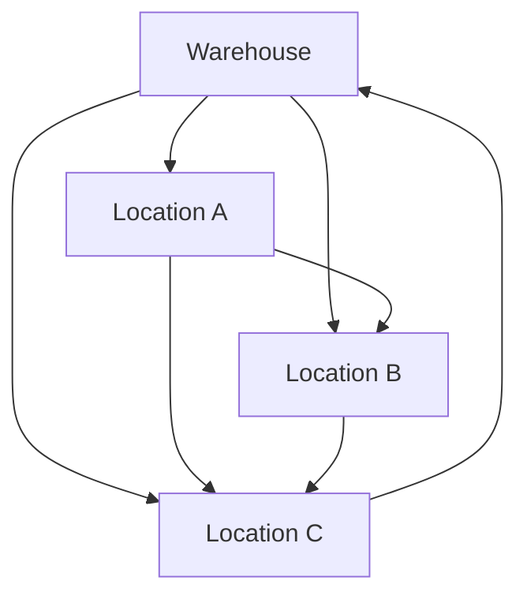
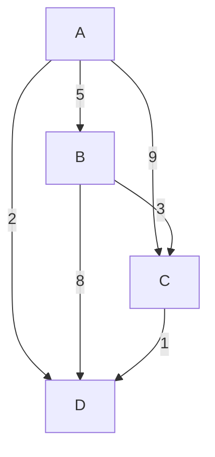
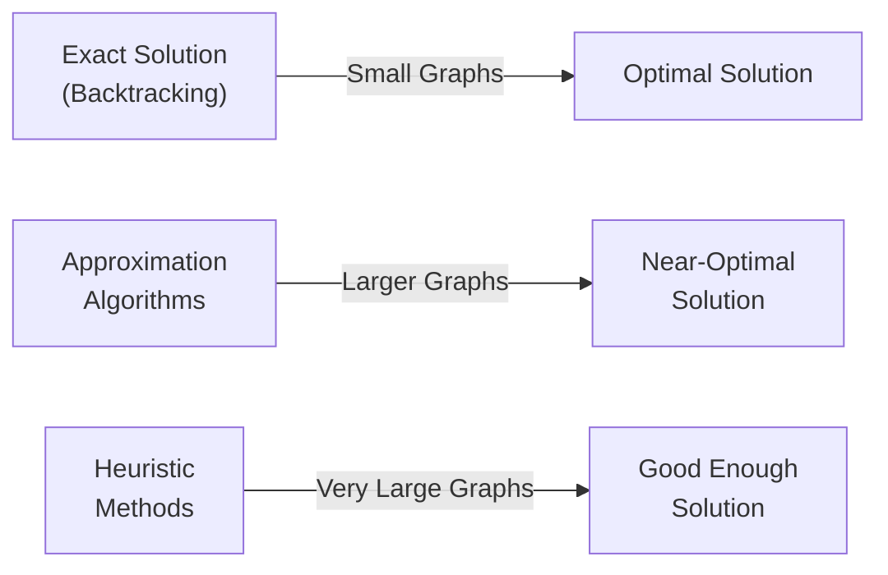

# 🌐 Real-World Applications and Variations

The Hamiltonian Cycle problem extends far beyond theoretical computer science. Let's explore its practical applications and interesting variations.

## 🚚 Practical Applications

### Logistics and Transportation

- **Delivery Route Planning**: Finding routes that visit multiple locations exactly once
- **Vehicle Routing Problems**: Determining efficient routes for fleets of vehicles
- **Tourist Trip Planning**: Creating itineraries that visit each attraction exactly once



### Circuit Design and Manufacturing

- **Printed Circuit Board Drilling**: Minimizing travel time for drilling machines
- **VLSI Circuit Design**: Creating efficient layouts for electronic components
- **Assembly Line Optimization**: Ordering operations to minimize processing time

### Computer Science and Networking

- **Network Design**: Planning efficient network topologies
- **Task Scheduling**: Ordering tasks with dependency constraints
- **Game Level Design**: Creating game levels where players must visit every location

## 🔄 Key Variations

### Hamiltonian Path Problem

Similar to the Hamiltonian Cycle, but without the requirement to return to the starting vertex.

> [!NOTE]
> A Hamiltonian Path visits each vertex exactly once but doesn't form a cycle.


### Traveling Salesperson Problem (TSP)

An extension of the Hamiltonian Cycle where edges have weights (distances), and the goal is to find the shortest Hamiltonian Cycle.

> [!TIP]
> The TSP adds an optimization component to the Hamiltonian Cycle problem. It's even harder to solve!



### Knight's Tour

A specialized Hamiltonian Path problem where a knight on a chess board must visit every square exactly once.

```
┌───┬───┬───┬───┬───┬───┬───┬───┐
│ 1 │ 38│ 55│ 42│ 5 │ 24│ 63│ 20│
├───┼───┼───┼───┼───┼───┼───┼───┤
│ 54│ 41│ 2 │ 25│ 64│ 19│ 6 │ 23│
├───┼───┼───┼───┼───┼───┼───┼───┤
│ 39│ 56│ 43│ 4 │ 21│ 62│ 25│ 7 │
├───┼───┼───┼───┼───┼───┼───┼───┤
│ 53│ 40│ 57│ 26│ 3 │ 22│ 18│ 8 │
├───┼───┼───┼───┼───┼───┼───┼───┤
│ 38│ 55│ 44│ 61│ 28│ 17│ 10│ 27│
├───┼───┼───┼───┼───┼───┼───┼───┤
│ 51│ 32│ 59│ 46│ 11│ 30│ 15│ 16│
├───┼───┼───┼───┼───┼───┼───┼───┤
│ 36│ 49│ 32│ 13│ 60│ 47│ 28│ 9 │
├───┼───┼───┼───┼───┼───┼───┼───┤
│ 31│ 52│ 35│ 48│ 33│ 12│ 29│ 14│
└───┴───┴───┴───┴───┴───┴───┴───┘
```

### Gray Code Generation

A Gray code is a binary numeral system where two consecutive values differ by only one bit. Generating a Gray code is equivalent to finding a Hamiltonian Path on a hypercube.

```
0000 → 0001 → 0011 → 0010 → 0110 → 0111 → 0101 → 0100 → 
1100 → 1101 → 1111 → 1110 → 1010 → 1011 → 1001 → 1000
```

## 🧠 Alternative Approaches

When exact solutions are impractical, consider these alternatives:

### Approximation Algorithms

- **Nearest Neighbor**: Greedy approach that always selects the closest unvisited vertex
- **Christofides Algorithm**: Provides a 3/2 approximation for the TSP on metric graphs
- **2-Opt**: Local search technique that iteratively improves a tour

### Heuristic Methods

- **Genetic Algorithms**: Evolutionary approach that "evolves" better solutions over time
- **Simulated Annealing**: Probabilistic technique inspired by metallurgical annealing
- **Ant Colony Optimization**: Bio-inspired algorithm mimicking ant behavior



## 🌟 Special Graph Cases

Some types of graphs have interesting Hamiltonian Cycle properties:

- **Complete Graphs**: Always have a Hamiltonian Cycle (many of them!)
- **Bipartite Graphs**: Have specific conditions for Hamiltonian Cycles to exist
- **Dirac's Theorem**: A graph with n vertices (n≥3) has a Hamiltonian Cycle if every vertex has degree ≥ n/2
- **Ore's Theorem**: A graph with n vertices (n≥3) has a Hamiltonian Cycle if for every pair of non-adjacent vertices, the sum of their degrees is ≥ n

<details>
<summary>Historical Context</summary>

The Hamiltonian Cycle problem is named after Sir William Rowan Hamilton, who invented a game called the "Icosian Game" in 1857. The game involved finding a path along the edges of a dodecahedron that visits each vertex exactly once before returning to the start.

This problem gained prominence in theoretical computer science when it was proven to be NP-complete in the 1970s as part of Karp's 21 NP-complete problems. Despite decades of research, no polynomial-time algorithm has been found.
</details>

## 💭 Questions to Ponder

1. How might you adapt the Hamiltonian Cycle algorithm to solve the Traveling Salesperson Problem?
2. Can you think of any real-world scenarios in your own life that could be modeled as a Hamiltonian Cycle problem?
3. Why might approximate solutions be preferred over exact ones in many practical applications?

In the final lesson, we'll summarize what we've learned and provide practice exercises to reinforce your understanding! 