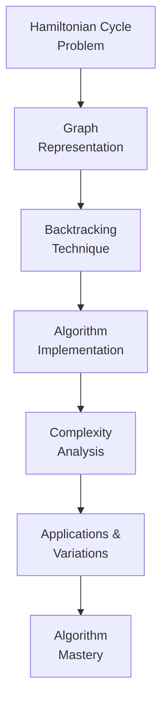
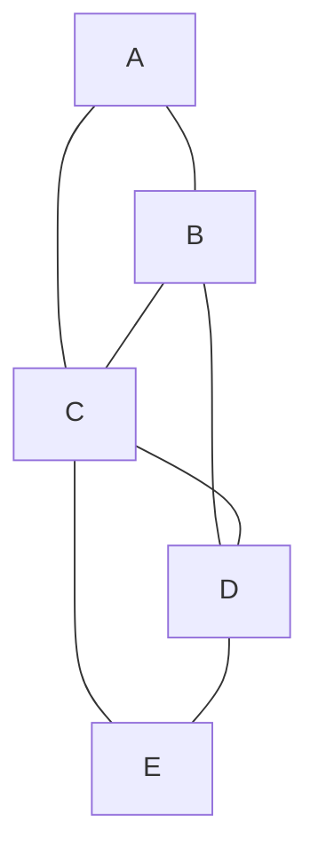
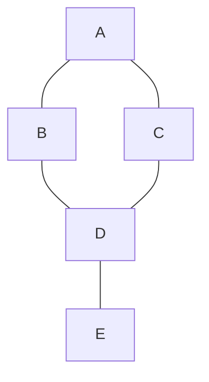
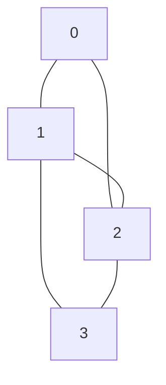

# 🎯 Mastering the Hamiltonian Cycle Algorithm

Congratulations on reaching the end of our Hamiltonian Cycle algorithm journey! Let's summarize what we've learned and practice our knowledge with some exercises.

## 📚 Key Learning Points

Throughout this series, we've explored:

1. **Problem Definition**: Understanding what a Hamiltonian Cycle is and why it matters
2. **Graph Representation**: Using adjacency matrices to represent graph structures
3. **Backtracking Technique**: Systematically exploring possibilities to find valid cycles
4. **Algorithm Implementation**: Coding the solution step-by-step
5. **Complexity Analysis**: Understanding the time and space requirements
6. **Applications and Variations**: Seeing how the concept applies in the real world

## 🧠 Core Concepts Review



### The Hamiltonian Cycle in a Nutshell:

> [!NOTE]
> The Hamiltonian Cycle algorithm uses backtracking to find a cycle that visits each vertex exactly once and returns to the starting point. It handles NP-completeness by systematically exploring and pruning paths.

## 🏋️ Practice Exercises

### Exercise 1: Basic Identification

Determine if each of the following graphs has a Hamiltonian Cycle. If so, provide one example cycle.

Graph A:


Graph B:


<details>
<summary>Solutions</summary>

Graph A: Yes, it has a Hamiltonian Cycle. One example is A → B → D → E → C → A.

Graph B: No, it doesn't have a Hamiltonian Cycle. The vertex E has only one connection, so any path that visits E can't return to another vertex without revisiting a vertex.
</details>

### Exercise 2: Tracing the Algorithm

Trace through our backtracking algorithm on the following graph, showing the first few steps of execution:



<details>
<summary>Solution</summary>

Initial state:
- `path = [0, -1, -1, -1]` (starting at vertex 0)
- `visited = [true, false, false, false]`

Call `hamCycleUtil(graph, path, visited, 1)`:

Try vertex 1:
- `path = [0, 1, -1, -1]`
- `visited = [true, true, false, false]`
- Call `hamCycleUtil(graph, path, visited, 2)`

Try vertex 2:
- `path = [0, 1, 2, -1]`
- `visited = [true, true, true, false]`
- Call `hamCycleUtil(graph, path, visited, 3)`

Try vertex 3:
- `path = [0, 1, 2, 3]`
- `visited = [true, true, true, true]`
- Base case: All vertices are visited
- Check if `graph[3][0] == 1`: No edge between vertex 3 and 0
- Backtrack and try another path

Try vertex 3 (from vertex 1):
- `path = [0, 1, 3, -1]`
- `visited = [true, true, false, true]`
- Call `hamCycleUtil(graph, path, visited, 3)`

And so on...
</details>

### Exercise 3: Code Modification

Modify the Hamiltonian Cycle algorithm to find a Hamiltonian Path instead of a cycle (where you don't need to return to the starting vertex). What changes would you need to make?

<details>
<summary>Solution</summary>

For a Hamiltonian Path, the main change is in the base case of the `hamCycleUtil` function:

```
function hamCycleUtil(graph, path, visited, position):
    // Base case: all vertices are included in the path
    if position == numVertices:
        // No need to check for a cycle back to start
        return true
    
    // Rest of the function remains the same
    ...
```

Also, in the main function, we don't need to append the starting vertex to the path at the end:

```
function findHamiltonianPath(graph):
    ...
    if hamCycleUtil(graph, path, visited, 1):
        return path  // No need to complete the cycle
    ...
```
</details>

### Exercise 4: Real-World Application

Design a small real-world problem that can be modeled as a Hamiltonian Cycle problem. Create the corresponding graph and solve it using our algorithm.

<details>
<summary>Example Solution</summary>

**Problem**: A delivery driver needs to deliver packages to 4 locations and return to the warehouse. The road network only allows certain direct connections between locations.

**Graph**:
- Vertices: Warehouse (W), Location A, Location B, Location C, Location D
- Edges: W-A, W-C, A-B, A-D, B-C, B-D, C-D, D-W

This can be represented by the adjacency matrix:
```
[0, 1, 0, 1, 0] // Warehouse
[1, 0, 1, 0, 1] // Location A
[0, 1, 0, 1, 1] // Location B
[1, 0, 1, 0, 1] // Location C
[0, 1, 1, 1, 0] // Location D
```

The Hamiltonian Cycle solution would be: W → A → B → C → D → W
</details>

## 🚀 Further Learning

To deepen your understanding of the Hamiltonian Cycle problem and related concepts:

1. **Explore Variations**: Implement the Traveling Salesperson Problem using Hamiltonian Cycles
2. **Study Graph Theory**: Learn more about graph properties that guarantee Hamiltonian Cycles
3. **Try Optimization**: Implement heuristic methods for finding approximate solutions to large instances
4. **Apply to Real Problems**: Use your knowledge to solve real-world routing or scheduling problems

> [!TIP]
> The best way to master algorithms is through practice! Try implementing the algorithm in different programming languages and testing it on various graphs.

## 🏆 Final Challenge

Implement an optimized version of the Hamiltonian Cycle algorithm that can handle larger graphs more efficiently. Consider adding heuristics or additional pruning strategies to improve performance.

<details>
<summary>Optimization Ideas</summary>

- **Degree Heuristic**: Try vertices with higher degrees first
- **Look-ahead Pruning**: Check if adding a vertex would create a dead-end later
- **Branch Ordering**: Order the branches of the search tree based on promising solutions
- **Parallelization**: Explore multiple branches of the search tree in parallel
- **Iterative Deepening**: Gradually increase the depth of the search
</details>

## 🎊 Congratulations!

You now have a solid understanding of the Hamiltonian Cycle problem, its algorithm, and applications. This knowledge will serve you well in tackling complex graph problems and optimization challenges in your programming journey.

Remember, mastering algorithms is an ongoing process—keep practicing and exploring new problems and techniques!

Happy coding! 🚀 