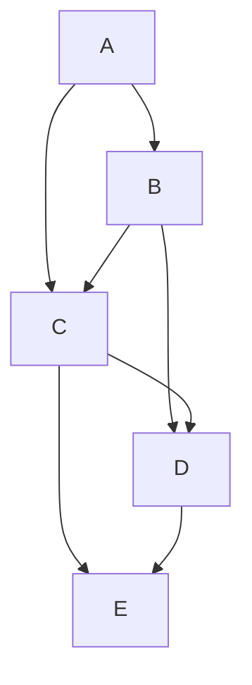

# 📊 Graph Representation for Hamiltonian Paths

Before we dive into solving the Hamiltonian Path problem, we need to understand how to represent graphs in code. The representation we choose can significantly impact our algorithm's efficiency.

## 🧩 Common Graph Representations

### 1️⃣ Adjacency Matrix

An adjacency matrix is a 2D array where `matrix[i][j] = 1` indicates an edge from vertex i to vertex j, and `matrix[i][j] = 0` indicates no edge.

```
    A  B  C  D  E
A  [0, 1, 1, 0, 0]
B  [1, 0, 1, 1, 0]
C  [1, 1, 0, 1, 1]
D  [0, 1, 1, 0, 1]
E  [0, 0, 1, 1, 0]
```

> [!TIP]
> Adjacency matrices are great for quickly checking if an edge exists between two vertices (O(1) time), but they use O(V²) space even for sparse graphs.

### 2️⃣ Adjacency List

An adjacency list represents a graph as an array or dictionary of lists, where each list contains the neighbors of a vertex.

```
A: [B, C]
B: [A, C, D]
C: [A, B, D, E]
D: [B, C, E]
E: [C, D]
```

> [!NOTE]
> For our Hamiltonian Path algorithm, we'll primarily use the adjacency matrix representation because it simplifies checking if two vertices are connected.

## 🔄 Converting Between Representations

Here's how you might convert from one representation to another:

<details>
<summary>From Adjacency Matrix to Adjacency List</summary>

```python
def matrix_to_list(matrix):
    adj_list = {}
    for i in range(len(matrix)):
        adj_list[i] = []
        for j in range(len(matrix[i])):
            if matrix[i][j] == 1:
                adj_list[i].append(j)
    return adj_list
```
</details>

<details>
<summary>From Adjacency List to Adjacency Matrix</summary>

```python
def list_to_matrix(adj_list, n):
    matrix = [[0 for _ in range(n)] for _ in range(n)]
    for vertex, neighbors in adj_list.items():
        for neighbor in neighbors:
            matrix[vertex][neighbor] = 1
    return matrix
```
</details>

## 🧮 Graph Properties for Hamiltonian Paths

When analyzing a graph for Hamiltonian Paths, certain properties can give us insights:

1. **Connectivity**: A graph must be connected to have a Hamiltonian Path
2. **Vertex Degree**: If any vertex has degree 0, it's isolated and no Hamiltonian Path exists
3. **Dirac's Theorem**: If every vertex has degree ≥ n/2 (where n is the number of vertices), a Hamiltonian Cycle exists



> [!WARNING]
> While these properties can help us quickly rule out some graphs, they don't guarantee a Hamiltonian Path. The only sure way is to search for one algorithmically.

## 🤔 Think About It

Before proceeding to the next lesson, consider:

1. Why might adjacency matrices be particularly useful for the Hamiltonian Path problem?
2. Can you think of a small graph where every vertex has degree ≥ 2 but no Hamiltonian Path exists?
3. How would you represent a weighted graph (where edges have different "costs" or "distances")? 