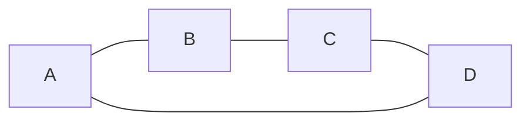

# 🔄 Solving Hamiltonian Paths with Backtracking

Backtracking is a powerful technique for solving problems that involve finding a configuration that satisfies certain constraints. It's particularly well-suited for the Hamiltonian Path problem.

## 🧠 Understanding Backtracking

> [!NOTE]
> Backtracking is like exploring a maze with a piece of string. You try one path, and if it leads to a dead end, you "backtrack" to the last junction and try a different route.

In the context of the Hamiltonian Path problem:
1. We start at a vertex
2. We recursively try to build a path by adding one vertex at a time
3. If we reach a dead end (can't add more vertices, but haven't visited all), we backtrack

## 📝 Backtracking Algorithm for Hamiltonian Path

Here's the step-by-step approach:

1. Start from a vertex (we may need to try all vertices as potential starting points)
2. Add the vertex to our path and mark it as visited
3. Recursively try to find a Hamiltonian Path from this vertex
4. If the recursive call fails, backtrack: remove the vertex from the path and mark it as unvisited
5. Try the next possible vertex

### 🎯 Pseudocode

```
function hamiltonianPath(graph):
    n = number of vertices in graph
    path = []  // To store the current path
    visited = [false, false, ..., false]  // To track visited vertices
    
    function findPath(currentVertex):
        Add currentVertex to path
        Mark currentVertex as visited
        
        If all vertices are visited (path.length == n):
            Return true (found a Hamiltonian Path)
            
        For each adjacent vertex nextVertex:
            If nextVertex is not visited:
                If findPath(nextVertex) returns true:
                    Return true
                    
        // Backtrack if no path was found
        Remove currentVertex from path
        Mark currentVertex as unvisited
        Return false
    
    // Try each vertex as a possible start
    For each vertex v in graph:
        If findPath(v) returns true:
            Return path (a valid Hamiltonian Path)
        Reset path and visited for next iteration
        
    Return null (no Hamiltonian Path exists)
```

## 🔍 Visualizing the Backtracking Process

Let's trace through a small example with backtracking:



<details>
<summary>Step-by-step execution</summary>

1. Start at vertex A:
   - Path: [A], Visited: [A]
   - Try neighbor B

2. Add vertex B:
   - Path: [A, B], Visited: [A, B]
   - Try neighbor C

3. Add vertex C:
   - Path: [A, B, C], Visited: [A, B, C]
   - Try neighbor D

4. Add vertex D:
   - Path: [A, B, C, D], Visited: [A, B, C, D]
   - All vertices visited! Found Hamiltonian Path: A→B→C→D

</details>

## ⚖️ Advantages and Limitations

> [!TIP]
> Backtracking is guaranteed to find a Hamiltonian Path if one exists, but it may take exponential time in the worst case.

**Advantages:**
- Simple to implement
- Guarantees finding a solution if one exists
- Works well for small to medium-sized graphs

**Limitations:**
- Exponential time complexity O(n!)
- Not practical for large graphs (more than ~20 vertices)

## 👨‍💻 Python Implementation

Here's how you might implement the backtracking approach in Python:

```python
def hamiltonian_path(graph):
    n = len(graph)
    path = []
    visited = [False] * n
    
    def find_path(v):
        path.append(v)
        visited[v] = True
        
        if len(path) == n:
            return True
            
        for i in range(n):
            if graph[v][i] == 1 and not visited[i]:
                if find_path(i):
                    return True
                    
        # Backtrack
        path.pop()
        visited[v] = False
        return False
    
    for start_node in range(n):
        if find_path(start_node):
            return True
        # Reset for next starting vertex
        path.clear()
        visited = [False] * n
        
    return False
```

## 🧠 Think About It

Consider these questions to deepen your understanding:

1. How would you modify the algorithm to return the actual path, not just whether a path exists?
2. Can you think of any optimizations to reduce the number of paths we need to explore?
3. Under what circumstances would a depth-first search (DFS) approach not find a Hamiltonian Path? 