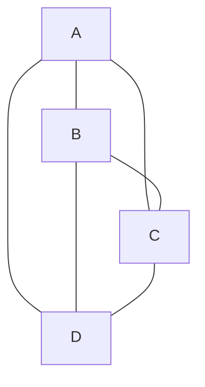
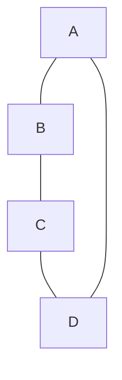

# 🚀 Optimizations and Special Cases for Hamiltonian Paths

While we've covered the classic algorithms for finding Hamiltonian Paths, there are numerous optimizations and special cases worth exploring. These can dramatically improve performance or simplify the problem in specific scenarios.

## 🔍 Early Detection of Impossible Cases

Before running any algorithm, we can quickly rule out some graphs:

> [!TIP]
> Quick checks can save significant computation time by identifying impossible cases early!

### 1️⃣ Connectivity Check

If the graph is not connected, it can't have a Hamiltonian Path.

```python
def is_connected(graph):
    n = len(graph)
    if n == 0:
        return False
    
    visited = [False] * n
    queue = [0]  # Start BFS from vertex 0
    visited[0] = True
    
    while queue:
        vertex = queue.pop(0)
        for i in range(n):
            if graph[vertex][i] == 1 and not visited[i]:
                visited[i] = True
                queue.append(i)
    
    return all(visited)  # All vertices must be reachable
```

### 2️⃣ Degree Check

A vertex with degree 0 (except in a single-vertex graph) means the graph can't have a Hamiltonian Path.

```python
def has_isolated_vertex(graph):
    n = len(graph)
    for i in range(n):
        if sum(graph[i]) == 0:
            return True
    return False
```

## 🧩 Special Graph Structures

Some graph types have known properties regarding Hamiltonian Paths:

### 1️⃣ Complete Graphs

> [!NOTE]
> A complete graph (where every vertex is connected to every other vertex) always has a Hamiltonian Path.

In fact, any permutation of vertices forms a valid Hamiltonian Path!



### 2️⃣ Path Graphs

A path graph (a simple chain of vertices) has exactly one Hamiltonian Path: the path itself.


### 3️⃣ Cycle Graphs

A cycle graph (a simple loop of vertices) has exactly n different Hamiltonian Paths, where n is the number of vertices.



## 💡 Algorithmic Optimizations

### 1️⃣ Branch and Bound

We can enhance the backtracking approach with "pruning" techniques:

```python
def hamiltonian_path_with_pruning(graph):
    n = len(graph)
    path = []
    visited = [False] * n
    
    def find_path(v, depth):
        path.append(v)
        visited[v] = True
        
        if depth == n:
            return True
            
        # Sort neighbors by degree (fewer options first)
        neighbors = []
        for i in range(n):
            if graph[v][i] == 1 and not visited[i]:
                neighbors.append((i, sum(1 for j in range(n) if graph[i][j] == 1 and not visited[j])))
        
        # Try vertices with fewer unvisited neighbors first
        for next_v, _ in sorted(neighbors, key=lambda x: x[1]):
            if find_path(next_v, depth + 1):
                return True
                
        # Backtrack
        path.pop()
        visited[v] = False
        return False
    
    for start_node in range(n):
        if find_path(start_node, 1):
            return True
        path.clear()
        visited = [False] * n
        
    return False
```

### 2️⃣ Heuristic Approaches

For very large graphs, we might use heuristics like:

- **Nearest Neighbor**: Always move to the closest unvisited vertex
- **Genetic Algorithms**: Evolve potential paths over generations
- **Simulated Annealing**: Probabilistically explore the solution space

<details>
<summary>Nearest Neighbor Heuristic Example</summary>

```python
def nearest_neighbor_hamiltonian(graph):
    n = len(graph)
    path = [0]  # Start at vertex 0
    visited = [False] * n
    visited[0] = True
    
    while len(path) < n:
        current = path[-1]
        next_vertex = -1
        min_degree = float('inf')
        
        # Find unvisited neighbor with minimum degree
        for i in range(n):
            if graph[current][i] == 1 and not visited[i]:
                degree = sum(graph[i])
                if degree < min_degree:
                    min_degree = degree
                    next_vertex = i
        
        if next_vertex == -1:
            return None  # No Hamiltonian path
        
        path.append(next_vertex)
        visited[next_vertex] = True
    
    return path
```
</details>

## 🧮 Related Problems

The Hamiltonian Path problem is closely related to other famous problems:

### 1️⃣ Traveling Salesman Problem (TSP)

Find the shortest Hamiltonian Cycle (a cycle that visits each vertex exactly once).

### 2️⃣ Knight's Tour

Find a sequence of moves of a knight on a chessboard such that the knight visits every square exactly once.

### 3️⃣ Gray Codes

Generate a sequence of binary numbers where consecutive numbers differ in exactly one bit position.

## 🧠 Think About It

1. How would the algorithm change if you needed to find all possible Hamiltonian Paths?
2. For which types of real-world networks might you expect to find Hamiltonian Paths more easily?
3. Can you think of a heuristic that would work particularly well for sparse graphs? 