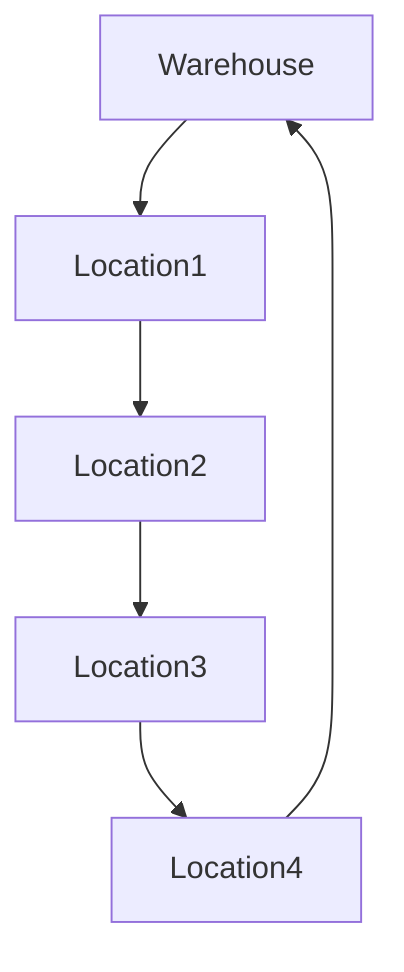

# 🌍 Practical Applications of Hamiltonian Paths

While the Hamiltonian Path problem may seem abstract, it has numerous real-world applications across various domains. Let's explore how this fundamental graph theory concept solves practical problems.

## 🚚 Logistics and Route Planning

Hamiltonian Paths are essential in planning efficient routes for:

### 1️⃣ Delivery Services

Delivery companies need to determine routes that visit each location exactly once.

> [!NOTE]
> When costs or distances between locations matter, this becomes the famous Traveling Salesman Problem (TSP), which is finding the shortest Hamiltonian Cycle.



### 2️⃣ Garbage Collection

Planning routes for garbage trucks to visit all streets in a neighborhood without unnecessary repetition.

### 3️⃣ Utility Meter Reading

Determining efficient routes for meter readers to visit every household once.

## 💻 Computer Science Applications

### 1️⃣ Circuit Design

In Very Large Scale Integration (VLSI) circuit design, Hamiltonian Paths help:
- Minimize wire length
- Optimize signal routing
- Reduce power consumption

### 2️⃣ Network Routing

In computer networks, finding paths that visit specific nodes exactly once can optimize:
- Data collection from sensor networks
- Efficient resource discovery in distributed systems
- Minimizing network congestion

## 🧬 Bioinformatics and Genomics

> [!TIP]
> Hamiltonian Paths provide a powerful framework for DNA sequencing and analysis!

### 1️⃣ DNA Fragment Assembly

When DNA is broken into small fragments for sequencing, reassembling the original sequence can be modeled as a Hamiltonian Path problem:

1. Each fragment becomes a vertex
2. Edges represent overlaps between fragments
3. Finding a Hamiltonian Path gives the complete DNA sequence

```
Fragment 1: ACGTG
Fragment 2: GTGCA
Fragment 3: GCATT

Assembled: ACGTGCATT
```

<details>
<summary>How DNA Assembly Works with Hamiltonian Paths</summary>

1. Create a graph where each DNA fragment is a vertex
2. Create edges between fragments that overlap
3. Find a Hamiltonian Path through this graph
4. The path represents the assembled DNA sequence

This approach is used in "sequence assembly" algorithms for genomics research.
</details>

## 🎮 Gaming and Puzzles

### 1️⃣ Knight's Tour

A classic chess puzzle: Can a knight visit every square on the chessboard exactly once?


This is a direct application of the Hamiltonian Path problem where:
- Each square on the chessboard is a vertex
- Edges represent valid knight moves

### 2️⃣ Game Level Design

Game designers use Hamiltonian Paths to create engaging levels where players must:
- Visit all rooms or locations exactly once
- Collect all items without backtracking
- Solve puzzles in a specific sequence

## 🏭 Manufacturing and Production

### 1️⃣ Assembly Line Optimization

Planning the sequence of operations in manufacturing to minimize tool changes or setup times.

### 2️⃣ PCB Drilling

Determining the optimal sequence for drilling holes in printed circuit boards (PCBs) to minimize:
- Total travel distance of the drill head
- Production time
- Equipment wear


## 📱 Telecommunications

### 1️⃣ Network Design

Planning fiber optic routes or cell tower placements to ensure coverage with minimal redundancy.

### 2️⃣ Data Collection in Sensor Networks

Designing efficient paths for data collection in wireless sensor networks to:
- Minimize energy consumption
- Maximize network lifetime
- Ensure complete coverage

## 💡 Implementation Example: GPS Route Planner

Here's a simplified example of how a Hamiltonian Path algorithm might be used in a GPS route planner:

```python
def plan_delivery_route(locations, distance_matrix):
    """
    Plan an optimal delivery route visiting each location exactly once.
    
    Args:
        locations: List of delivery locations
        distance_matrix: Matrix of distances between locations
        
    Returns:
        The optimal route as a list of location indices
    """
    n = len(locations)
    
    # Create a graph where edges exist between all locations
    # but with weights representing distances
    graph = [[1 for _ in range(n)] for _ in range(n)]
    
    # Find a Hamiltonian Path
    path = []
    visited = [False] * n
    
    def find_shortest_path(current, depth, current_distance):
        nonlocal best_path, min_distance
        
        path.append(current)
        visited[current] = True
        
        if depth == n:
            if current_distance < min_distance:
                min_distance = current_distance
                best_path = path.copy()
        else:
            for next_loc in range(n):
                if not visited[next_loc]:
                    new_distance = current_distance + distance_matrix[current][next_loc]
                    find_shortest_path(next_loc, depth + 1, new_distance)
        
        # Backtrack
        path.pop()
        visited[current] = False
    
    # Try each location as starting point
    best_path = []
    min_distance = float('inf')
    
    for start in range(n):
        find_shortest_path(start, 1, 0)
    
    # Convert indices to actual locations
    return [locations[i] for i in best_path]
```

## 🧠 Think About It

1. Can you think of a Hamiltonian Path application in your field of interest?
2. How would you modify the approach for applications where some locations can be skipped (but with a penalty)?
3. In what scenarios might finding all possible Hamiltonian Paths be more valuable than finding just one? 