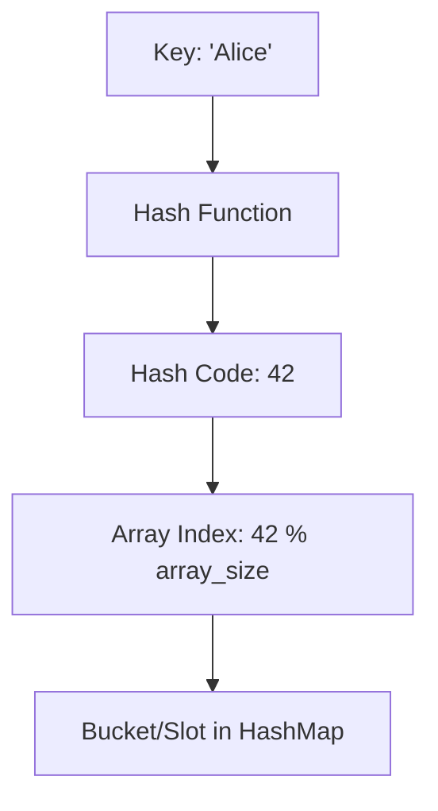

# 🧮 Hash Functions: The Magic Behind HashMap

> [!NOTE]
> This lesson introduces the concept of hash functions, which are at the heart of how hash maps work.

## What is a Hash Function? 🔍

A **hash function** is a mathematical function that takes an input (or "key") of any size and produces a fixed-size output, typically an integer. This output is called a **hash code** or **hash value**.

In the context of a HashMap:
- The hash function converts your key (like a name or an ID) into an array index
- This index tells us exactly where to store or find the associated value

## How Hash Functions Work ⚙️

Let's break it down with a simple example:



**The process:**
1. Take the key (e.g., "Alice")
2. Apply the hash function to generate a hash code
3. Use modulo operation to convert it to a valid array index
4. Use that index to store or retrieve the value

## Characteristics of Good Hash Functions 🌟

An effective hash function should:

1. **Be deterministic** - The same key always produces the same hash value
2. **Distribute values uniformly** - Outputs should be evenly distributed across the possible range
3. **Be efficient to compute** - Hash calculation should be fast
4. **Minimize collisions** - Different keys should rarely produce the same hash value

> [!WARNING]
> A poor hash function that creates many collisions (different keys mapping to the same index) will degrade the performance of your hash map!

## A Simple Hash Function Example 🧩

Here's a basic example of a string hash function in JavaScript:

```javascript
function simpleHash(key, arraySize) {
  let hash = 0;
  const keyString = String(key);
  
  // For each character in the string
  for (let i = 0; i < keyString.length; i++) {
    // Get the character code
    const char = keyString.charCodeAt(i);
    // Multiply the accumulated hash to create an avalanche effect
    // Add the character code, then take modulo to fit array size
    hash = (hash * 31 + char) % arraySize;
  }
  
  return hash;
}

// Example usage
const arraySize = 16;
console.log(simpleHash("apple", arraySize));  // Some number between 0-15
console.log(simpleHash("banana", arraySize)); // A different number between 0-15
```

> [!TIP]
> The multiplication by 31 is a common practice in hash functions. It's chosen because:
> - It's a prime number (good for distribution)
> - It can be optimized by compilers as `31 * n == (n << 5) - n`

## Different Types of Hash Functions 🧪

Different types of data may need different hashing approaches:

1. **String hashing** - Used for text keys (as shown above)
2. **Integer hashing** - Special functions for integer keys
3. **Object hashing** - For complex objects as keys
4. **Cryptographic hashing** - For security applications (SHA-256, MD5)

<details>
<summary>Real-world Hash Function: djb2</summary>

The djb2 algorithm is a popular non-cryptographic hash function created by Daniel J. Bernstein:

```javascript
function djb2Hash(key) {
  let hash = 5381; // Initial value
  const keyString = String(key);
  
  for (let i = 0; i < keyString.length; i++) {
    hash = ((hash << 5) + hash) + keyString.charCodeAt(i);
  }
  
  return hash >>> 0; // Convert to unsigned 32-bit integer
}
```

This function has excellent distribution properties for string keys!
</details>

## Visualizing Hash Function Distribution 📊

Ideally, a hash function should distribute keys uniformly across all buckets:

```
Good distribution:  | * | * | * | * | * | * | * | * |
                    Buckets 0-7 with roughly equal entries

Poor distribution:  | *** |   | ***** |   |   | * |   | * |
                    Uneven distribution causing some buckets to be overloaded
```

**Question:** What happens when two different keys produce the same hash value (index)? This is called a **collision**, and we'll explore how to handle these in the next lesson! 🤔

## Try It Yourself! 🧠

Before moving on, try to calculate hash values for a few different strings using the simple hash function described above:
1. Your name
2. "Hello World"
3. A random word of your choice

How does changing the array size affect the distribution of hash values? 