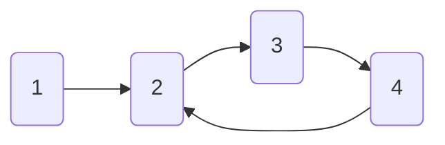

# The Naive Approach: Using Sets to Track Visited Elements 📝

> [!NOTE]
> In this lesson, we'll explore the simplest approach to cycle detection using sets or marking to track visited elements.

## The Intuition Behind Tracking Visited Elements 💭

The most straightforward way to detect a cycle is to remember every element we've visited. If we encounter the same element again, we know there's a cycle!

This approach relies on a fundamental principle: **In a cycle-free structure, we should never visit the same element twice.**

## How It Works 🛠️

Here's the step-by-step implementation:

1. Create a set (or array) to keep track of visited elements
2. Traverse the data structure (graph, linked list, etc.)
3. For each element:
   - If it's already in our visited set → **We found a cycle!** 🎉
   - Otherwise, add it to our visited set and continue

## Let's Visualize It 👁️

### Example: Detecting a Cycle in a Linked List



Let's trace through the algorithm:

1. Visit node `1` → Add to visited set: `{1}`
2. Visit node `2` → Add to visited set: `{1, 2}`
3. Visit node `3` → Add to visited set: `{1, 2, 3}`
4. Visit node `4` → Add to visited set: `{1, 2, 3, 4}`
5. Visit node `2` → **Already in visited set!** → Cycle detected ⚠️

## Implementation Example 💻

Here's how we might implement this approach in JavaScript for a linked list:

```javascript
function hasCycle(head) {
  // Create a set to track visited nodes
  const visited = new Set();
  
  // Start at the head of the list
  let current = head;
  
  // Traverse the list
  while (current !== null) {
    // If we've seen this node before, we found a cycle
    if (visited.has(current)) {
      return true;
    }
    
    // Mark the current node as visited
    visited.add(current);
    
    // Move to the next node
    current = current.next;
  }
  
  // If we reach the end (null), there's no cycle
  return false;
}
```

## For Graphs: Using Color Marking 🎨

For graphs, we can use a similar approach with three colors:
- **White**: Unvisited nodes
- **Gray**: Nodes in the current traversal path
- **Black**: Completely processed nodes

If we ever encounter a gray node during traversal, we've found a cycle!

> [!TIP]
> This approach is conceptually simple and guaranteed to work! However, it requires O(n) extra space to store the visited elements.

## Advantages and Disadvantages ⚖️

### Advantages:
- ✅ Easy to understand and implement
- ✅ Works for any data structure
- ✅ Guaranteed to find cycles if they exist

### Disadvantages:
- ❌ Requires O(n) extra space
- ❌ Not the most efficient solution for certain scenarios

<details open>
<summary>Think About This</summary>

Can you think of a scenario where this approach might use too much memory? What if we're dealing with a very large data structure?

</details>

In the next lesson, we'll explore a more memory-efficient approach: **Floyd's Cycle Detection Algorithm** (also known as the Tortoise and Hare algorithm), which can detect cycles using only constant space! 🐢🐇 