# 💥 Collision Handling: When Keys Clash

> [!NOTE]
> No matter how good our hash function is, collisions are inevitable when mapping a large set of possible keys to a smaller range of indices. This lesson explores how to handle them.

## What is a Collision? 🤔

A **collision** occurs when our hash function produces the same index for two different keys. For example:

```javascript
// With array size 10
hash("cat") → 3
hash("dog") → 7  // No collision, different indices
hash("act") → 3  // Collision! Same index as "cat"
```

When collisions happen, we need strategies to handle them so we don't lose data.

## Collision Resolution Strategies 🛠️

There are two main approaches to handling collisions:

1. **Separate Chaining** - Store multiple key-value pairs at the same index using a secondary data structure
2. **Open Addressing** - Find another empty slot in the array when a collision occurs

Let's explore both approaches in detail.

## Separate Chaining: Using Linked Lists 📝

The most common separate chaining technique uses linked lists at each array position:

```mermaid
graph TD
    A["HashMap Array"] --> B["0: null"]
    A --> C["1: → [key: 'apple', value: 'red'] → [key: 'grape', value: 'purple']"]
    A --> D["2: → [key: 'banana', value: 'yellow']"]
    A --> E["3: null"]
    A --> F["4: → [key: 'orange', value: 'orange']"]
```



**How it works:**
1. Hash the key to get an index
2. Go to that index in the array
3. If the index is empty, create a new node with the key-value pair
4. If the index already has entries, add the new key-value pair to the linked list

**In code:**
```javascript
class HashMapNode {
  constructor(key, value) {
    this.key = key;
    this.value = value;
    this.next = null;
  }
}

put(key, value) {
  const index = this.hash(key);
  let node = this.buckets[index];
  
  // Check if the key already exists in the chain
  while (node !== null) {
    if (node.key === key) {
      node.value = value; // Update existing value
      return;
    }
    if (node.next === null) break;
    node = node.next;
  }
  
  // Add new node to the beginning of the chain (prepend)
  const newNode = new HashMapNode(key, value);
  if (this.buckets[index] === null) {
    this.buckets[index] = newNode;
  } else {
    newNode.next = this.buckets[index];
    this.buckets[index] = newNode;
  }
  this.size++;
}
```

> [!TIP]
> Many modern HashMap implementations use other data structures instead of linked lists for chains, such as balanced trees when lists get long, to improve worst-case performance!

## Open Addressing: Finding Another Spot 🔍

With open addressing, everything is stored directly in the main array—we just look for another empty slot when a collision occurs.

### Linear Probing

The simplest open addressing technique is **linear probing**:

```mermaid
graph LR
    A["Hash('cat') → 3"] --> B["Check index 3"]
    B --> C["Index 3 is occupied!"]
    C --> D["Check index 4"]
    D --> E["Index 4 is empty, store here"]
```



**How it works:**
1. Hash the key to get an initial index
2. If that slot is already occupied, try the next slot (index + 1)
3. Continue until you find an empty slot or determine the key already exists
4. Use modulo arithmetic to wrap around if you reach the end of the array

**In code:**
```javascript
put(key, value) {
  let index = this.hash(key);
  let initialIndex = index;
  
  // Keep probing until we find an empty slot or the key
  while (this.keys[index] !== undefined) {
    // If we find the key, update its value
    if (this.keys[index] === key) {
      this.values[index] = value;
      return;
    }
    
    // Move to the next slot (with wrapping)
    index = (index + 1) % this.capacity;
    
    // If we've checked all slots, the map is full
    if (index === initialIndex) {
      throw new Error('HashMap is full');
    }
  }
  
  // Found an empty slot, insert the new key-value pair
  this.keys[index] = key;
  this.values[index] = value;
  this.size++;
}
```

### Other Open Addressing Methods

Beyond linear probing, there are more sophisticated approaches:

1. **Quadratic Probing** - Instead of checking slots sequentially, use a quadratic function to determine the next position: `(hash(key) + 1²), (hash(key) + 2²), ...`

2. **Double Hashing** - Use a second hash function to determine the step size: `(hash1(key) + i * hash2(key)) % arraySize`

<details>
<summary>Comparison of Collision Resolution Strategies</summary>

| Strategy | Advantages | Disadvantages |
|----------|------------|---------------|
| **Separate Chaining** | Simple implementation, works well under high load factors | Extra memory for linked lists, slower due to pointer chasing |
| **Linear Probing** | Memory efficient, good cache locality | Suffers from clustering - collisions tend to clump together |
| **Quadratic Probing** | Reduces clustering problem compared to linear probing | Can still suffer from secondary clustering |
| **Double Hashing** | Best probe sequence distribution, minimizes clustering | More computation required for second hash function |

The best choice depends on your specific use case, expected load factor, and performance requirements.
</details>

## Load Factor and Rehashing 📈

As a hash map fills up, collisions become more frequent and performance degrades. The **load factor** is a measure of how full the hash map is:

```
Load Factor = Number of Entries / Number of Buckets
```

When the load factor exceeds a certain threshold (typically 0.75), the hash map needs to grow. This process is called **rehashing**:

1. Create a new array with larger capacity (usually 2x)
2. Recompute the hash for each existing key-value pair
3. Insert all pairs into the new array
4. Replace the old array with the new one

```javascript
rehash() {
  const oldBuckets = this.buckets;
  this.capacity *= 2;
  this.buckets = new Array(this.capacity).fill(null);
  this.size = 0;
  
  // Reinsert all entries
  for (let i = 0; i < oldBuckets.length; i++) {
    let node = oldBuckets[i];
    while (node !== null) {
      this.put(node.key, node.value);
      node = node.next;
    }
  }
}
```

## Collision Handling in Action 🎬

Let's see how these strategies work with a concrete example:

Imagine we have a hash map with array size 5, and we're inserting these key-value pairs:
- ("apple", "red")
- ("banana", "yellow")
- ("cherry", "red")
- ("date", "brown")
- ("elderberry", "purple")

Now let's say our simple hash function maps these keys as follows:
- hash("apple") → 0
- hash("banana") → 2
- hash("cherry") → 0 (collision with "apple")
- hash("date") → 3
- hash("elderberry") → 2 (collision with "banana")

**Separate Chaining Result:**
```
[0] → ["apple":"red"] → ["cherry":"red"]
[1] → null
[2] → ["banana":"yellow"] → ["elderberry":"purple"]
[3] → ["date":"brown"]
[4] → null
```

**Linear Probing Result:**
```
[0] → ["apple":"red"]
[1] → ["cherry":"red"]
[2] → ["banana":"yellow"]
[3] → ["date":"brown"]
[4] → ["elderberry":"purple"]
```

**Question to ponder:** How would the performance differ between these two approaches as the hash map fills up? When would you choose one approach over the other? 🧠 