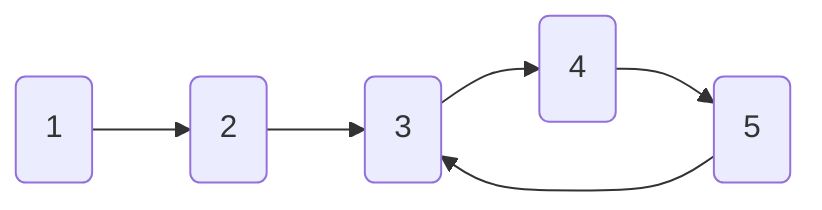

# Floyd's Cycle Detection Algorithm: The Tortoise and Hare 🐢🐇

> [!NOTE]
> In this lesson, we'll learn about Floyd's Cycle Detection Algorithm (also known as the Tortoise and Hare algorithm), a clever technique that uses only constant space!

## A Tale of Two Pointers 📚

Imagine a race between a tortoise and a hare on a circular track. The hare runs twice as fast as the tortoise. If they both keep running, will the hare ever catch up to the tortoise?

Yes! Because of the circular track, the hare will eventually lap the tortoise and they'll meet again.

This is the brilliant insight behind Floyd's algorithm:

- If there's a cycle, a fast pointer will eventually catch up to a slow pointer
- If there's no cycle, the fast pointer will reach the end of the structure

## How It Works 🛠️

The algorithm uses two pointers moving at different speeds:

1. **Tortoise** (slow pointer): Moves one step at a time
2. **Hare** (fast pointer): Moves two steps at a time

If there's a cycle:
- The hare and tortoise will eventually meet
- When they meet, we've detected a cycle! 🎉

If there's no cycle:
- The hare will reach the end of the structure (null or undefined)
- We can conclude there's no cycle

## Let's Visualize It 👁️

Imagine a linked list with a cycle:



Let's trace through the algorithm:

1. **Initial position**:
   - Tortoise: Node 1
   - Hare: Node 1

2. **First iteration**:
   - Tortoise moves to Node 2
   - Hare moves to Node 3

3. **Second iteration**:
   - Tortoise moves to Node 3
   - Hare moves to Node 5

4. **Third iteration**:
   - Tortoise moves to Node 4
   - Hare moves to Node 4 (via 5→3→4)

5. **Fourth iteration**:
   - Tortoise moves to Node 5
   - Hare moves to Node 5 (via 4→5)
   
6. **Fifth iteration**:
   - Tortoise moves to Node 3
   - Hare moves back to Node 3
   - **They meet!** Cycle detected! ⚠️

## Implementation Example 💻

Here's how we can implement Floyd's algorithm in JavaScript:

```javascript
function hasCycle(head) {
  // Handle edge cases: empty list or single node
  if (!head || !head.next) return false;
  
  // Initialize tortoise and hare pointers
  let tortoise = head;
  let hare = head;
  
  // Move pointers until they meet or hare reaches the end
  while (hare !== null && hare.next !== null) {
    // Tortoise moves one step
    tortoise = tortoise.next;
    
    // Hare moves two steps
    hare = hare.next.next;
    
    // If they meet, we found a cycle
    if (tortoise === hare) {
      return true;
    }
  }
  
  // If hare reached the end, there's no cycle
  return false;
}
```

## The Math Behind The Magic 🧮

Why does this work? It comes down to modular arithmetic:

- If there's a cycle of length **C**
- And the hare is **D** steps ahead of the tortoise
- The distance between them increases by 1 each iteration
- When this distance becomes a multiple of **C**, they meet!

> [!TIP]
> This algorithm can be extended to find where the cycle begins and the length of the cycle!

## Advantages and Disadvantages ⚖️

### Advantages:
- ✅ Uses only O(1) extra space (just two pointers)
- ✅ Elegant and efficient solution
- ✅ Works well for linked data structures

### Disadvantages:
- ❌ Cannot easily be adapted for all types of graphs
- ❌ Might take longer to detect very large cycles
- ❌ More complex to understand than the naive approach

<details>
<summary>Advanced: Finding the Cycle Start Point</summary>

After the tortoise and hare meet:
1. Reset the tortoise to the head of the list
2. Keep the hare at the meeting point
3. Move both pointers at the same speed (one step at a time)
4. The point where they meet again is the start of the cycle!

This works due to the mathematical properties of the cycle structure.
</details>

## Real-World Applications 🌍

Floyd's algorithm is used in many applications:

- **Cryptography**: Finding cycles in pseudo-random number generators
- **Programming languages**: Detecting infinite loops in program execution
- **Memory management**: Finding reference cycles in garbage collection

> [!WARNING]
> While Floyd's algorithm works great for linked structures like linked lists, it requires modification for graphs where nodes can have multiple successors!

In the next lesson, we'll explore how to adapt cycle detection for graphs using Depth-First Search (DFS) approaches. 