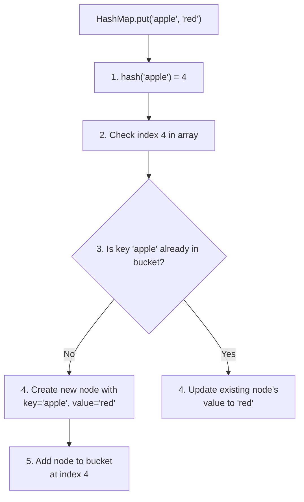
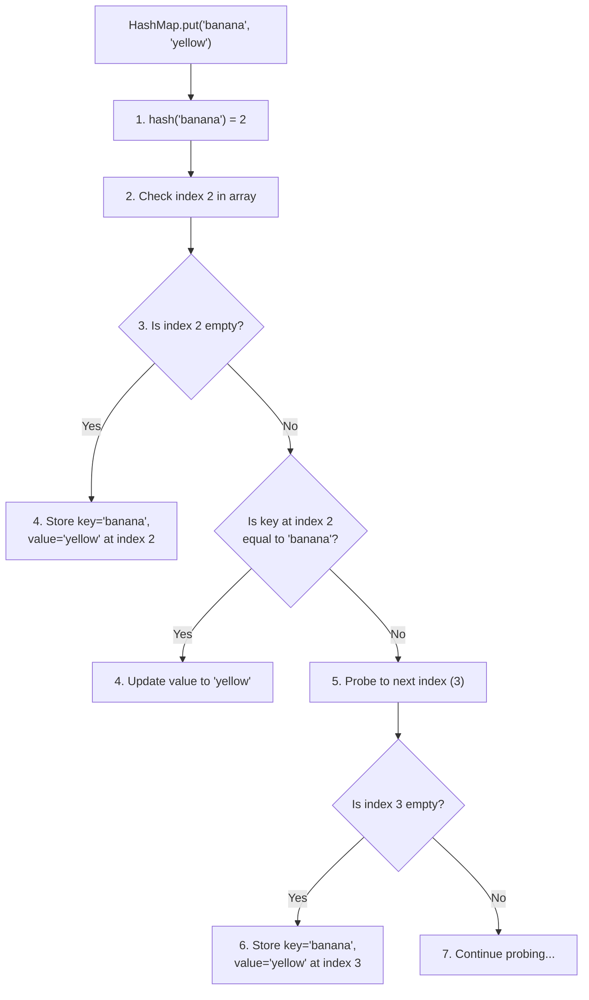
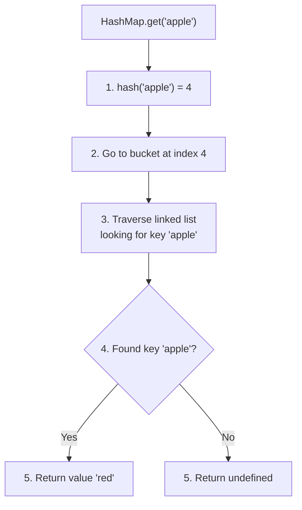
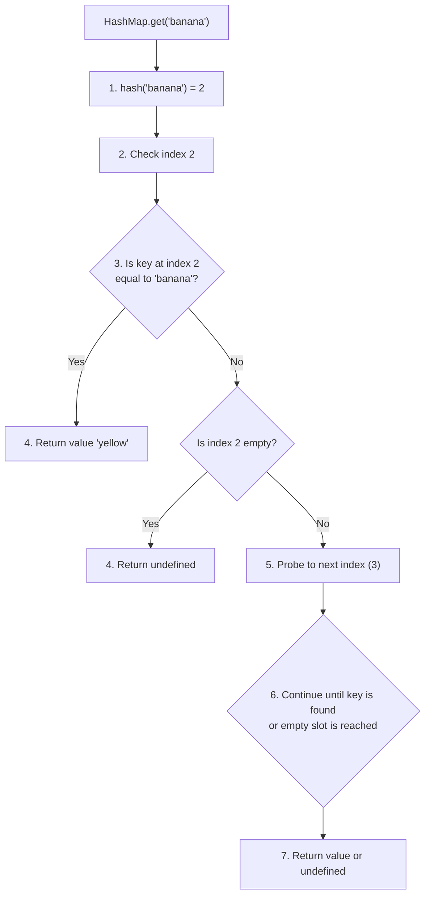
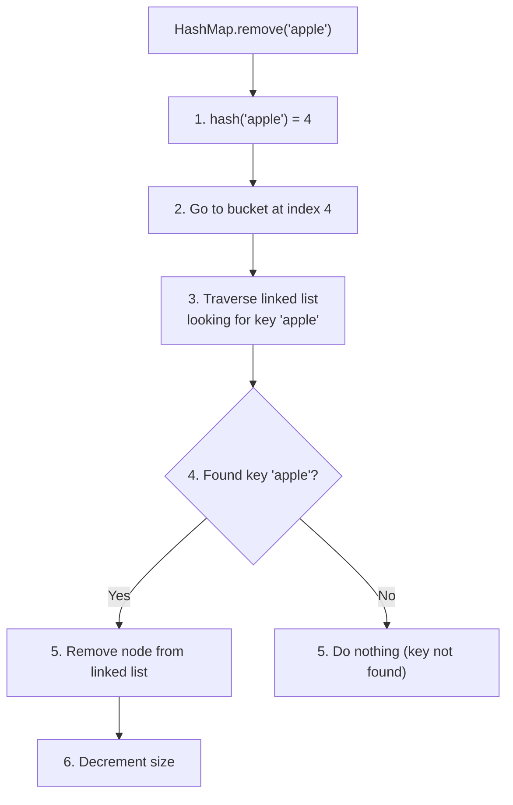
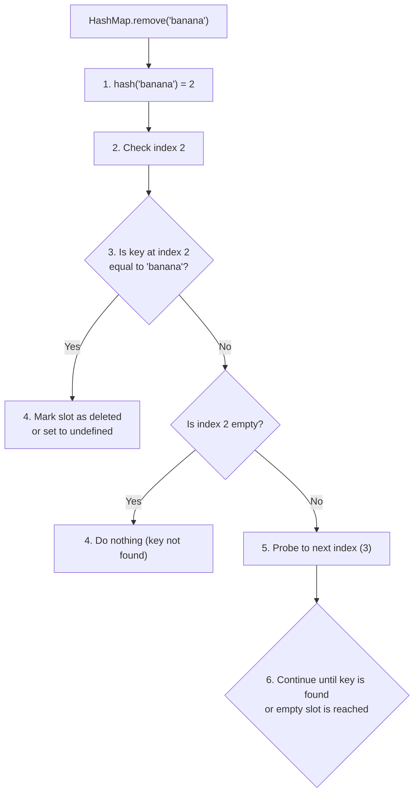

# 🛠️ Hash Map Operations: Put, Get, Remove

> [!NOTE]
> Now that we understand how hash functions and collision handling work, let's explore the fundamental operations every hash map must support.

## The Core Operations ⚙️

Every hash map implementation needs to support three basic operations:

1. **Put** (or Insert) - Add a key-value pair to the hash map
2. **Get** (or Retrieve) - Retrieve a value using its key
3. **Remove** (or Delete) - Remove a key-value pair from the hash map

Let's explore each operation in detail.

## The Put Operation ➕

The **put** operation adds a new key-value pair to the hash map or updates an existing key's value.

### Steps in the Put Operation:

1. Calculate the hash code of the key
2. Convert the hash code to an array index
3. Check if the key already exists (to update rather than insert)
4. Handle any collisions that occur
5. Store the key-value pair at the appropriate location

Here's how it works with visual examples for both collision handling approaches:

### Separate Chaining Put:



### Open Addressing Put:



### Implementation (Separate Chaining):

```javascript
put(key, value) {
  // 1. Calculate hash and get index
  const index = this.hash(key);
  let node = this.buckets[index];
  
  // 2. Check if key already exists
  while (node !== null) {
    if (node.key === key) {
      // 3. Update existing value
      node.value = value;
      return;
    }
    if (node.next === null) break;
    node = node.next;
  }
  
  // 4. Create and add new node
  const newNode = new HashMapNode(key, value);
  
  // 5. Handle insertion
  if (this.buckets[index] === null) {
    // Empty bucket
    this.buckets[index] = newNode;
  } else {
    // Add to beginning of chain
    newNode.next = this.buckets[index];
    this.buckets[index] = newNode;
  }
  
  // 6. Increment size
  this.size++;
  
  // 7. Check if rehashing is needed
  if (this.size / this.capacity > 0.75) {
    this.rehash();
  }
}
```

> [!TIP]
> When adding to a chain, you can either add the new node at the beginning (prepend) or end (append) of the list. Prepending is usually faster since you don't have to traverse the list, but it changes the order in which entries are examined.

## The Get Operation 🔍

The **get** operation retrieves a value based on its key.

### Steps in the Get Operation:

1. Calculate the hash code of the key
2. Convert the hash code to an array index
3. Search for the key at that location
4. If found, return the associated value; otherwise, return null/undefined

### Separate Chaining Get:



### Open Addressing Get:



### Implementation (Separate Chaining):

```javascript
get(key) {
  // 1. Calculate hash and get index
  const index = this.hash(key);
  let node = this.buckets[index];
  
  // 2. Traverse the linked list at this index
  while (node !== null) {
    // 3. Check if this is the key we're looking for
    if (node.key === key) {
      // 4. Key found, return its value
      return node.value;
    }
    // 5. Move to next node in chain
    node = node.next;
  }
  
  // 6. Key not found
  return undefined;
}
```

## The Remove Operation ❌

The **remove** operation deletes a key-value pair from the hash map.

### Steps in the Remove Operation:

1. Calculate the hash code of the key
2. Convert the hash code to an array index
3. Search for the key at that location
4. If found, remove the key-value pair
5. Update any necessary pointers or structures

### Separate Chaining Remove:



### Open Addressing Remove:



### Implementation (Separate Chaining):

```javascript
remove(key) {
  // 1. Calculate hash and get index
  const index = this.hash(key);
  let node = this.buckets[index];
  let prev = null;
  
  // 2. Traverse the linked list at this index
  while (node !== null) {
    // 3. Check if this is the key we're looking for
    if (node.key === key) {
      // 4. Remove node from the linked list
      if (prev === null) {
        // It's the first node in the chain
        this.buckets[index] = node.next;
      } else {
        // It's somewhere in the middle or end
        prev.next = node.next;
      }
      
      // 5. Decrement size
      this.size--;
      return;
    }
    
    // 6. Move to next node
    prev = node;
    node = node.next;
  }
  
  // Key not found, nothing to remove
}
```

> [!WARNING]
> With open addressing, simply marking a slot as undefined can break the get and remove operations! When a slot is deleted, we still need to be able to find keys that might have been placed after it due to probing. A common solution is to use a special "DELETED" marker instead of undefined.

## Additional Useful Operations 🔧

Beyond the core operations, most hash map implementations also support:

1. **Size** - Returns the number of key-value pairs in the map
2. **isEmpty** - Checks if the map contains any key-value pairs
3. **Clear** - Removes all key-value pairs from the map
4. **Keys** - Returns all keys in the map
5. **Values** - Returns all values in the map
6. **Entries** - Returns all key-value pairs in the map

## Performance Characteristics ⚡

The efficiency of hash map operations is what makes them so powerful:

| Operation | Average Time Complexity | Worst Time Complexity |
|-----------|-------------------------|----------------------|
| Put       | O(1)                    | O(n)                 |
| Get       | O(1)                    | O(n)                 |
| Remove    | O(1)                    | O(n)                 |

The worst-case scenario (O(n)) occurs when:
- Many keys hash to the same index, creating long chains
- The hash function is poor, causing many collisions
- With open addressing, when many probes are needed to find an open slot

> [!TIP]
> The key to maintaining O(1) average performance is:
> 1. Using a good hash function with uniform distribution
> 2. Keeping the load factor below a threshold (usually 0.75)
> 3. Resizing and rehashing when needed

## Try It Yourself! 🧠

Before moving to the next lesson, think about how you would implement these operations:

1. How would you modify the get and remove operations for open addressing with linear probing?
2. How would you implement a "containsKey" method that checks if a key exists in the hash map?
3. How might you improve the efficiency of the separate chaining approach when chains become very long? 