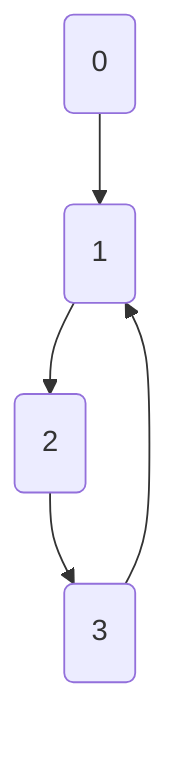

# Cycle Detection in Graphs: The DFS Approach 🕸️

> [!NOTE]
> In this lesson, we'll learn how to detect cycles in graphs using Depth-First Search (DFS), a powerful graph traversal technique.

## Graphs: A Different Kind of Challenge 🧩

Unlike linked lists, graphs can have complex structures with multiple paths and connections. This makes cycle detection more challenging, but Depth-First Search provides an elegant solution.

## The DFS Intuition for Cycle Detection 💭

The key insight for detecting cycles in graphs using DFS is:

> **If we encounter a node that's already in our current exploration path, we've found a cycle!**

This is different from just checking if a node has been visited before, as we need to know if it's part of our *current* exploration path.

## How It Works: The Three-Color Approach 🎨

We'll use a "three-color" marking system to track the state of each node:

- **White** (0): Unvisited nodes
- **Gray** (1): Nodes currently in the exploration path (being processed)
- **Black** (2): Completely processed nodes (all neighbors have been explored)

The algorithm works as follows:

1. All nodes start as **white** (unvisited)
2. When we start exploring a node, we mark it as **gray**
3. When we've explored all of a node's neighbors, we mark it as **black**
4. If we encounter a **gray** node during exploration, we've found a cycle!

## Let's Visualize It 👁️

Consider this directed graph:



Let's trace the DFS traversal:

1. Start at node 0:
   - Mark node 0 as **gray** (in current path)
   - Explore neighbor: node 1

2. At node 1:
   - Mark node 1 as **gray**
   - Explore neighbor: node 2

3. At node 2:
   - Mark node 2 as **gray**
   - Explore neighbor: node 3

4. At node 3:
   - Mark node 3 as **gray**
   - Explore neighbor: node 1
   - Node 1 is **gray** → **Cycle detected!** ⚠️

## Implementation: Recursive Approach 💻

Here's how we can implement cycle detection using recursive DFS:

```javascript
function hasCycleInGraph(graph) {
  const n = graph.length;
  
  // Colors: 0 = white (unvisited), 1 = gray (in current path), 2 = black (processed)
  const colors = new Array(n).fill(0);
  
  // Check each potential starting node
  for (let i = 0; i < n; i++) {
    if (colors[i] === 0 && dfsDetectCycle(i)) {
      return true;
    }
  }
  
  return false;
  
  // DFS helper function
  function dfsDetectCycle(node) {
    // Mark current node as being in the current path
    colors[node] = 1;
    
    // Check all neighbors
    for (const neighbor of graph[node]) {
      // If unvisited, explore it
      if (colors[neighbor] === 0) {
        if (dfsDetectCycle(neighbor)) {
          return true;
        }
      } 
      // If in current path, we found a cycle
      else if (colors[neighbor] === 1) {
        return true;
      }
      // If already processed, skip
    }
    
    // Mark current node as processed
    colors[node] = 2;
    return false;
  }
}
```

## Implementation: Iterative Approach 🔄

For those who prefer an iterative approach (avoiding potential stack overflow issues):

```javascript
function hasCycleInGraph(graph) {
  const n = graph.length;
  const visited = new Array(n).fill(false);
  const inPath = new Array(n).fill(false);
  
  for (let start = 0; start < n; start++) {
    if (visited[start]) continue;
    
    const stack = [start];
    inPath[start] = true;
    
    while (stack.length > 0) {
      const current = stack[stack.length - 1];
      visited[current] = true;
      
      let allProcessed = true;
      
      for (const neighbor of graph[current]) {
        if (!visited[neighbor]) {
          stack.push(neighbor);
          inPath[neighbor] = true;
          allProcessed = false;
          break;
        } else if (inPath[neighbor]) {
          return true; // Cycle detected
        }
      }
      
      if (allProcessed) {
        inPath[stack.pop()] = false;
      }
    }
  }
  
  return false;
}
```

## Handling Different Types of Graphs 🔀

### Directed vs. Undirected Graphs

The approach changes slightly for undirected graphs:
- In undirected graphs, an edge from A to B and B to A doesn't constitute a cycle
- We need to keep track of the parent node to avoid false cycle detection

### Disconnected Graphs

Our algorithm handles disconnected graphs by:
- Starting DFS from each unvisited node
- This ensures we check all components of the graph

> [!TIP]
> The cycle detection algorithm for graphs has a time complexity of O(V + E) where V is the number of vertices and E is the number of edges!

## Applications of Graph Cycle Detection 🌐

- **Deadlock detection** in operating systems
- **Dependency resolution** in build systems
- **Circuit analysis** in electrical engineering
- **Detecting infinite loops** in state machines
- **Finding strongly connected components** in directed graphs

> [!WARNING]
> Be careful with self-loops! A node pointing to itself is immediately a cycle.

<details>
<summary>Advanced: Finding All Cycles in a Graph</summary>

Finding all cycles in a graph is more complex than just detecting if a cycle exists. Johnson's algorithm is a popular approach for finding all elementary cycles in a directed graph. It has a time complexity of O((V+E)(C+1)), where C is the number of cycles in the graph.

Another approach is to use Tarjan's algorithm to find strongly connected components, as each strongly connected component with more than one node or with a self-loop contains at least one cycle.
</details>

In the next lesson, we'll explore Brent's Algorithm, an optimization of Floyd's Cycle Detection that can be more efficient in certain scenarios. 