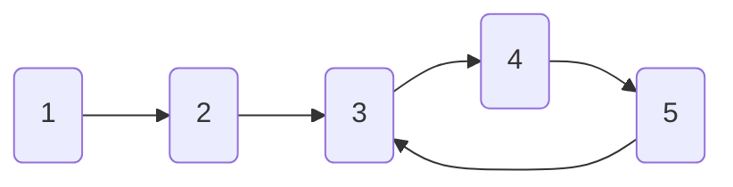

# Brent's Algorithm: A More Efficient Approach 🚀

> [!NOTE]
> In this lesson, we'll learn about Brent's Algorithm, a clever optimization of Floyd's Cycle Detection that can be more efficient in many cases.

## Why Optimize? 🤔

While Floyd's Tortoise and Hare algorithm is elegant and uses O(1) space, it has some inefficiencies:
- The tortoise pointer performs redundant comparisons
- In some cases, it might take longer to detect a cycle than necessary

In 1980, Richard P. Brent developed an improved algorithm that maintains the O(1) space complexity but offers better average-case performance.

## The Key Insight 💡

Brent's algorithm uses a different approach:
- Instead of moving two pointers at different speeds...
- We use a "teleporting hare" strategy with power-of-two jumps
- This reduces the number of comparisons needed to detect a cycle

## How It Works 🛠️

The algorithm works as follows:

1. Start with two pointers: a stationary "tortoise" and a moving "hare"
2. The hare moves forward one step at a time
3. After 2^i steps (where i starts at 0), the tortoise teleports to the hare's position
4. If the hare ever reaches the same position as the tortoise, we've found a cycle
5. If the hare reaches the end (null), there's no cycle

## Let's Visualize It 👁️

Consider this linked list with a cycle:



Let's trace through Brent's algorithm:

1. **Initial state**:
   - Tortoise = Node 1
   - Hare = Node 1
   - Power = 1 (2^0)
   - Steps taken = 0

2. **First teleport threshold (after 1 step)**:
   - Hare moves to Node 2
   - Steps taken = 1
   - Steps = Power? Yes (1 = 1)
   - Tortoise teleports to Node 2
   - Power = 2 (2^1)

3. **Second teleport threshold (after 2 more steps)**:
   - Hare moves to Node 3, then Node 4
   - Steps taken = 3
   - Steps = Power? No (3 ≠ 2)

4. **Continue moving hare**:
   - Hare moves to Node 5
   - Steps taken = 4
   - Steps = Power? Yes (4 = 2^2)
   - Tortoise teleports to Node 5
   - Power = 4 (2^2)

5. **Continue algorithm**:
   - Hare moves to Node 3
   - No match with tortoise, continue
   - Hare moves to Node 4, then Node 5
   - Steps taken = 7
   - Hare moves to Node 3
   - Steps taken = 8
   - Steps = Power? Yes (8 = 2^3)
   - Tortoise teleports to Node 3
   - Power = 8 (2^3)

6. **Detect cycle**:
   - Hare moves to Node 4
   - Hare moves to Node 5
   - Hare moves to Node 3
   - **Match found!** Cycle detected! ⚠️

## Implementation Example 💻

Here's how we might implement Brent's algorithm in JavaScript:

```javascript
function hasCycle(head) {
  // Handle edge cases
  if (!head || !head.next) return false;
  
  let tortoise = head;
  let hare = head.next;
  let power = 1;
  let steps = 1;
  
  // Continue until we find a cycle or reach the end
  while (hare !== null && hare !== tortoise) {
    // If we've reached the power of 2 steps
    if (steps === power) {
      // Teleport the tortoise to the hare's position
      tortoise = hare;
      // Double the power for next teleport
      power *= 2;
      // Reset step counter
      steps = 0;
    }
    
    // Move the hare forward
    hare = hare.next;
    steps++;
  }
  
  // If hare is null, we reached the end - no cycle
  // If hare equals tortoise, we found a cycle
  return hare !== null;
}
```

## The Efficiency Advantage 📊

Brent's algorithm offers better performance in many cases:

- **Floyd's algorithm**: Takes λ + μ iterations to detect a cycle
  (where λ is the cycle length and μ is the distance to the cycle)

- **Brent's algorithm**: Takes about 2μ + λ iterations in the worst case, but often much fewer

For large values of λ, Brent's algorithm can be significantly faster. In practice, it performs about 36% fewer comparisons than Floyd's algorithm on average.

> [!TIP]
> Brent's Algorithm performs fewer actual comparisons because it only compares the hare with the tortoise after powers of 2 steps, rather than at every step like Floyd's algorithm!

## Advantages and Disadvantages ⚖️

### Advantages:
- ✅ Uses O(1) space like Floyd's algorithm
- ✅ Better average-case performance
- ✅ Fewer comparisons needed

### Disadvantages:
- ❌ Slightly more complex to implement
- ❌ Does not directly provide the cycle start point (needs modification)
- ❌ Less widely known and used than Floyd's algorithm

<details>
<summary>When to Use Brent's Algorithm</summary>

Brent's algorithm is particularly useful when:
- You need the most efficient cycle detection possible
- You're working with very large data structures
- The cycle might be very long
- You're only concerned with detecting if a cycle exists, not finding its start

If you need to find the start of the cycle as well, Floyd's algorithm might be simpler, as it has a well-known extension for this purpose.
</details>

## Real-World Applications 🌍

Like Floyd's algorithm, Brent's algorithm is useful in:
- **Cryptographic sequences**: Finding periods in pseudo-random number generators
- **Function iteration**: Detecting cycles in repeated function applications
- **Memory leak detection**: Finding reference cycles

In the next lesson, we'll explore how to implement cycle detection in real-world programming scenarios with practical examples and applications. 