# 🚀 Advanced Hash Map Concepts & Real-world Applications

> [!NOTE]
> Now that we have a solid foundation in hash maps, let's explore some advanced concepts, variations, and practical applications.

## Advanced Hash Map Variations 🔄

Several specialized hash map variants exist to solve specific problems:

### 1. Concurrent Hash Maps 🧵

Regular hash maps aren't thread-safe - concurrent access from multiple threads can lead to data corruption. Concurrent hash maps use techniques like:

- Lock striping - dividing the hash map into segments, each with its own lock
- Compare-and-swap (CAS) operations for lock-free updates
- Read-write locks that allow multiple concurrent readers but exclusive writers

```javascript
// Simplified example of a segment-locked concurrent hash map
class ConcurrentHashMap {
  constructor(capacity = 16, concurrencyLevel = 4) {
    this.segments = Array(concurrencyLevel)
      .fill()
      .map(() => new HashMap(capacity / concurrencyLevel));
    this.concurrencyLevel = concurrencyLevel;
  }
  
  getSegment(key) {
    const hash = this.hash(key);
    return hash % this.concurrencyLevel;
  }
  
  put(key, value) {
    const segmentIndex = this.getSegment(key);
    // In a real implementation, we would acquire a lock here
    this.segments[segmentIndex].put(key, value);
    // Release lock
  }
  
  get(key) {
    const segmentIndex = this.getSegment(key);
    // For read operations, we might use a read lock or no lock at all
    return this.segments[segmentIndex].get(key);
  }
  
  // Other methods similarly delegate to the appropriate segment
}
```

### 2. Ordered Hash Maps 📋

Standard hash maps don't maintain insertion order. Ordered hash maps (like LinkedHashMap in Java) combine hash table's fast lookups with linked list's order preservation.

```mermaid
graph TD
    A["Ordered HashMap"] --> B["Hash Table Component<br>(Fast Lookups)"]
    A --> C["Linked List Component<br>(Order Tracking)"]
    B --> D["Bucket 0: → Entry('banana')"]
    B --> E["Bucket 1: → Entry('apple')"]
    B --> F["Bucket 2: → Entry('orange')"]
    C --> G["apple ⟷ banana ⟷ orange"]
```



```javascript
class OrderedHashMapNode {
  constructor(key, value) {
    this.key = key;
    this.value = value;
    this.next = null;  // For hash table chaining
    this.before = null; // For doubly-linked list
    this.after = null;  // For doubly-linked list
  }
}

class OrderedHashMap {
  constructor() {
    this.map = new HashMap();
    this.head = null; // First inserted item
    this.tail = null; // Last inserted item
  }
  
  put(key, value) {
    // Check if key already exists
    const existingNode = this.map.get(key);
    if (existingNode) {
      // Just update the value
      existingNode.value = value;
      return;
    }
    
    // Create new node
    const node = new OrderedHashMapNode(key, value);
    
    // Add to hash map
    this.map.put(key, node);
    
    // Add to end of linked list
    if (!this.head) {
      this.head = node;
    } else {
      node.before = this.tail;
      this.tail.after = node;
    }
    this.tail = node;
  }
  
  // Other methods would similarly maintain both structures
}
```

### 3. Weak Hash Maps 🔍

Weak hash maps allow entries to be garbage collected when keys are no longer referenced elsewhere in the program. They're useful for caching or storing metadata about objects without preventing them from being garbage collected.

```javascript
// In JavaScript, you can use the built-in WeakMap
const cache = new WeakMap();

function processObject(obj) {
  // Check if we've already processed this object
  if (cache.has(obj)) {
    return cache.get(obj);
  }
  
  // Process object
  const result = /* expensive computation */;
  
  // Cache result
  cache.set(obj, result);
  
  return result;
}

// When all references to 'obj' are gone, the entry in the WeakMap
// will be automatically removed during garbage collection
```

### 4. Immutable Hash Maps 🔒

Immutable hash maps never change after creation. Instead, operations that would modify the map return a new map. They're useful in functional programming and concurrent systems where shared mutable state can cause problems.

```javascript
class ImmutableHashMap {
  constructor(entries = []) {
    this._map = new Map(entries);
    // Freeze to prevent modification
    Object.freeze(this);
  }
  
  set(key, value) {
    // Create a new map with the old entries plus the new one
    const newEntries = [...this._map.entries(), [key, value]];
    return new ImmutableHashMap(newEntries);
  }
  
  get(key) {
    return this._map.get(key);
  }
  
  // Other methods similarly return new instances instead of modifying
}

// Usage
let map1 = new ImmutableHashMap();
let map2 = map1.set("a", 1);
let map3 = map2.set("b", 2);

console.log(map1.get("a")); // undefined - original map unchanged
console.log(map2.get("a")); // 1
console.log(map3.get("b")); // 2
```

## Advanced Hash Functions 🧩

The hash function is critical for a hash map's performance. Here are some advanced hash functions:

### 1. MurmurHash

A fast, non-cryptographic hash function good for hash maps:

```javascript
function murmurHash3(key, seed = 0) {
  const data = String(key);
  const c1 = 0xcc9e2d51;
  const c2 = 0x1b873593;
  const r1 = 15;
  const r2 = 13;
  const m = 5;
  const n = 0xe6546b64;
  
  let hash = seed;
  
  // Process 4 bytes at a time
  for (let i = 0; i < data.length - (data.length % 4); i += 4) {
    let k = data.charCodeAt(i) |
            (data.charCodeAt(i + 1) << 8) |
            (data.charCodeAt(i + 2) << 16) |
            (data.charCodeAt(i + 3) << 24);
    
    k = Math.imul(k, c1);
    k = (k << r1) | (k >>> (32 - r1));
    k = Math.imul(k, c2);
    
    hash ^= k;
    hash = (hash << r2) | (hash >>> (32 - r2));
    hash = Math.imul(hash, m) + n;
  }
  
  // Handle remaining bytes
  // ...
  
  // Finalize
  hash ^= data.length;
  hash ^= hash >>> 16;
  hash = Math.imul(hash, 0x85ebca6b);
  hash ^= hash >>> 13;
  hash = Math.imul(hash, 0xc2b2ae35);
  hash ^= hash >>> 16;
  
  return hash >>> 0; // Convert to unsigned 32-bit
}
```

### 2. FNV-1a

Another fast, simple hash function with good distribution:

```javascript
function fnv1a(key) {
  const FNV_PRIME = 0x01000193;
  const FNV_OFFSET_BASIS = 0x811c9dc5;
  
  let hash = FNV_OFFSET_BASIS;
  const data = String(key);
  
  for (let i = 0; i < data.length; i++) {
    hash ^= data.charCodeAt(i);
    hash = Math.imul(hash, FNV_PRIME);
  }
  
  return hash >>> 0; // Convert to unsigned 32-bit
}
```

### 3. Cryptographic Hashes

For applications requiring security (like storing passwords), cryptographic hash functions like SHA-256 are used instead:

```javascript
// Using a library like crypto-js
import { SHA256 } from 'crypto-js';

function secureHash(key) {
  return SHA256(key).toString();
}
```

## Advanced Collision Resolution 🔀

Beyond the basic separate chaining and linear probing methods, there are more sophisticated techniques:

### 1. Robin Hood Hashing

This technique minimizes the variance in probe sequence lengths by favoring elements that are far from their ideal position:

```javascript
put(key, value) {
  let index = this.hash(key);
  let distance = 0;
  
  while (true) {
    // If slot is empty, insert here
    if (this.keys[index] === undefined) {
      this.keys[index] = key;
      this.values[index] = value;
      this.size++;
      return;
    }
    
    // If key already exists, update value
    if (this.keys[index] === key) {
      this.values[index] = value;
      return;
    }
    
    // Calculate how far the existing element is from its ideal position
    const existingDistance = (index - this.hash(this.keys[index]) + this.capacity) % this.capacity;
    
    // If current element is closer to its ideal position,
    // we insert our element here and continue with the displaced element
    if (distance > existingDistance) {
      // Swap elements
      [key, this.keys[index]] = [this.keys[index], key];
      [value, this.values[index]] = [this.values[index], value];
      distance = existingDistance;
    }
    
    // Move to next slot
    index = (index + 1) % this.capacity;
    distance++;
    
    if (distance >= this.capacity) {
      // We've gone all the way around the array - it's full
      this.resize(this.capacity * 2);
      // Restart with the new capacity
      index = this.hash(key);
      distance = 0;
    }
  }
}
```

### 2. Cuckoo Hashing

Cuckoo hashing uses multiple hash functions and moves elements around when collisions occur:

```javascript
class CuckooHashMap {
  constructor(capacity = 16) {
    this.capacity = capacity;
    this.size = 0;
    // Two separate tables
    this.keys1 = new Array(capacity).fill(undefined);
    this.values1 = new Array(capacity).fill(undefined);
    this.keys2 = new Array(capacity).fill(undefined);
    this.values2 = new Array(capacity).fill(undefined);
  }
  
  hash1(key) {
    // First hash function
  }
  
  hash2(key) {
    // Second hash function - must be different from hash1
  }
  
  put(key, value, maxRecursion = 100) {
    if (maxRecursion <= 0) {
      // Too many recursions, resize and try again
      this.resize(this.capacity * 2);
      this.put(key, value);
      return;
    }
    
    let index1 = this.hash1(key);
    
    // Check if key already exists in table 1
    if (this.keys1[index1] === key) {
      this.values1[index1] = value;
      return;
    }
    
    let index2 = this.hash2(key);
    
    // Check if key already exists in table 2
    if (this.keys2[index2] === key) {
      this.values2[index2] = value;
      return;
    }
    
    // Try to place in table 1
    if (this.keys1[index1] === undefined) {
      this.keys1[index1] = key;
      this.values1[index1] = value;
      this.size++;
      return;
    }
    
    // Try to place in table 2
    if (this.keys2[index2] === undefined) {
      this.keys2[index2] = key;
      this.values2[index2] = value;
      this.size++;
      return;
    }
    
    // Both positions occupied, need to kick out an existing element
    // Let's evict from table 1
    const existingKey = this.keys1[index1];
    const existingValue = this.values1[index1];
    
    this.keys1[index1] = key;
    this.values1[index1] = value;
    
    // Recursively place the evicted element
    this.put(existingKey, existingValue, maxRecursion - 1);
  }
  
  // Other methods (get, remove, etc.)
}
```

## Practical Applications 🌟

Let's look at how hash maps are used to solve real-world problems:

### 1. Implementing a Cache 💾

```javascript
class LRUCache {
  constructor(capacity) {
    this.capacity = capacity;
    this.map = new Map(); // JavaScript's built-in Map
    this.head = null; // Most recently used
    this.tail = null; // Least recently used
  }
  
  get(key) {
    if (!this.map.has(key)) return -1;
    
    const node = this.map.get(key);
    
    // Move to front (most recently used)
    this.removeFromList(node);
    this.addToFront(node);
    
    return node.value;
  }
  
  put(key, value) {
    if (this.map.has(key)) {
      // Update existing entry
      const node = this.map.get(key);
      node.value = value;
      
      // Move to front
      this.removeFromList(node);
      this.addToFront(node);
      return;
    }
    
    // Create new node
    const node = { key, value, prev: null, next: null };
    this.map.set(key, node);
    this.addToFront(node);
    
    // Check capacity
    if (this.map.size > this.capacity) {
      // Remove least recently used (tail)
      const toRemove = this.tail;
      this.removeFromList(toRemove);
      this.map.delete(toRemove.key);
    }
  }
  
  removeFromList(node) {
    // Implementation details for removing from doubly-linked list
  }
  
  addToFront(node) {
    // Implementation details for adding to front of doubly-linked list
  }
}
```

### 2. Two Sum Problem 🧮

Given an array of numbers and a target sum, find two numbers that add up to the target:

```javascript
function twoSum(nums, target) {
  const map = new Map();
  
  for (let i = 0; i < nums.length; i++) {
    const complement = target - nums[i];
    
    if (map.has(complement)) {
      return [map.get(complement), i];
    }
    
    map.set(nums[i], i);
  }
  
  return null;
}

// Example
console.log(twoSum([2, 7, 11, 15], 9)); // [0, 1]
```

### 3. Implementing a Graph 📊

```javascript
class Graph {
  constructor() {
    this.adjacencyList = new Map();
  }
  
  addVertex(vertex) {
    if (!this.adjacencyList.has(vertex)) {
      this.adjacencyList.set(vertex, []);
    }
  }
  
  addEdge(vertex1, vertex2) {
    this.adjacencyList.get(vertex1).push(vertex2);
    this.adjacencyList.get(vertex2).push(vertex1); // For undirected graph
  }
  
  getNeighbors(vertex) {
    return this.adjacencyList.get(vertex);
  }
  
  depthFirstSearch(start) {
    const visited = new Set();
    const result = [];
    
    const dfs = (vertex) => {
      if (!vertex) return;
      
      visited.add(vertex);
      result.push(vertex);
      
      for (const neighbor of this.adjacencyList.get(vertex)) {
        if (!visited.has(neighbor)) {
          dfs(neighbor);
        }
      }
    };
    
    dfs(start);
    return result;
  }
}
```

### 4. First Unique Character 🔤

Given a string, find the first non-repeating character:

```javascript
function firstUniqueChar(s) {
  const counts = new Map();
  
  // Count character occurrences
  for (const char of s) {
    counts.set(char, (counts.get(char) || 0) + 1);
  }
  
  // Find first character with count 1
  for (let i = 0; i < s.length; i++) {
    if (counts.get(s[i]) === 1) {
      return i;
    }
  }
  
  return -1;
}

// Example
console.log(firstUniqueChar("leetcode")); // 0 (l is the first unique character)
```

## Performance Considerations and Best Practices 🔧

When working with hash maps, keep these tips in mind:

### 1. Choose the Right Load Factor

- Too high: More collisions, worse performance
- Too low: Wasted space, more frequent resizing

```javascript
// Adjust load factor based on expected use
if (needFastLookups) {
  map.loadFactorThreshold = 0.5; // Lower for better performance
} else if (memoryConstrained) {
  map.loadFactorThreshold = 0.9; // Higher to save space
}
```

### 2. Be Careful with Mutable Objects as Keys

If you modify an object after using it as a key, you might not be able to retrieve it:

```javascript
const map = new Map();
const key = { id: 1 };

map.set(key, "value");
console.log(map.get(key)); // "value"

// Modifying the key object changes its hash code
key.id = 2;
console.log(map.get(key)); // undefined in some implementations
```

### 3. Consider Custom Hash Functions for Special Cases

```javascript
class CustomHashMap {
  constructor(hashFunction) {
    this.hashFunction = hashFunction || this.defaultHash;
    // ...other initialization
  }
  
  defaultHash(key) {
    // Default implementation
  }
  
  hash(key) {
    return this.hashFunction(key) % this.capacity;
  }
  
  // Rest of implementation
}

// Usage with custom hash function for special cases
const pointHashMap = new CustomHashMap((point) => {
  return point.x * 31 + point.y;
});
```

### 4. Space-Time Tradeoffs

Hash maps trade space for time efficiency. For very space-constrained environments, consider alternatives:

- Sorted arrays with binary search (more time, less space)
- Bloom filters (for membership testing only)
- Tries (for string keys)

## Summary and Further Learning 🎓

We've covered advanced hash map concepts including:

- Specialized hash map variants (concurrent, ordered, weak, immutable)
- Advanced hash functions (MurmurHash, FNV-1a)
- Advanced collision resolution techniques (Robin Hood, Cuckoo)
- Practical applications and implementation examples
- Performance tips and best practices

To continue learning about hash maps:

1. Implement one of the advanced variations
2. Experiment with different hash functions and measure their performance
3. Use hash maps to solve algorithmic problems on platforms like LeetCode
4. Study hash maps in different programming languages (Java, Python, C++)

Hash maps are one of the most versatile and powerful data structures in computer science. Understanding them deeply will make you a more effective programmer and help you solve complex problems efficiently!

**Question to ponder:** How would you design a distributed hash map that works across multiple machines? What challenges would you need to address? 🌐 